# Payment API Platform — Complete Engineering Curriculum

> **Purpose**: Self-contained curriculum to design, build, operate, scale, secure, and evolve a production-grade polyglot payment platform from first principles.
>
> **Audience**: Engineer seeking Staff/Principal-level competency. No prior knowledge assumed beyond basic programming.
>
> **Estimated Duration**: 12-18 months (full-time equivalent), self-paced.
>
> **Teaching Philosophy**: First principles always. Dependency chains explicit. Production mindset from day one.
>
> **Last Updated**: 2026-05-27
> **Version**: v1.0

---

# Part 1 — Knowledge Dependency Graph

## 1.1 What This Graph Is

This graph defines **everything you must learn**, organized by dependency. Every node is a concept. Every arrow means "must understand before." Nothing teaches a framework before its language. Nothing teaches distributed systems before networking. Nothing teaches payment architecture before databases and transactions.

**How to read this**: Start at the top (blue layer). Follow arrows down. A node is NOT ready to learn until ALL its incoming arrows are satisfied.

## 1.2 The Complete Dependency Graph

```mermaid
graph TD
    %% ═══════════════════════════════════════════════════════════════
    %% LAYER 0: COMPUTER SCIENCE FOUNDATIONS (Blue)
    %% ═══════════════════════════════════════════════════════════════
    CS01["Computer Architecture<br/>CPU · Memory · Cache · Bus"]
    CS02["Data Structures<br/>Array · List · Tree · Hash · Graph"]
    CS03["Algorithms<br/>Sort · Search · Graph · Complexity"]
    CS04["Boolean Logic & Binary<br/>AND/OR/NOT · Bits · Bytes"]

    CS01 --> CS05
    CS02 --> CS03
    CS02 --> CS05
    CS04 --> CS05

    CS05["Operating Systems<br/>Process · Thread · Scheduling<br/>Virtual Memory · File Systems"]
    CS06["Networking Fundamentals<br/>OSI Model · TCP/IP · DNS<br/>Routing · Subnets · Firewalls"]
    CS07["Concurrency Fundamentals<br/>Race Conditions · Deadlocks<br/>Mutex · Semaphore · Atomic"]

    CS01 --> CS07
    CS05 --> CS06
    CS05 --> CS07
    CS06 --> CS08

    CS08["Application Networking<br/>HTTP/1.1 · HTTP/2 · HTTP/3<br/>TLS 1.3 · WebSocket · gRPC"]
    CS09["REST & API Design<br/>Resources · Methods · Status Codes<br/>Pagination · Versioning · HATEOAS"]
    CS10["Load Balancing & Proxies<br/>L4 vs L7 · Algorithms · Health Checks<br/>Reverse Proxy · API Gateway"]

    CS08 --> CS09
    CS08 --> CS10

    %% ═══════════════════════════════════════════════════════════════
    %% LAYER 1: DATABASE FOUNDATIONS (Green)
    %% ═══════════════════════════════════════════════════════════════
    DB01["Relational Theory<br/>Relations · Tuples · Schemas<br/>Normal Forms · Keys · Constraints"]
    DB02["SQL Mastery<br/>SELECT · JOIN · Subquery · CTE<br/>Window Functions · Aggregation"]
    DB03["ACID Transactions<br/>Atomicity · Consistency · Isolation · Durability<br/>Isolation Levels · MVCC"]

    CS02 --> DB01
    DB01 --> DB02
    DB02 --> DB03
    CS07 --> DB03

    DB04["PostgreSQL Internals<br/>Storage Engine · WAL · MVCC<br/>Query Planner · Index Types · Vacuum"]
    DB05["Database Performance<br/>EXPLAIN · Index Strategy · Partitioning<br/>Connection Pooling · Replication"]

    DB02 --> DB04
    DB03 --> DB04
    DB04 --> DB05

    DB06["Redis Internals<br/>Data Structures · Persistence<br/>Replication · Cluster · Lua"]
    DB07["OpenSearch Internals<br/>Inverted Index · Sharding<br/>Query DSL · Aggregations"]

    DB05 --> DB06
    DB05 --> DB07

    %% ═══════════════════════════════════════════════════════════════
    %% LAYER 2: DISTRIBUTED SYSTEMS (Orange)
    %% ═══════════════════════════════════════════════════════════════
    DS01["CAP Theorem<br/>Consistency · Availability · Partition<br/>Trade-offs in Payment Systems"]
    DS02["Consistency Models<br/>Linearizable · Sequential · Causal<br/>Eventual · Read-Your-Writes"]

    CS07 --> DS01
    DB03 --> DS01
    DS01 --> DS02

    DS03["Consensus Algorithms<br/>Paxos · Raft · Leader Election<br/>Replication · Quorum"]
    DS04["Distributed Transactions<br/>2PC · 3PC · XA · Coordinator Failure<br/>Heuristic Decisions"]

    CS07 --> DS03
    DB03 --> DS04
    DS01 --> DS03
    DS01 --> DS04

    DS05["Sagas & Compensation<br/>Orchestration vs Choreography<br/>Compensating Transactions"]
    DS06["CQRS & Event Sourcing<br/>Command Model · Query Model<br/>Event Store · Snapshots"]

    DS04 --> DS05
    DB03 --> DS05
    DS02 --> DS06

    DS07["Outbox Pattern<br/>Transactional Outbox · CDC Relay<br/>At-Least-Once · Deduplication"]
    DS08["Idempotency & Retry<br/>Idempotency Keys · Exponential Backoff<br/>Jitter · Dead Letter Queue"]

    DB03 --> DS07
    DS05 --> DS07
    DS01 --> DS08
    DS07 --> DS08

    DS09["Resilience Patterns<br/>Circuit Breaker · Bulkhead · Timeout<br/>Backpressure · Rate Limiting"]
    DS10["Distributed Locking<br/>Redis Redlock · PostgreSQL Advisory<br/>Fencing Token · Lease"]

    DS01 --> DS09
    CS07 --> DS09
    DS09 --> DS10

    %% ═══════════════════════════════════════════════════════════════
    %% LAYER 3: KAFKA ECOSYSTEM (Red)
    %% ═══════════════════════════════════════════════════════════════
    KF01["Kafka Architecture<br/>Brokers · Topics · Partitions · Segments<br/>Controller · ISR · Zookeeper/KRaft"]
    KF02["Kafka Producers<br/>Batching · Compression · Acks<br/>Idempotent Producer · Transactions"]
    KF03["Kafka Consumers<br/>Consumer Groups · Offset Management<br/>Rebalancing · Exactly-Once"]

    DS01 --> KF01
    DS02 --> KF01
    CS08 --> KF01
    KF01 --> KF02
    KF01 --> KF03

    KF04["Schema Registry & Avro<br/>Compatibility Modes · Subject Naming<br/>Serialization · Deserialization"]
    KF05["Kafka Connect & Debezium<br/>Source/Sink Connectors · SMT<br/>CDC Pipeline · Outbox Integration"]
    KF06["Kafka Operations<br/>Monitoring · Lag · Partition Reassignment<br/>MirrorMaker 2 · DR"]

    KF01 --> KF04
    KF01 --> KF05
    DS07 --> KF05
    KF02 --> KF06
    KF03 --> KF06

    %% ═══════════════════════════════════════════════════════════════
    %% LAYER 4: LANGUAGE FOUNDATIONS (Purple)
    %% ═══════════════════════════════════════════════════════════════

    subgraph JAVA["Java Track"]
        J01["Java Fundamentals<br/>Syntax · OOP · Collections · Streams"]
        J02["JVM Internals<br/>Class Loading · JIT · GC · Memory Model"]
        J03["Java Concurrency<br/>Threads · ExecutorService · Virtual Threads<br/>CompletableFuture · Locks"]
        J01 --> J02
        J02 --> J03
    end

    subgraph GO["Go Track"]
        G01["Go Fundamentals<br/>Syntax · Slices · Maps · Interfaces"]
        G02["Go Concurrency<br/>Goroutines · Channels · Select · Context"]
        G03["Go Runtime<br/>GMP Scheduler · Escape Analysis · GC"]
        G01 --> G02
        G02 --> G03
    end

    subgraph PYTHON["Python Track"]
        P01["Python Fundamentals<br/>Syntax · Comprehensions · Decorators"]
        P02["Python Concurrency<br/>GIL · Threading · Asyncio · Multiproc"]
        P03["CPython Internals<br/>Bytecode · ceval · Memory Allocator"]
        P01 --> P02
        P02 --> P03
    end

    subgraph TSNODE["TypeScript + Node.js Track"]
        N01["TypeScript Fundamentals<br/>Types · Generics · Decorators"]
        N02["Node.js Runtime<br/>V8 · libuv · Event Loop · Streams"]
        N03["Node.js Concurrency<br/>Async/Await · Workers · Cluster"]
        N01 --> N02
        N02 --> N03
    end

    CS02 --> J01
    CS02 --> G01
    CS02 --> P01
    CS02 --> N01
    CS05 --> J02
    CS05 --> G03
    CS05 --> P03
    CS05 --> N02
    CS07 --> J03
    CS07 --> G02
    CS07 --> P02
    CS07 --> N03

    %% ═══════════════════════════════════════════════════════════════
    %% LAYER 5: FRAMEWORKS (Cyan)
    %% ═══════════════════════════════════════════════════════════════

    subgraph SPRING["Spring Boot Track"]
        SB01["Spring Core<br/>DI · IoC · Bean Lifecycle · AOP"]
        SB02["Spring Boot<br/>Auto-Config · Actuator · Testing"]
        SB03["Spring Data JPA<br/>Repositories · EntityGraph · Locking"]
        SB04["Spring Security<br/>Filter Chain · OAuth2 · RBAC"]
        SB05["Spring Kafka<br/>Listener · Template · Error Handling"]
        J01 --> SB01
        J02 --> SB01
        J03 --> SB01
        SB01 --> SB02
        SB02 --> SB03
        SB02 --> SB04
        SB02 --> SB05
        DB03 --> SB03
        KF01 --> SB05
    end

    subgraph FAST["FastAPI Track"]
        FA01["FastAPI Core<br/>ASGI · Routes · Dependencies · Middleware"]
        FA02["FastAPI Data<br/>Pydantic v2 · SQLAlchemy Async"]
        P01 --> FA01
        P02 --> FA01
        FA01 --> FA02
    end

    subgraph CHI["Chi (Go) Track"]
        CH01["Chi Core<br/>Router · Middleware · Context"]
        CH02["Chi Data<br/>sqlc · Database/SQL · Migrations"]
        G01 --> CH01
        CH01 --> CH02
        DB05 --> CH02
    end

    subgraph NEST["NestJS Track"]
        NS01["NestJS Core<br/>Modules · Controllers · Providers · DI"]
        NS02["NestJS Data<br/>TypeORM/Prisma · Validation Pipes"]
        N01 --> NS01
        NS01 --> NS02
        DB03 --> NS02
    end

    %% ═══════════════════════════════════════════════════════════════
    %% LAYER 6: INFRASTRUCTURE & PLATFORM (Teal)
    %% ═══════════════════════════════════════════════════════════════
    IF01["Docker<br/>Namespaces · Cgroups · UnionFS<br/>Layers · Networking · Compose"]
    IF02["Kubernetes<br/>Control Plane · Pods · Deployments<br/>Services · Ingress · Operators"]
    IF03["Terraform<br/>HCL · Modules · State · Workspaces<br/>Providers · Provisioners"]

    CS05 --> IF01
    CS06 --> IF01
    CS08 --> IF01
    IF01 --> IF02
    IF02 --> IF03

    IF04["AWS Services<br/>EKS · Aurora · MSK · ElastiCache<br/>OpenSearch · S3 · IAM · VPC"]
    IF05["Service Mesh (Istio)<br/>mTLS · Traffic Splitting · Circuit Breaking<br/>Observability · Ambient Mesh"]
    IF06["GitOps (ArgoCD)<br/>Declarative GitOps · Sync · Rollbacks<br/>Canary (Argo Rollouts)"]

    IF02 --> IF04
    IF02 --> IF05
    IF05 --> IF06

    %% ═══════════════════════════════════════════════════════════════
    %% LAYER 7: OBSERVABILITY (Pink)
    %% ═══════════════════════════════════════════════════════════════
    OB01["Logging<br/>Structured JSON · Correlation ID<br/>Log Levels · Aggregation"]
    OB02["Metrics<br/>RED Method · USE Method · Prometheus<br/>PromQL · Recording Rules"]
    OB03["Tracing<br/>Spans · Context Propagation · OTel<br/>Sampling · Jaeger/Tempo"]

    IF01 --> OB01
    IF02 --> OB02
    DS01 --> OB03
    CS08 --> OB03

    OB04["SLI/SLO/SLA<br/>Error Budgets · Burn Rate · Alerting<br/>Multi-Window Multi-Burn-Rate"]
    OB05["Dashboards & Alerting<br/>Grafana · Alertmanager · Runbooks<br/>Incident Response"]

    OB02 --> OB04
    OB02 --> OB05
    OB04 --> OB05

    %% ═══════════════════════════════════════════════════════════════
    %% LAYER 8: SECURITY (Gray)
    %% ═══════════════════════════════════════════════════════════════
    SEC01["Cryptography<br/>AES · RSA · ECDSA · SHA-256<br/>HMAC · Key Exchange · PKI"]
    SEC02["TLS 1.3<br/>Handshake · Certificates · mTLS<br/>Certificate Transparency"]
    SEC03["OAuth2 & OIDC<br/>Authorization Code · PKCE<br/>Client Credentials · Token Introspection"]

    CS04 --> SEC01
    CS08 --> SEC02
    SEC01 --> SEC02
    CS09 --> SEC03
    SEC01 --> SEC03

    SEC04["JWT Deep Dive<br/>Header/Payload/Signature · RS256<br/>Key Rotation · JWKS · Claims"]
    SEC05["RBAC & ABAC<br/>Roles · Permissions · Policies<br/>Spring Security · OPA"]
    SEC06["Secrets Management<br/>Vault · KMS · Secrets Manager<br/>Dynamic Credentials · Rotation"]

    SEC03 --> SEC04
    SEC05 --> SEC06

    SEC07["PCI DSS<br/>12 Requirements · Compliance Mapping<br/>SAQ · ROC · Audit"]
    SEC08["Threat Modeling<br/>STRIDE · Attack Trees · DFD<br/>Security in CI/CD"]

    SEC04 --> SEC07
    SEC05 --> SEC07
    SEC02 --> SEC08
    SEC03 --> SEC08

    %% ═══════════════════════════════════════════════════════════════
    %% LAYER 9: PAYMENT DOMAIN (Gold)
    %% ═══════════════════════════════════════════════════════════════
    PAY01["Payment Industry<br/>Four-Party Model · Card Networks<br/>Bank Transfers · Digital Wallets"]
    PAY02["Double-Entry Ledger<br/>Chart of Accounts · Journal Entries<br/>Trial Balance · Accounting Equation"]

    DB03 --> PAY02
    PAY01 --> PAY02

    PAY03["Wallet Architecture<br/>Balance Projection · Holds<br/>Optimistic Concurrency"]
    PAY04["Payment State Machine<br/>Lifecycle · Transitions · Guards<br/>Saga Compensation"]

    DB04 --> PAY03
    PAY02 --> PAY03
    DB03 --> PAY04
    DS05 --> PAY04
    PAY01 --> PAY04

    PAY05["Settlement & Reconciliation<br/>EOD Batch · Net Calculation<br/>3-Way Match · Adjustments"]
    PAY06["Treasury & FX<br/>Liquidity · Reserves · Inter-Bank<br/>Exchange Rates · Cross-Currency"]

    PAY02 --> PAY05
    PAY03 --> PAY05
    PAY02 --> PAY06
    PAY05 --> PAY06

    PAY07["Fraud Detection<br/>Rules Engine · Velocity · ML Scoring<br/>Feature Engineering · Model Lifecycle"]
    PAY08["AML & Compliance<br/>KYC · Screening · SAR · PEP<br/>Transaction Monitoring"]

    DS05 --> PAY07
    DB06 --> PAY07
    PAY01 --> PAY07
    PAY07 --> PAY08

    PAY09["Idempotency<br/>Keys · Storage · Replay · Dedup<br/>Exactly-Once Payment Delivery"]
    PAY10["Fee Calculation<br/>Tiered · Percentage · Flat · Promotions<br/>Interchange · Markup"]

    DS08 --> PAY09
    PAY04 --> PAY09
    PAY01 --> PAY10

    %% ═══════════════════════════════════════════════════════════════
    %% LAYER 10: ENGINEERING MATURITY (Black)
    %% ═══════════════════════════════════════════════════════════════
    EM01["Staff Engineer<br/>Trade-offs · ADRs · Capacity Planning<br/>Cost Modeling · Platform Engineering<br/>Production Readiness Reviews"]
    EM02["Principal Engineer<br/>First-Principles Thinking<br/>Technology Evaluation · System Evolution<br/>Cross-Org Architecture · Mentoring"]

    PAY02 --> EM01
    PAY04 --> EM01
    IF02 --> EM01
    OB04 --> EM01
    SEC05 --> EM01

    EM01 --> EM02
    DS01 --> EM02
    PAY01 --> EM02

    %% ═══════════════════════════════════════════════════════════════
    %% STYLING
    %% ═══════════════════════════════════════════════════════════════
    classDef cs fill:#1a73e8,color:#fff
    classDef db fill:#34a853,color:#fff
    classDef ds fill:#ff9800,color:#000
    classDef kf fill:#ea4335,color:#fff
    classDef lang fill:#9c27b0,color:#fff
    classDef frame fill:#00bcd4,color:#000
    classDef infra fill:#009688,color:#fff
    classDef obs fill:#e91e63,color:#fff
    classDef sec fill:#607d8b,color:#fff
    classDef pay fill:#f9a825,color:#000
    classDef mat fill:#212121,color:#fff

    class CS01,CS02,CS03,CS04,CS05,CS06,CS07,CS08,CS09,CS10 cs
    class DB01,DB02,DB03,DB04,DB05,DB06,DB07 db
    class DS01,DS02,DS03,DS04,DS05,DS06,DS07,DS08,DS09,DS10 ds
    class KF01,KF02,KF03,KF04,KF05,KF06 kf
    class J01,J02,J03,G01,G02,G03,P01,P02,P03,N01,N02,N03 lang
    class SB01,SB02,SB03,SB04,SB05,FA01,FA02,CH01,CH02,NS01,NS02 frame
    class IF01,IF02,IF03,IF04,IF05,IF06 infra
    class OB01,OB02,OB03,OB04,OB05 obs
    class SEC01,SEC02,SEC03,SEC04,SEC05,SEC06,SEC07,SEC08 sec
    class PAY01,PAY02,PAY03,PAY04,PAY05,PAY06,PAY07,PAY08,PAY09,PAY10 pay
    class EM01,EM02 mat
```



## 1.3 Layer Walkthrough

### Layer 0: Computer Science Foundations (Blue)

**Why this layer exists**: Every concept above this layer is built on computer science fundamentals. You cannot understand JVM garbage collection without understanding heap memory. You cannot understand PostgreSQL MVCC without understanding concurrency. You cannot understand Kubernetes without understanding processes and cgroups.

| Node | If You Skip This, You'll Struggle With |
|------|---------------------------------------|
| Computer Architecture | JVM GC, Go escape analysis, CPU profiling, cache-line contention in Kafka |
| Data Structures | PostgreSQL B-tree indexes, Redis skiplist, Kafka log segments, Java Collections |
| Algorithms | PostgreSQL query planner (cost-based optimization), consistent hashing in Redis Cluster |
| Operating Systems | Docker namespaces/cgroups, goroutine scheduling, file descriptors, virtual memory tuning for PostgreSQL |
| Networking Fundamentals | Kafka broker communication, load balancer health checks, TLS handshake, DNS service discovery |
| Concurrency Fundamentals | Race conditions in wallet debits, deadlocks in PostgreSQL, thread safety in Spring singletons |
| HTTP/TLS/gRPC | REST API design, Kafka REST Proxy, gRPC for inter-service calls, OAuth2 flows |
| Load Balancing | API Gateway routing, Kafka partition assignment, Kubernetes Services |

### Layer 1: Database Foundations (Green)

**Why this layer exists**: Money lives in the database. The ledger is a set of PostgreSQL tables. Before you can design the ledger architecture, you must understand how PostgreSQL stores data, enforces consistency, and handles concurrency.

The dependency chain is deliberate:
1. **Relational Theory** → Understand what a relation is, what normal forms mean, what a key constraint enforces
2. **SQL Mastery** → Write the queries that power every payment operation
3. **ACID Transactions** → Understand why the ledger needs Serializable isolation and what MVCC does
4. **PostgreSQL Internals** → The storage engine, WAL, planner — everything the ledger depends on
5. **Database Performance** → Indexing, partitioning, connection pooling — what makes it fast at scale
6. **Redis** → Caching, rate limiting, idempotency — the hot path
7. **OpenSearch** → Transaction search, audit log indexing — the read path

### Layer 2: Distributed Systems (Orange)

**Why this layer exists**: A payment platform is a distributed system. Every cross-service call — Payment → Fraud, Payment → Ledger, Fraud → Redis — is a distributed system interaction. The failure modes of distributed systems ARE the failure modes of the payment platform.

The dependency chain:
1. **CAP Theorem** → Partition between Payment and Fraud: CP (block the payment) or AP (process without fraud check)? This decision affects every payment flow.
2. **Consistency Models** → When the wallet balance is updated, when can the user see it? Read-your-writes? Eventual?
3. **Consensus** → Kafka ISR elections, PostgreSQL synchronous replication — Raft underpins both
4. **Distributed Transactions** → 2PC is the classic approach; why Sagas replaced it
5. **Sagas** → THE pattern for payment orchestration. Payment state machine IS a saga.
6. **CQRS/Event Sourcing** → Transaction history is a read model projection of ledger events
7. **Outbox Pattern** → How PaymentCompleted events are reliably published to Kafka
8. **Idempotency** → Duplicate payment request → same outcome → client charged once
9. **Resilience** → Circuit breakers for downstream failures, bulkheads for resource isolation
10. **Distributed Locks** → Preventing double-spend across service instances

### Layer 3: Kafka Ecosystem (Red)

**Why this layer exists**: Kafka is the central nervous system. Every domain event — PaymentCompleted, JournalEntryCreated, WalletBalanceUpdated — flows through Kafka. Understanding Kafka internals is understanding how the platform communicates.

Kafka sits above Distributed Systems (it IS a distributed system — partitions, replication, consensus) and above Networking (it IS a TCP-based protocol). It feeds into every framework (Spring Kafka, aiokafka, KafkaJS, confluent-kafka-go).

### Layer 4: Language Foundations (Purple)

**Why this layer exists**: The platform uses 4 languages. Each language has a different memory model, concurrency model, and runtime. You cannot choose the right language for a context without understanding these differences.

**The dependency on Layer 0 is critical**:
- JVM GC = heap memory management (Computer Architecture + OS)
- Go goroutines = M:N scheduler (OS process/thread model)
- Python GIL = mutual exclusion (Concurrency Fundamentals)
- Node.js event loop = libuv + V8 (OS I/O model)

| Language | Payment Platform Role | Key Runtime Knowledge |
|----------|----------------------|----------------------|
| Java 21 | Financial Core, Payment, Refund, FX, Treasury | JIT compilation tiers, ZGC pause times, virtual thread scheduling |
| Go 1.22 | Settlement, Reconciliation, Compliance, Bank Integration | GMP scheduler, escape analysis, goroutine stack growth |
| Python 3.12 | Fraud Detection, AML | GIL contention analysis, asyncio event loop, multiprocessing for ML |
| TypeScript + Node.js 22 | Notification, Transaction Read, Fee Engine | Event loop phases, V8 hidden classes, stream backpressure |

### Layer 5: Frameworks (Cyan)

**Why this layer exists**: Frameworks are productivity multipliers. They encapsulate patterns you would otherwise build yourself. But you cannot use them correctly without understanding their language and runtime.

Each framework track depends on its language track. Spring Boot depends on Java + JVM internals. FastAPI depends on Python + asyncio. Chi depends on Go + goroutines. NestJS depends on TypeScript + Node.js event loop.

### Layer 6: Infrastructure & Platform (Teal)

**Why this layer exists**: Every service runs in Docker on Kubernetes. Infrastructure is not "someone else's problem" — it is how your code reaches production.

The chain is deliberate:
1. **Docker** → Namespaces and cgroups (OS concepts applied)
2. **Kubernetes** → Orchestration on top of Docker
3. **Terraform** → Infrastructure as Code for the K8s cluster
4. **AWS Services** → Managed versions of PostgreSQL, Kafka, Redis, OpenSearch
5. **Service Mesh (Istio)** → mTLS, traffic splitting, observability at the network layer
6. **GitOps (ArgoCD)** → Declarative deployment from Git

### Layer 7: Observability (Pink)

**Why this layer exists**: At 3 AM when a payment fails, you need to know exactly which service, on which line, with which data, during which trace, with which latency. Observability IS production readiness.

The three pillars (Logs, Metrics, Traces) build on each other:
- **Logs** tell you WHAT happened (structured JSON with correlation IDs)
- **Metrics** tell you HOW MANY and HOW FAST (RED method: Rate, Errors, Duration)
- **Traces** tell you WHERE in the distributed call chain (W3C Trace Context)

### Layer 8: Security (Gray)

**Why this layer exists**: Payment platforms handle money and PII. PCI DSS is not optional — it's regulatory. Every decision from API design to database schema is constrained by security requirements.

The chain:
1. **Cryptography** → The math. AES, RSA, ECDSA, SHA-256.
2. **TLS** → How HTTP becomes HTTPS. mTLS for service-to-service.
3. **OAuth2/OIDC** → How users authenticate and authorize
4. **JWT** → The token format. RS256 signing, key rotation.
5. **RBAC/ABAC** → Who can do what. Role-based vs attribute-based.
6. **PCI DSS** → 12 requirements. How they map to the platform architecture.

### Layer 9: Payment Domain (Gold)

**Why this layer exists**: THIS is what the platform does. Every line of code serves one of these 10 sections. Without understanding the domain, you will build the wrong thing correctly.

The dependency chain shows that payment domain mastery requires:
- **Database knowledge** (ledger is in PostgreSQL, balances are optimistic concurrency)
- **Distributed Systems** (payment IS a saga, idempotency IS exactly-once)
- **Kafka** (every payment state change IS an event)
- **Resilience** (circuit breakers for fraud service, retries for ledger writes)

### Layer 10: Engineering Maturity (Black)

**Why this layer exists**: Technical knowledge alone doesn't make a Staff or Principal Engineer. These roles require trade-off reasoning, architecture decision-making, capacity planning, and system evolution thinking.

Everything below this layer is "how to build." This layer is "what to build, why, and when."

---

## 1.4 How to Use This Graph

1. **Start at the top**. Blue nodes first. If you can't explain CPU cache lines and how they affect Java array access patterns, stay in Layer 0.

2. **Never skip arrows**. If a node has 3 incoming arrows, you must understand all 3 before proceeding. PostgreSQL Internals requires: SQL Mastery, ACID Transactions, AND Concurrency Fundamentals.

3. **Validate at each node**. Before moving to a dependent node, ask: "Can I explain this to someone who has the prerequisites?" If not, stay in the current node.

4. **The payment domain (gold) comes LAST in the dependency chain** — but it's the MOST IMPORTANT for the project. Mastering databases, distributed systems, and Kafka makes the payment domain make sense. Not the other way around.

5. **Languages can be learned in parallel** (purple nodes have no cross-dependencies). But each language track must start with its Layer 0 prerequisites.

---

## 1.5 Dependency Matrix (What Must Come Before What)

| To Learn This... | You Must First Understand... |
|------------------|------------------------------|
| PostgreSQL MVCC | ACID Transactions, Concurrency Fundamentals, Operating Systems (virtual memory) |
| Kafka Exactly-Once | Distributed Transactions, Idempotency, Producer acks=all, Consumer offset management |
| Spring @Transactional | JVM class loading (proxy generation), Database isolation levels, AOP |
| Payment Saga | Distributed Transactions, ACID, Kafka, Domain Events, Compensation Logic |
| Kubernetes Pod Scheduling | Docker (cgroups, namespaces), OS Scheduling, Networking |
| OAuth2 Authorization Code Flow | TLS, HTTP Redirects, Cryptography (PKI), JWT |
| Ledger Double-Entry | Relational Theory (normalization), ACID, PostgreSQL CONSTRAINTS, Accounting Fundamentals |
| Fraud ML Pipeline | Python concurrency (GIL + multiprocessing), Kafka consumers, Redis velocity counters |
| PCI DSS Compliance | TLS, Encryption, RBAC, Audit Logging, Network Segmentation |
| Capacity Planning | PostgreSQL performance characteristics, Kafka throughput, Network bandwidth, Cost modeling |

---

## 1.6 What's NOT on This Graph (Intentional Omissions)

| Topic | Why Omitted |
|-------|------------|
| Git | Taught implicitly through exercises; not a curriculum focus |
| CI/CD (Jenkins/GitHub Actions) | Covered in Part 8 (Cloud & Platform) |
| Frontend (React/Angular) | Payment platform is backend-only; BFF serves API, not UI |
| Blockchain/Web3 | Not relevant to traditional payment platforms |
| NoSQL (MongoDB, Cassandra) | PostgreSQL + Redis + OpenSearch cover all payment platform needs |
| GraphQL | REST is the platform standard; GraphQL not needed |
| Machine Learning theory | Fraud uses applied ML (scikit-learn), not deep theory |
| Formal methods | Not practical for this scale |
| Specific cloud providers beyond AWS | Platform is AWS; multi-cloud is a Staff-level topic, not core |

---

**Part 1 complete.**

---

# Part 2 — Complete Learning Roadmap

## 2.1 How This Roadmap Works

Each phase is a self-contained unit of learning. Phases are sequential — each builds on all previous phases. The estimated durations assume full-time study (~40 hrs/week). For part-time, multiply by 2–3.

**Every phase includes**:
- **Goal**: What you will be able to do
- **Prerequisites**: Which prior phases and which Part 1 nodes
- **Topics**: Ordered list with estimated hours each
- **Hands-on Exercises**: Concrete tasks, not passive reading
- **Mini Project**: A complete working artifact that exercises the phase's skills
- **Common Mistakes**: What people get wrong at this stage
- **Milestone Check**: Self-assessment to verify readiness
- **Reading Resources**: Free and paid

## 2.2 Phase Summary Table

| # | Phase | Duration | Cumulative | Key Skill Acquired |
|---|-------|----------|:--:|-------------------|
| 0 | Computer Science Bootcamp | 2-3 weeks | 3w | Reason about programs at the hardware level |
| 1 | Operating Systems & Networking | 3-4 weeks | 7w | Understand what happens when a process runs and a packet travels |
| 2 | Database Fundamentals | 3-4 weeks | 11w | Design normalized schemas and write complex SQL |
| 3 | Java Deep Dive | 4-6 weeks | 17w | Build production Java services with JVM expertise |
| 4 | Python Deep Dive | 2-3 weeks | 20w | Build ML-ready services with asyncio mastery |
| 5 | Go Deep Dive | 2-3 weeks | 23w | Build high-concurrency services with goroutine mastery |
| 6 | TypeScript + Node.js Deep Dive | 2-3 weeks | 26w | Build event-driven services with event loop mastery |
| 7 | Spring Boot Mastery | 4-6 weeks | 32w | Build enterprise Java microservices |
| 8 | FastAPI + NestJS + Chi | 3-4 weeks | 36w | Build polyglot services across 3 frameworks |
| 9 | PostgreSQL Internals & Performance | 4-6 weeks | 42w | Tune a production database for financial workloads |
| 10 | Distributed Systems Theory | 6-8 weeks | 50w | Design distributed architectures that survive failures |
| 11 | Kafka Ecosystem | 4-6 weeks | 56w | Operate a production event streaming platform |
| 12 | Cloud & Platform Engineering | 6-8 weeks | 64w | Deploy and operate on Kubernetes in AWS |
| 13 | Observability | 3-4 weeks | 68w | Instrument, monitor, and debug distributed systems |
| 14 | Security Engineering | 4-6 weeks | 74w | Secure a payment platform against real threats |
| 15 | Payment Domain Mastery | 6-8 weeks | 82w | Design payment systems from first principles |
| 16 | Building the Platform | 12-16 weeks | 98w | Build the actual Payment API Platform |
| 17 | Production Operations | 4-6 weeks | 104w | Operate a payment platform in production |
| 18 | Staff Engineer | ongoing | — | Lead architecture decisions and platform strategy |
| 19 | Principal Engineer | ongoing | — | Think from first principles across organizations |

---

## 2.3 Phase 0 — Computer Science Bootcamp

**Duration**: 2-3 weeks | **Part 1 Nodes**: CS01–CS04

### Goal
You can read a CPU instruction set reference, understand how cache lines affect performance, implement core data structures from scratch, and analyze algorithm complexity.

### Why This Matters for Payments
The JVM GC pause time that causes a payment timeout is a result of heap fragmentation. The Redis sorted set that powers your velocity checker is a skiplist — you need to know what that is. The B-tree that indexes wallet balances is a data structure. You cannot optimize what you don't understand.

### Prerequisites
- Basic programming in any language (variables, loops, functions, conditionals)
- High school mathematics (algebra, basic probability)

### Topics

| # | Topic | Hours | Key Concepts |
|---|-------|:-----:|-------------|
| 0.1 | Binary, bits, bytes, hex | 2h | Two's complement, IEEE 754, endianness, bitwise operations |
| 0.2 | CPU architecture | 4h | ALU, registers, instruction cycle (fetch-decode-execute), pipelining, branch prediction |
| 0.3 | Memory hierarchy | 3h | Registers → L1 → L2 → L3 → RAM → SSD, cache lines (64 bytes), cache coherence (MESI), TLB |
| 0.4 | Arrays, linked lists, stacks, queues | 4h | Contiguous vs linked memory, amortized analysis, ring buffers |
| 0.5 | Hash tables | 3h | Hash functions, collision resolution (chaining, open addressing), load factor, rehashing |
| 0.6 | Trees (binary, BST, balanced) | 4h | AVL rotations, Red-Black tree properties, B-tree structure (why PostgreSQL uses B-trees) |
| 0.7 | Heaps and priority queues | 2h | Binary heap, heapify, heap sort, priority queue use cases |
| 0.8 | Graphs | 3h | Adjacency list/matrix, BFS, DFS, topological sort, shortest path |
| 0.9 | Algorithm analysis | 4h | Big-O, Big-Theta, Big-Omega, best/average/worst case, space complexity |
| 0.10 | Sorting and searching | 4h | Quick sort, merge sort, binary search, when to use which (data size, memory constraints) |
| 0.11 | Recursion and dynamic programming | 4h | Call stack, memoization, tabulation, tail recursion |

### Hands-On Exercises

1. **Cache Simulator**: Write a program that demonstrates cache-line effects. Create two versions of matrix multiplication — row-major vs column-major — and measure the 10x+ performance difference.
2. **Hash Table from Scratch**: Implement a hash table with chaining. Use it as the backing store for a simple key-value database with `GET`, `SET`, `DEL` operations.
3. **B-Tree Visualizer**: Implement a B-tree with insertion and search. Visualize the node splitting process. Connect this to how PostgreSQL stores rows.
4. **Topological Sort**: Given a dependency graph of payment processing steps (validate → fraud check → ledger write → notify), output the valid processing order.

### Mini Project: In-Memory Database Engine
Implement a simple in-memory database that:
- Stores records in a hash table indexed by primary key
- Supports B-tree range queries on a secondary key
- Writes an append-only log (preview of PostgreSQL WAL)
- Supports BEGIN/COMMIT/ROLLBACK with in-memory state (preview of MVCC)

### Common Mistakes at This Stage
- Memorizing sorting algorithms without understanding WHY one is O(n log n) and another is O(n²)
- Skipping memory hierarchy — then being confused by JVM GC tuning later
- Thinking "I'll never need to implement these" — you won't implement them, but you'll debug systems BUILT on them
- Neglecting hash table internals — Redis IS a hash table, and its performance characteristics derive from it

### Milestone Check
- [ ] Can explain why a B-tree lookup is O(log n) and a hash table lookup is O(1) average
- [ ] Can implement a hash table from scratch in under 30 minutes
- [ ] Can analyze the time and space complexity of an algorithm you've never seen before
- [ ] Understands what happens when `array[i]` is executed — from CPU cache to TLB to RAM

### Resources
- **Book**: "Computer Systems: A Programmer's Perspective" (Bryant & O'Hallaron) — Chapters 1-6
- **Book**: "Introduction to Algorithms" (CLRS) — Part I, II, III
- **Course**: MIT 6.006 Introduction to Algorithms (free on OCW)
- **Interactive**: visualgo.net for algorithm visualization
- **Practice**: LeetCode Easy/Medium (50 problems)

---

## 2.4 Phase 1 — Operating Systems & Networking

**Duration**: 3-4 weeks | **Part 1 Nodes**: CS05–CS10

### Goal
You understand what the OS does when you start a process, how virtual memory works, why context switching is expensive, and how a TCP packet travels from your application to a remote server and back.

### Why This Matters for Payments
Docker containers ARE processes with isolated namespaces. Kubernetes pod scheduling IS OS scheduling concepts applied at cluster scale. Kafka producer batching performance IS TCP buffer sizing. PostgreSQL `shared_buffers` IS virtual memory management. You cannot operate a production payment system without understanding the OS underneath.

### Topics

| # | Topic | Hours | Key Concepts |
|---|-------|:-----:|-------------|
| 1.1 | Process model | 4h | Process states (new, ready, running, waiting, terminated), PCB, fork/exec, signals, zombie processes |
| 1.2 | Threads and concurrency | 4h | Kernel vs user threads, thread pools, context switching cost, CPU affinity |
| 1.3 | CPU scheduling | 3h | Preemptive vs non-preemptive, CFS (Linux), priority inversion, nice values |
| 1.4 | Virtual memory | 5h | Page tables, TLB, page faults, demand paging, swapping, mmap, copy-on-write |
| 1.5 | File systems | 3h | Inodes, directories, journaling (ext4, XFS), VFS, fsync/O_SYNC/O_DIRECT — why PostgreSQL uses O_DIRECT |
| 1.6 | I/O models | 4h | Blocking, non-blocking, I/O multiplexing (select/poll/epoll), signal-driven I/O, asynchronous I/O — why Node.js uses epoll, why Java NIO uses epoll |
| 1.7 | OSI model and TCP/IP | 4h | Layers (physical → application), encapsulation, IP addressing, subnetting, routing |
| 1.8 | TCP deep dive | 6h | Three-way handshake, flow control (sliding window, receive window), congestion control (slow start, congestion avoidance, fast retransmit), Nagle's algorithm, TIME_WAIT |
| 1.9 | UDP | 2h | Connectionless, no guarantees, use cases (DNS, streaming, QUIC), why gRPC uses HTTP/2 over TCP |
| 1.10 | DNS | 3h | Hierarchy (root → TLD → authoritative), record types (A, AAAA, CNAME, MX, TXT), resolution, caching, TTL, DNS-based service discovery (Kubernetes CoreDNS) |
| 1.11 | HTTP/1.1, HTTP/2, HTTP/3 | 4h | Persistent connections, pipelining, multiplexing (HTTP/2 streams), HPACK, QUIC (HTTP/3), TLS integration |
| 1.12 | TLS 1.3 | 4h | Handshake (1-RTT, 0-RTT), cipher suites, certificate chains, certificate transparency, mTLS |
| 1.13 | Load balancing | 3h | L4 (TCP) vs L7 (HTTP), algorithms (round-robin, least-connections, consistent hashing), health checks, sticky sessions |
| 1.14 | gRPC | 2h | Protobuf, HTTP/2 transport, streaming (unary, server, client, bidirectional), deadlines/cancellation |

### Hands-On Exercises

1. **Write a TCP Server**: Implement a simple TCP echo server in C using raw sockets. Observer the three-way handshake with Wireshark.
2. **Measure Context Switch Cost**: Write a program that creates two threads and measures the time to ping-pong a token between them. Compare with process-level ping-pong via pipes.
3. **Wireshark HTTP Trace**: Make an HTTPS request to any payment API (Stripe test mode). Decrypt the TLS traffic (using SSLKEYLOGFILE). Read the full HTTP/2 stream.
4. **Virtual Memory Experiment**: Allocate 1GB of memory, touch only every 4096th byte, and measure RSS vs VSS. Then touch every byte and observe the page fault storm.
5. **epoll Server**: Implement a single-threaded TCP server using epoll that handles 10,000 concurrent connections. This is what Node.js and Nginx do internally.

### Mini Project: HTTP Load Balancer
Implement an L7 HTTP load balancer that:
- Listens on port 80 and forwards requests to a pool of backend servers
- Supports round-robin and least-connections algorithms
- Implements health checks (HTTP GET /health every 5s)
- Handles backend failures gracefully (remove from pool, retry another backend)
- Logs request metrics (latency, status code, backend used)

### Common Mistakes at This Stage
- Confusing TCP flow control with congestion control — different problems, different solutions
- Not understanding TIME_WAIT — then wondering why ports are exhausted
- Thinking epoll is Node.js specific — it's a Linux kernel feature used by Nginx, Redis, Kafka, Java NIO
- Skipping virtual memory — then not understanding why PostgreSQL `shared_buffers = 25% of RAM`

### Milestone Check
- [ ] Can explain every step of a TCP connection: SYN → SYN-ACK → ACK → data → FIN → FIN-ACK → ACK → TIME_WAIT
- [ ] Can write a TCP server and client from scratch
- [ ] Understands what `vmstat 1` output means (si, so, bi, bo, cs, us, sy, id)
- [ ] Can explain what happens in the OS when `malloc(1024)` is called

### Resources
- **Book**: "Operating Systems: Three Easy Pieces" (Arpaci-Dusseau) — free online
- **Book**: "TCP/IP Illustrated, Volume 1" (Stevens)
- **Book**: "High Performance Browser Networking" (Grigorik) — free online
- **Tool**: Wireshark — learn to read packet captures
- **Course**: Stanford CS144 — Introduction to Computer Networking

---

## 2.5 Phase 2 — Database Fundamentals

**Duration**: 3-4 weeks | **Part 1 Nodes**: DB01–DB03

### Goal
You can design a normalized database schema, write complex SQL queries including window functions and CTEs, and explain how ACID transactions work at the isolation level.

### Why This Matters for Payments
The payment ledger is a set of PostgreSQL tables. Every money movement is a transaction. Every balance check is a query. You cannot design the ledger schema without understanding normalization. You cannot guarantee correct balances without understanding isolation levels.

### Topics

| # | Topic | Hours | Key Concepts |
|---|-------|:-----:|-------------|
| 2.1 | Relational model | 3h | Relations, tuples, attributes, domains, keys (primary, foreign, composite, candidate), integrity constraints |
| 2.2 | Normalization | 4h | 1NF (atomic), 2NF (no partial dependency), 3NF (no transitive dependency), BCNF, denormalization trade-offs |
| 2.3 | SQL — DDL | 3h | CREATE TABLE, ALTER TABLE, constraints (NOT NULL, UNIQUE, CHECK, DEFAULT, FOREIGN KEY), data types (especially NUMERIC/DECIMAL for money) |
| 2.4 | SQL — DML | 4h | INSERT, UPDATE, DELETE, SELECT, WHERE, GROUP BY, HAVING, ORDER BY, LIMIT/OFFSET |
| 2.5 | SQL — JOINs | 4h | INNER, LEFT, RIGHT, FULL OUTER, CROSS, self-join, join strategies (nested loop, hash, merge) |
| 2.6 | SQL — Subqueries & CTEs | 3h | Correlated subqueries, EXISTS, WITH (CTE, recursive CTE), derived tables, window functions (ROW_NUMBER, RANK, LAG, LEAD, SUM OVER) |
| 2.7 | Indexes | 4h | B-tree, Hash, bitmap, covering indexes, partial indexes, index-only scans, when indexes help and when they hurt |
| 2.8 | Transactions | 5h | ACID properties, BEGIN/COMMIT/ROLLBACK, savepoints, isolation levels (Read Uncommitted, Read Committed, Repeatable Read, Serializable), anomalies (dirty read, non-repeatable read, phantom, serialization anomaly) |
| 2.9 | Locking | 4h | Shared vs exclusive locks, row-level locks (SELECT FOR UPDATE, FOR SHARE), deadlocks (detection, prevention, handling), lock escalation |
| 2.10 | MVCC | 4h | Snapshot isolation, tuple visibility (xmin, xmax), vacuum, transaction ID wraparound, why PostgreSQL chose MVCC over 2PL |
| 2.11 | Query planning | 3h | EXPLAIN, EXPLAIN ANALYZE, reading query plans, cost estimation, statistics (ANALYZE), sequential scan vs index scan decisions |
| 2.12 | Database design patterns | 3h | Star schema vs normalized, single-table inheritance, table partitioning concepts, soft delete vs hard delete, audit tables |

### Hands-On Exercises

1. **Design a Ledger Schema**: Given the payment domain, design tables for `accounts`, `journal_entries`, `journal_lines`, `wallet_balances`. Justify every normal form decision.
2. **Concurrent Balance Update**: Two transactions simultaneously debit the same wallet. Write the SQL with `SELECT FOR UPDATE` that prevents double-spend. Test with concurrent psql sessions.
3. **Query Plan Analysis**: Write a query that joins payments, users, and merchants. Use EXPLAIN ANALYZE. Add indexes. Observe the plan change. Repeat until query is optimized.
4. **Isolation Level Experiment**: Open two psql sessions. In Session A, begin a transaction. In Session B, update a row. Observe what Session A sees at each isolation level. Document the anomalies.

### Mini Project: Accounting Database
Design and implement a double-entry accounting database with:
- A chart of accounts (assets, liabilities, equity, revenue, expenses)
- Journal entries (header + multiple lines — debit and credit)
- A CONSTRAINT that enforces `SUM(debit) = SUM(credit)` per journal entry
- A view that computes trial balance
- A trigger that prevents UPDATE/DELETE on journal_entries (immutable audit trail)

### Common Mistakes at This Stage
- Using FLOAT for money — use NUMERIC/DECIMAL. FLOAT is approximate; money must be exact.
- Not understanding isolation levels — then having production bugs where balances are wrong under concurrent access
- Indexing everything — indexes slow down writes. Index only what queries filter on.
- OFFSET pagination — degrades exponentially. Learn keyset/cursor pagination early.

### Milestone Check
- [ ] Can design a normalized schema for any domain given requirements
- [ ] Can write a query with JOINs, subqueries, window functions, and CTEs from memory
- [ ] Can explain the difference between Read Committed and Repeatable Read with concrete examples
- [ ] Can read an EXPLAIN ANALYZE output and identify the bottleneck
- [ ] Understands why `SELECT FOR UPDATE` exists and when to use it

### Resources
- **Book**: "Database Design for Mere Mortals" (Hernandez)
- **Book**: "SQL Antipatterns" (Karwin)
- **Interactive**: pgexercises.com
- **Course**: CMU 15-445/645 Database Systems (free on YouTube)
- **Tool**: PostgreSQL (psql) — install it and use it for ALL exercises

---

## 2.6 Phase 3 — Java Deep Dive

**Duration**: 4-6 weeks | **Part 1 Nodes**: J01–J03 | **Prerequisites**: Phases 0-2

### Goal
You can write production-grade Java services, understand JVM internals (class loading, JIT compilation, GC algorithms), and reason about concurrency with threads, executors, and virtual threads.

### Topics

| # | Topic | Hours | Key Concepts |
|---|-------|:-----:|-------------|
| 3.1 | Java syntax and OOP | 6h | Classes, objects, inheritance, polymorphism, abstract classes, interfaces, records (Java 16+), sealed classes, pattern matching |
| 3.2 | Collections framework | 4h | List (ArrayList vs LinkedList), Set (HashSet, TreeSet), Map (HashMap, TreeMap, LinkedHashMap), internal implementations |
| 3.3 | Generics | 4h | Type parameters, bounded types, wildcards, type erasure (runtime behavior), generic methods |
| 3.4 | Streams and lambdas | 4h | Functional interfaces, lambda syntax, stream pipeline (map, filter, reduce, collect), parallel streams |
| 3.5 | Exception handling | 3h | Checked vs unchecked, try-with-resources, custom exceptions, exception chaining |
| 3.6 | I/O and NIO | 4h | InputStream/OutputStream, Reader/Writer, FileChannel, ByteBuffer, Selector (multiplexed I/O), memory-mapped files |
| 3.7 | Concurrency fundamentals | 5h | Thread, Runnable, synchronization (synchronized, volatile), wait/notify, Lock, Condition, atomic classes |
| 3.8 | Executor framework | 4h | ExecutorService, ThreadPoolExecutor (core/max pool size, work queue), ScheduledExecutorService, Future, CompletableFuture, ForkJoinPool |
| 3.9 | Virtual threads (Project Loom) | 4h | Why virtual threads exist, platform threads vs virtual threads, carrier threads, scheduling, pinning, when NOT to use virtual threads |
| 3.10 | JVM architecture | 5h | Class loader subsystem (Bootstrap, Extension, Application), runtime data areas (method area, heap, stack, PC register, native method stack) |
| 3.11 | JIT compilation | 4h | Interpreter vs compiler, C1 (client), C2 (server), tiered compilation, inlining, escape analysis, on-stack replacement |
| 3.12 | Garbage collection | 6h | Heap structure (Young Gen: Eden + Survivor, Old Gen, Metaspace), GC algorithms (Serial, Parallel, G1, ZGC, Shenandoah), GC tuning (pause time goals, heap sizing, GC logging) |
| 3.13 | Memory management | 3h | Heap dumps (jmap), memory leaks (static collections, unclosed resources, thread-local variables), MAT (Memory Analyzer Tool) |
| 3.14 | Build tools (Maven + Gradle) | 4h | Maven (POM, lifecycle, plugins, dependency management, multi-module), Gradle (Groovy/Kotlin DSL, task graph, incremental builds) |
| 3.15 | Testing | 4h | JUnit 5 (@Test, @BeforeEach, parameterized tests), Mockito (mock, spy, verify), AssertJ (fluent assertions), Testcontainers |
| 3.16 | Debugging and profiling | 4h | jstack (thread dumps), jmap (heap histogram), jstat (GC statistics), JFR (Java Flight Recorder), async-profiler (CPU, allocation, lock profiling) |

### Hands-On Exercises

1. **Thread-Safe Wallet**: Implement a `Wallet` class with `debit(amount)` and `credit(amount)` methods that are thread-safe. Test with 100 concurrent threads, 10,000 operations each. Verify final balance.
2. **Virtual Thread Web Server**: Write an HTTP server using virtual threads. Handle 100,000 concurrent connections. Compare memory usage with a platform-thread version.
3. **GC Experiment**: Write a program that allocates objects at different rates. Run with Serial, Parallel, G1, and ZGC. Compare pause times from GC logs. Tune heap size for G1.
4. **Heap Dump Analysis**: Create a memory leak (e.g., static Map that never clears). Generate a heap dump. Use MAT to find the leak.
5. **JIT Watch**: Run a simple loop with JIT compilation logging. Observe when it transitions from interpreted → C1 → C2.

### Mini Project: In-Memory Idempotency Store
Implement a thread-safe, in-memory idempotency key store with:
- `setIfAbsent(key, response, ttl)` — atomically stores if key doesn't exist
- `get(key)` — retrieves stored response if key exists within TTL
- Automatic TTL expiration (background cleanup thread)
- Size limit with LRU eviction
- Thread-safe under concurrent access
- Metrics: hit rate, miss rate, eviction count, current size

### Common Mistakes at This Stage
- Thinking `synchronized` solves all concurrency problems — it doesn't handle coordinated state changes
- Not understanding type erasure — then trying to `instanceof List<String>` (it doesn't work)
- Default GC (Serial on single-CPU, Parallel on multi-CPU) — always explicitly choose and tune GC
- Using `new Thread()` instead of ExecutorService — thread creation is expensive
- Confusing `CompletableFuture.thenApply()` (synchronous) with `thenApplyAsync()` (asynchronous)

### Milestone Check
- [ ] Can write a correct concurrent data structure without external help
- [ ] Can read a GC log and identify: allocation rate, promotion rate, pause times, heap occupancy
- [ ] Can explain what happens when `new Object()` is executed — from bytecode to heap allocation to GC collection
- [ ] Can set up a Maven multi-module project from scratch
- [ ] Can write a JUnit 5 + Mockito test for a service class that depends on a repository

### Resources
- **Book**: "Effective Java" (Bloch) — THE Java book. Read cover to cover.
- **Book**: "Java Concurrency in Practice" (Goetz)
- **Book**: "Optimizing Java" (Evans, Gough, Newland)
- **Doc**: JEPs for virtual threads (JEP 444), ZGC (JEP 333+)
- **Tool**: JFR (Java Flight Recorder), async-profiler, VisualVM
- **Practice**: Implement data structures from java.util.concurrent

---

## 2.7 Phase 4 — Python Deep Dive

**Duration**: 2-3 weeks | **Part 1 Nodes**: P01–P03 | **Prerequisites**: Phases 0-2

### Goal
You can build async Python services, understand the GIL and how to work around it, and leverage Python's ML/Database ecosystem for fraud detection workloads.

### Topics

| # | Topic | Hours | Key Concepts |
|---|-------|:-----:|-------------|
| 4.1 | Python syntax | 3h | Dynamic typing, indentation-based blocks, list/dict/set comprehensions, slicing, unpacking, f-strings |
| 4.2 | Functions and closures | 3h | First-class functions, lambda, map/filter/reduce, closures, decorators (with and without arguments) |
| 4.3 | Object-oriented Python | 3h | Classes, dunder methods (__init__, __str__, __repr__, __eq__, __hash__), properties, classmethod/staticmethod, inheritance, MRO |
| 4.4 | Iterators and generators | 3h | Iterator protocol (__iter__, __next__), generator functions (yield), generator expressions, itertools |
| 4.5 | Exception handling | 2h | try/except/else/finally, exception hierarchy, context managers (with statement), custom context managers (__enter__, __exit__) |
| 4.6 | Type hints | 3h | mypy, typing module (List, Dict, Optional, Union, Protocol, TypedDict, Literal), generics, type narrowing |
| 4.7 | GIL deep dive | 4h | What the GIL is, why it exists, when it's released (I/O, C extensions), GIL contention, Python 3.13 free-threading (experimental) |
| 4.8 | Threading vs multiprocessing | 3h | threading (I/O-bound, GIL-locked), multiprocessing (CPU-bound, separate GIL), concurrent.futures (ThreadPoolExecutor, ProcessPoolExecutor) |
| 4.9 | asyncio | 5h | Event loop, coroutines (async/await), Tasks, gathering, cancellation, queues, synchronization primitives (Lock, Event, Semaphore) |
| 4.10 | CPython internals | 4h | Compilation to bytecode, stack-based VM, frame objects, ceval loop, object model (PyObject, reference counting, cyclic GC), memory allocator (pymalloc) |
| 4.11 | Package management | 3h | pip, virtualenv, pyproject.toml, poetry, uv, dependency resolution, lock files |
| 4.12 | Testing | 3h | pytest (fixtures, parametrize, markers, conftest), unittest, mocking (unittest.mock, pytest-mock), coverage |
| 4.13 | NumPy and Pandas | 4h | NumPy (ndarray, vectorized operations, broadcasting), Pandas (Series, DataFrame, groupby, merge, pivot, time series) — foundational for fraud analytics |
| 4.14 | Debugging and profiling | 3h | pdb, cProfile, line_profiler, memory_profiler, tracemalloc, py-spy (sampling profiler) |

### Hands-On Exercises

1. **GIL Contention**: Write a CPU-bound function. Run it in 1 thread, then 4 threads. Observe throughput does NOT scale. Rewrite with multiprocessing. Observe 4x speedup.
2. **asyncio Rate Limiter**: Implement an async rate limiter using asyncio.Semaphore and asyncio.Queue. Test with 100 concurrent tasks trying to make API calls at max 10/second.
3. **CPython Bytecode**: Write a simple function. Disassemble it with `dis.dis()`. Trace execution by hand through the bytecode instructions. Understand what each LOAD_FAST, STORE_FAST, CALL_FUNCTION does.
4. **Pandas Fraud Analysis**: Given a CSV of 1M transactions (timestamp, user_id, amount, merchant_id, status), use Pandas to: (a) find users with > 5 transactions in 10 minutes (velocity check), (b) calculate average transaction amount per user, (c) identify outliers (z-score > 3).

### Mini Project: Async Fraud Check Service
Implement a simplified fraud checking service using asyncio:
- Exposes an HTTP endpoint (using aiohttp, no framework yet)
- On each request, runs 3 checks concurrently: velocity check (Redis), amount threshold check (in-memory), known fraud pattern check (regex)
- Aggregates results and returns a fraud score (0-100)
- All checks run concurrently (asyncio.gather)
- Configurable timeouts per check

### Common Mistakes at This Stage
- Using threads for CPU-bound work — threads are for I/O-bound; use multiprocessing for CPU-bound
- Not understanding the GIL — then "why is my 8-thread program only using 1 core?"
- Mixing sync I/O in async functions — blocks the event loop for ALL coroutines
- Not pinning dependencies — `pip freeze` without version pinning = broken builds next month

### Milestone Check
- [ ] Can explain exactly when the GIL is held and when it's released
- [ ] Can choose between threading, multiprocessing, and asyncio for any given workload
- [ ] Can write a correct async context manager
- [ ] Can analyze a Pandas DataFrame to answer business questions
- [ ] Can profile a Python program and identify the bottleneck

### Resources
- **Book**: "Fluent Python" (Ramalho) — THE Python book
- **Book**: "Python Concurrency with asyncio" (Fowler)
- **Book**: "High Performance Python" (Gorelick & Ozsvald)
- **Book**: "Python for Data Analysis" (McKinney) — for Pandas/NumPy
- **Blog**: "Python behind the scenes" series
- **Doc**: CPython internals guide (devguide.python.org)

---

## 2.8 Phase 5 — Go Deep Dive

**Duration**: 2-3 weeks | **Part 1 Nodes**: G01–G03 | **Prerequisites**: Phases 0-2

### Goal
You can build high-concurrency Go services, understand goroutine scheduling, and write production Go that doesn't leak goroutines or memory.

### Topics

| # | Topic | Hours | Key Concepts |
|---|-------|:-----:|-------------|
| 5.1 | Go fundamentals | 4h | Zero values, slices vs arrays (header struct), maps (bucket structure), structs, methods (value vs pointer receiver), interfaces (implicit satisfaction) |
| 5.2 | Error handling | 2h | error interface, sentinel errors, error wrapping (%w), errors.Is/As, custom error types, panic/recover |
| 5.3 | Interfaces and composition | 3h | Interface values (type + value pointer), empty interface, type assertion, type switch, embedding (not inheritance) |
| 5.4 | Generics | 2h | Type parameters, constraints, type inference, when to use generics vs interfaces |
| 5.5 | Goroutines | 4h | go keyword, goroutine lifecycle, stack growth (2KB → 1GB), goroutine leaks (blocked channel, blocked mutex, infinite loop) |
| 5.6 | Channels | 4h | Buffered vs unbuffered, send/receive semantics, select statement, default case, close, range over channel, fan-in/fan-out patterns |
| 5.7 | sync package | 3h | Mutex, RWMutex, WaitGroup, Once, Cond, Pool, atomic operations, when to use channels vs mutex |
| 5.8 | Context | 3h | context.Background/TODO, WithCancel, WithDeadline, WithTimeout, WithValue, context propagation (HTTP → DB → Kafka) |
| 5.9 | Go runtime (GMP scheduler) | 5h | G (goroutine), M (machine/OS thread), P (processor/logical CPU), GOMAXPROCS, work stealing, handoff, syscall handling, netpoller integration |
| 5.10 | Memory management | 4h | Stack vs heap, escape analysis (compiler decides allocation location), GC (concurrent mark-sweep, write barriers, GC pacer, GOGC tuning), memory profiling |
| 5.11 | Testing | 3h | Table-driven tests, subtests (t.Run), test helpers (t.Helper), benchmarks (testing.B), fuzz testing, race detector (-race), coverage |
| 5.12 | Standard library | 4h | net/http (server, client, middleware), encoding/json, database/sql, io (Reader, Writer interfaces), time, sync/atomic |
| 5.13 | Tooling | 3h | go mod, go vet, gofmt/gofumpt, pprof, trace, delve (debugger), golangci-lint |
| 5.14 | Production patterns | 3h | Graceful shutdown (signal.NotifyContext), structured logging (slog), health checks, connection pooling, context cancellation |

### Hands-On Exercises

1. **Goroutine Leak Detector**: Intentionally create goroutine leaks (blocked channel, infinite loop, blocked mutex). Use pprof goroutine profile to find them. Fix each leak.
2. **Pipeline Pattern**: Implement a 3-stage goroutine pipeline: generate → process → collect. Use channels for communication. Handle cancellation with context. Use WaitGroup for synchronization.
3. **Escape Analysis**: Write functions that allocate on heap vs stack. Use `go build -gcflags="-m"` to see escape analysis decisions. Understand WHY each allocation escapes.
4. **Race Detector**: Write code with a data race. Run with `-race`. Observe the race detector output. Fix the race. Repeat until you can spot races by reading code.

### Mini Project: Concurrent Settlement Engine
Implement a simplified settlement engine that:
- Reads a large CSV of payment transactions
- Groups by merchant (concurrent processing using worker pool)
- Calculates net settlement amount per merchant
- Writes results to a PostgreSQL database using connection pool
- Supports graceful shutdown via context cancellation
- Includes pprof endpoints for monitoring goroutines, heap, CPU

### Common Mistakes at This Stage
- Closing channels from the receiver side — only the sender should close
- Goroutine leaks — every `go func()` must have a way to exit
- Passing WaitGroup by value — must be a pointer
- Forgetting that `nil` channel blocks forever in select
- Not setting GOMAXPROCS in containers — Go sees all host CPUs, not container limits

### Milestone Check
- [ ] Can explain the GMP scheduler: what happens when a goroutine makes a syscall
- [ ] Can read escape analysis output and predict allocation location
- [ ] Can write a correct goroutine pipeline with cancellation and error propagation
- [ ] Can use pprof to analyze goroutine leaks, heap allocation, and CPU profiles
- [ ] Can explain the difference between buffered and unbuffered channels and when to use each

### Resources
- **Book**: "The Go Programming Language" (Donovan & Kernighan)
- **Book**: "Concurrency in Go" (Cox-Buday)
- **Blog**: "Go Scheduler" series (Morsing, Walker)
- **Blog**: "Go Memory Management" (dave.cheney.net)
- **Doc**: Effective Go, Go Memory Model
- **Video**: "Understanding Go's Garbage Collector" (Rick Hudson)

---

## 2.9 Phase 6 — TypeScript + Node.js Deep Dive

**Duration**: 2-3 weeks | **Part 1 Nodes**: N01–N03 | **Prerequisites**: Phases 0-2

### Goal
You can build type-safe Node.js services, understand the event loop and V8 internals, and write code that never blocks the event loop.

### Topics

| # | Topic | Hours | Key Concepts |
|---|-------|:-----:|-------------|
| 6.1 | TypeScript fundamentals | 5h | Type annotations, interfaces vs type aliases, union/intersection types, generics, mapped types, conditional types, template literal types, declaration files |
| 6.2 | Advanced TypeScript | 3h | Discriminated unions, type guards, type narrowing, infer, satisfies (4.9+), const assertions, decorators |
| 6.3 | Node.js runtime architecture | 4h | V8 (Ignition interpreter + TurboFan compiler), libuv (thread pool, I/O polling, cross-platform abstraction), binding layer (C++ ↔ JS) |
| 6.4 | Event loop deep dive | 5h | Six phases: timers → pending callbacks → idle/prepare → poll → check → close. Microtask queue vs macrotask queue. process.nextTick. setImmediate vs setTimeout(fn, 0). Starvation scenarios. |
| 6.5 | Streams | 4h | Readable, Writable, Transform, Duplex, pipeline, backpressure, highWaterMark, flowing vs paused mode |
| 6.6 | Concurrency | 4h | Single-threaded model, async/await (syntactic sugar over Promises), Promise.all/allSettled/race/any, Worker threads (CPU-bound offload), cluster module (multi-process) |
| 6.7 | Memory management | 3h | V8 heap (New Space, Old Space, Large Object Space), generational GC (Scavenge, Mark-Compact), heap snapshots, memory leaks (closures, global variables, event listeners, timers) |
| 6.8 | Performance | 4h | Hidden classes (maps), inline caching, deoptimization triggers, benchmarking (benchmark.js, autocannon), flame graphs (0x, clinic.js) |
| 6.9 | Package management | 3h | npm (package.json, package-lock.json, workspaces), pnpm (content-addressable storage, symlinked node_modules), semantic versioning, dependency audit |
| 6.10 | Testing | 3h | Vitest, Jest, supertest (HTTP testing), testcontainers-node, mocking (vi.fn, vi.mock), coverage |
| 6.11 | Debugging | 3h | Node.js inspector (--inspect, --inspect-brk), Chrome DevTools, ndb, clinic.js (Doctor, Flame, Bubbleprof), log points |
| 6.12 | Production patterns | 3h | Graceful shutdown (SIGTERM handling), structured logging (pino), PM2 process manager, Docker, health checks, connection pooling |

### Hands-On Exercises

1. **Event Loop Visualization**: Write a program that schedules tasks in every event loop phase and microtask queue. Log the execution order. Predict the output BEFORE running. Verify.
2. **Stream Processing**: Read a 1GB CSV file using a Readable stream. Transform each line (Transform stream). Write to output file (Writable stream). Use pipeline for error handling and backpressure. Memory usage must stay under 50MB.
3. **V8 Deoptimization**: Write a function that V8 optimizes. Add a code path that triggers deoptimization (e.g., changing object shape, passing different argument types). Use `node --trace-deopt` to observe.
4. **Memory Leak Hunt**: Create a memory leak (e.g., array that keeps growing). Take heap snapshots at t=0, t=30s, t=60s. Use Chrome DevTools comparison view to find the leaking object.

### Mini Project: Event-Driven Webhook Delivery Service
Implement a webhook delivery service that:
- Receives events via HTTP
- Delivers them to configured webhook URLs
- Handles delivery with exponential backoff (max 5 retries)
- Implements rate limiting per destination (max 10 req/s per URL)
- Logs delivery results (success/failure/latency)
- Uses streams for efficient request body handling
- Graceful shutdown: drains pending deliveries before exit
- All in TypeScript with strict mode

### Common Mistakes at This Stage
- Blocking the event loop with CPU-bound work (JSON.parse on large payload, crypto operations) — offload to Worker threads
- Not understanding microtask vs macrotask ordering — then having race conditions in async code
- Forgetting to handle stream errors — unhandled errors crash the process
- `Promise.all` without error handling — one rejection rejects all, other results lost
- Storing sensitive data in memory without realizing it persists in heap snapshots

### Milestone Check
- [ ] Can explain every phase of the event loop and what callbacks execute when
- [ ] Can read a `node --trace-deopt` output and identify why V8 deoptimized
- [ ] Can implement a stream pipeline with correct error handling and backpressure
- [ ] Can use Chrome DevTools to find memory leaks
- [ ] Can explain the difference between `process.nextTick`, `setImmediate`, and `setTimeout(fn, 0)`

### Resources
- **Official**: Node.js Event Loop Guide (nodejs.org/en/learn)
- **Video**: "Everything You Need to Know About Node.js Event Loop" (Bert Belder)
- **Book**: "Node.js Design Patterns" (Casciaro & Mammino)
- **Book**: "Effective TypeScript" (Vanderkam)
- **Blog**: "JavaScript engine fundamentals" series (Mathias Bynens, Benedikt Meurer)
- **Tool**: clinic.js, autocannon, 0x
- **Doc**: V8 blog (v8.dev/blog)

---

## 2.10 Phase 7 — Spring Boot Mastery

**Duration**: 4-6 weeks | **Part 1 Nodes**: SB01–SB05 | **Prerequisites**: Phase 3 (Java)

### Goal
You can build production-grade enterprise microservices with Spring Boot, understand every layer of the request lifecycle, and configure transactions, security, and persistence correctly.

### Topics

| # | Topic | Hours | Key Concepts |
|---|-------|:-----:|-------------|
| 7.1 | Spring Core | 6h | IoC container, ApplicationContext, BeanFactory, BeanDefinition, Bean lifecycle, BeanPostProcessor, @Configuration, @Bean, @ComponentScan, profiles |
| 7.2 | Dependency injection | 4h | Constructor injection (preferred), @Autowired/@Qualifier/@Primary, field injection problems, circular dependencies |
| 7.3 | AOP and proxies | 5h | JDK dynamic proxies vs CGLIB proxies, @Aspect, @Before/@After/@Around, pointcut expressions, how @Transactional works (AOP proxy wrapping) |
| 7.4 | Spring Boot auto-configuration | 4h | @SpringBootApplication, @EnableAutoConfiguration, spring.factories, @Conditional annotations, auto-configuration report |
| 7.5 | Request lifecycle | 5h | Filter chain → DispatcherServlet → HandlerMapping → HandlerAdapter → HandlerInterceptor (pre/post) → Controller → HandlerMethodReturnValueHandler → HttpMessageConverter → response |
| 7.6 | Spring MVC | 4h | @RestController, @RequestMapping, @PathVariable, @RequestParam, @RequestBody, @ResponseStatus, ResponseEntity, exception handling (@ControllerAdvice, @ExceptionHandler) |
| 7.7 | Validation | 3h | Bean Validation (@NotNull, @Valid, @Validated), custom validators, groups, method-level validation, error message internationalization |
| 7.8 | Spring Data JPA | 6h | Repository pattern (CrudRepository, JpaRepository), query derivation, @Query (JPQL, native), Specifications, Querydsl, EntityGraph (eager loading), @Lock (pessimistic, optimistic) |
| 7.9 | Transactions | 5h | @Transactional (propagation, isolation, timeout, readOnly, rollbackFor), TransactionTemplate, programmatic transactions, transaction synchronization, JPA flush order |
| 7.10 | Spring Security | 6h | Security filter chain, AuthenticationManager, ProviderManager, SecurityContextHolder, UserDetailsService, @PreAuthorize/@PostAuthorize, method security, JWT integration (OAuth2 Resource Server) |
| 7.11 | Spring Kafka | 4h | @KafkaListener, KafkaTemplate, consumer factory, error handlers (Seeking, DeadLetterPublishingRecoverer), @SendTo, transaction synchronization (KafkaTransactionManager) |
| 7.12 | Spring Boot Actuator | 3h | Health indicators (custom, composite), metrics (Micrometer), info endpoint, environment, thread dump, heap dump, custom endpoints |
| 7.13 | Testing | 5h | @SpringBootTest, @WebMvcTest, @DataJpaTest, @MockBean/@SpyBean, Testcontainers (@Testcontainers, @Container), slice testing, test configuration |
| 7.14 | Performance | 4h | HikariCP configuration, JPA batch operations, query plan caching, caching (@Cacheable, @EnableCaching, Caffeine/Redis), async processing (@Async) |
| 7.15 | Production | 4h | Graceful shutdown, Docker layered JAR, health/liveness/readiness probes, metrics export, log aggregation (JSON structured logging) |
| 7.16 | Build a mini Spring | 6h | Implement: a mini IoC container (bean registry + dependency resolution), a mini DispatcherServlet (URL mapping → handler → response), a mini @Transactional using JDK dynamic proxy |

### Hands-On Exercises

1. **Bean Lifecycle Lab**: Create a bean with @PostConstruct, InitializingBean, @PreDestroy, DisposableBean. Log every lifecycle event. Demonstrate the order of execution.
2. **Transaction Experiment**: Write a service method with `@Transactional(propagation = Propagation.REQUIRES_NEW)`. Call it from another transaction. Observe: (a) the inner transaction commits even if outer rolls back, (b) locks are released independently.
3. **N+1 Query Hunt**: Write a JPA query that triggers N+1 queries. Use @EntityGraph to fix it. Use p6spy or JPA SQL logging to verify.
4. **Security Filter Chain**: Build a JWT authentication filter. Integrate it into the Spring Security filter chain. Test with a valid JWT, expired JWT, no JWT, invalid signature.
5. **Build Mini Spring**: Implement a simplified IoC container from scratch (see section 7.16).

### Mini Project: Financial Core Ledger Service
Build the Financial Core service with Spring Boot:
- REST endpoints: `POST /journal-entries`, `GET /journal-entries/{id}`
- `POST /journal-entries` creates a journal entry with multiple lines in a single @Transactional
- Each journal entry enforces `SUM(debit) = SUM(credit)` via a database CHECK constraint
- Wallet balance updated in the same transaction as journal entry write
- Pessimistic locking (`SELECT FOR UPDATE`) on wallet_balances to prevent double-spend
- Idempotency: idempotency key stored in a UNIQUE column, duplicate returns original response
- Spring Security with JWT (RS256) and RBAC (user:read_wallet, admin:create_journal_entry)
- Kafka outbox: INSERT into outbox_events table in same transaction as journal entry
- Full test suite: unit (service layer), integration (@DataJpaTest), E2E (@SpringBootTest + Testcontainers)

### Common Mistakes at This Stage
- Field injection instead of constructor injection — makes testing harder, hides dependencies
- `@Transactional` on private methods — AOP proxies only work on public methods
- `propagation = REQUIRES_NEW` without understanding — creates a new physical transaction, releases locks in the outer transaction
- No `rollbackFor` configuration — @Transactional only rolls back on RuntimeException by default, not checked exceptions
- Testing with @SpringBootTest for everything — use slice tests (@WebMvcTest, @DataJpaTest) for faster feedback

### Milestone Check
- [ ] Can explain the full request lifecycle: from FilterChain to Controller to response
- [ ] Can configure transactions correctly for nested service calls
- [ ] Can set up Spring Security with JWT from memory (no copy-paste)
- [ ] Can identify and fix N+1 query problems using EntityGraph or @Query
- [ ] Can build a working IoC container from scratch

### Resources
- **Book**: "Spring in Action" (Walls)
- **Book**: "Spring Boot in Practice" (Musib)
- **Doc**: Spring Framework Reference Documentation
- **Doc**: Spring Boot Reference Documentation
- **Course**: Spring Academy (spring.academy) — free
- **Practice**: Build the mini Spring from section 7.16

---

## 2.11 Phase 8 — FastAPI + NestJS + Chi

**Duration**: 3-4 weeks | **Prerequisites**: Phase 4 (Python), Phase 5 (Go), Phase 6 (TS/Node)

### Goal
You can build production services in all three remaining frameworks (FastAPI, NestJS, Chi) with correct patterns for validation, database access, middleware, and testing.

### FastAPI Track (1 week)

| # | Topic | Hours |
|---|-------|:-----:|
| 8.1 | FastAPI architecture | 2h — ASGI, Starlette foundation, Pydantic v2 integration, lifespan events |
| 8.2 | Routes and path operations | 2h — Path parameters, query parameters, request body, response models, status codes |
| 8.3 | Dependency injection | 2h — Depends(), dependency overrides, yield dependencies, sub-dependencies, dependency caching |
| 8.4 | Pydantic v2 validation | 2h — BaseModel, Field validators, model_validator, discriminated unions |
| 8.5 | Middleware and CORS | 1h |
| 8.6 | SQLAlchemy async integration | 2h — AsyncSession, session management, connection pool, repository pattern |
| 8.7 | Testing | 2h — TestClient, httpx.AsyncClient, dependency overrides, pytest fixtures |
| 8.8 | Production | 1h — Gunicorn + UvicornWorker, graceful shutdown, Docker |

**Mini Project**: Fraud Check API — build `POST /fraud/check` that runs 3 concurrent checks (velocity via Redis, threshold, rules engine) and returns a fraud score.

### NestJS Track (1.5 weeks)

| # | Topic | Hours |
|---|-------|:-----:|
| 8.9 | NestJS architecture | 2h — Modules, Controllers, Providers, DI container, decorators |
| 8.10 | Request lifecycle | 2h — Middleware → Guards → Interceptors → Pipes → Controller → Interceptors → Exception Filters |
| 8.11 | Guards (authentication) | 2h — CanActivate, ExecutionContext, JWT guard |
| 8.12 | Pipes (validation) | 2h — ValidationPipe + class-validator, ParseIntPipe, custom pipes |
| 8.13 | Interceptors | 1h — Response mapping, logging, caching |
| 8.14 | Database (TypeORM/Prisma) | 2h — Entity/Model definition, repository pattern, migrations, transactions |
| 8.15 | Testing | 2h — Test.createTestingModule, overrideProvider, supertest |

**Mini Project**: Notification API — build a service that receives notification requests, validates templates, and queues delivery jobs.

### Chi Track (0.5 weeks)

| # | Topic | Hours |
|---|-------|:-----:|
| 8.16 | Chi router | 2h — Radix tree routing, route groups, middleware chains, URL parameters, sub-routers |
| 8.17 | Middleware | 1h — RequestID, RealIP, Logger, Recoverer, Timeout, custom middleware pattern |
| 8.18 | sqlc + database/sql | 2h — Generating type-safe Go from SQL, transaction support, pgx driver |

**Mini Project**: Settlement Batch API — build `POST /settlement/batch` that triggers a settlement batch run.

---

## 2.12 Phase 9 — PostgreSQL Internals & Performance

**Duration**: 4-6 weeks | **Part 1 Nodes**: DB04–DB05 | **Prerequisites**: Phase 2 (DB Fundamentals)

### Goal
You can tune PostgreSQL for a financial workload, understand every line of an EXPLAIN ANALYZE output, configure replication, and diagnose performance problems from pg_stat_statements.

### Topics

| # | Topic | Hours | Key Concepts |
|---|-------|:-----:|-------------|
| 9.1 | Storage engine | 5h | Heap files, pages (8KB), tuples (header + data), TOAST (oversized values), fillfactor, HOT (Heap-Only Tuple) updates |
| 9.2 | WAL architecture | 5h | Write-Ahead Log, LSN (Log Sequence Number), WAL records, WAL buffers, WAL writer, checkpoint (CHECKPOINT, checkpoint_timeout, max_wal_size), WAL segments, WAL archiving |
| 9.3 | MVCC deep dive | 6h | xmin, xmax, cid, infomask, snapshot construction (xmin, xmax, xip_list), tuple visibility rules, VACUUM (dead tuples, visibility map, freezing), autovacuum tuning, transaction ID wraparound prevention |
| 9.4 | Query planner | 6h | Planner stages (parse → rewrite → plan → execute), statistics (pg_stats, n_distinct, most_common_vals, histogram_bounds), cost constants (seq_page_cost, random_page_cost), join strategies (nested loop, hash join, merge join), genetic query optimizer (geqo) |
| 9.5 | Indexes | 6h | B-tree (structure, page split, fillfactor, deduplication), Hash, GiST, GIN (posting lists, fast update), BRIN (block range), partial indexes, covering indexes (INCLUDE), index-only scans, expression indexes |
| 9.6 | Locking | 5h | Row-level locks (FOR UPDATE, FOR NO KEY UPDATE, FOR SHARE, FOR KEY SHARE), table-level locks (ACCESS EXCLUSIVE — DDL), advisory locks (pg_advisory_lock), deadlock detection (deadlock_timeout), lock monitoring (pg_locks, pg_blocking_pids) |
| 9.7 | Transaction isolation | 4h | Read Committed (default), Repeatable Read (snapshot at first query), Serializable (SSI — Serializable Snapshot Isolation, predicate locks, serialization failures — must retry) |
| 9.8 | Replication | 5h | Streaming (physical) replication (WAL sender/receiver, replication slots, synchronous_commit), Logical replication (publication/subscription, pgoutput plugin, replication identity), failover (promote), logical decoding for CDC |
| 9.9 | Partitioning | 4h | Declarative partitioning (RANGE, LIST, HASH), partition pruning, default partition, sub-partitioning, pg_partman extension, partition management |
| 9.10 | Vacuum and maintenance | 4h | VACUUM (normal, FULL, FREEZE), autovacuum (autovacuum_vacuum_scale_factor, autovacuum_vacuum_threshold, cost delay), pg_repack (online table repack), reindex (CONCURRENTLY) |
| 9.11 | Performance tuning | 5h | shared_buffers (25% RAM), effective_cache_size (75% RAM), work_mem (per-operation), maintenance_work_mem, random_page_cost (SSD: 1.1), effective_io_concurrency, max_connections + PgBouncer |
| 9.12 | Connection pooling | 3h | PgBouncer (session vs transaction vs statement pooling), connection limits, prepared statement support, PgBouncer monitoring |
| 9.13 | Backup and PITR | 4h | pg_basebackup, WAL archiving (archive_command), PITR recovery (recovery.conf → recovery.signal), pgBackRest (parallel backup, delta restore), RPO/RTO |
| 9.14 | Monitoring | 4h | pg_stat_statements (query stats, plans), pg_stat_activity (current queries, wait events), pg_stat_user_tables (seq scans, index scans, vacuum stats), pg_stat_replication (lag), pg_locks, auto_explain |
| 9.15 | Payment-specific patterns | 4h | Pessimistic locking for wallet debits, optimistic concurrency (version column + WHERE version = $1), SECURITY DEFINER procedures for journal entry creation, UNIQUE constraints for idempotency keys (no duplicates), CHECK constraints for non-negative balances, STATEMENT triggers for double-entry verification, CHECKSUM/hash-chaining for audit integrity |

### Hands-On Exercises

1. **MVCC Visibility**: Insert a row. In another session, begin a transaction, UPDATE the row (don't commit). In a third session, SELECT the row. What do you see? Use `SELECT xmin, xmax, * FROM table` to see tuple visibility metadata.
2. **Query Plan Contest**: Given a slow query, make it 100x faster by adding indexes, rewriting the query, or adjusting configuration. Submit your best EXPLAIN ANALYZE output.
3. **Deadlock Reproduction**: Intentionally create a deadlock between two sessions. Use pg_locks to see the lock graph. Configure deadlock_timeout and observe detection.
4. **Partition Migration**: Create a 100M-row table. Partition it by month. Migrate data. Compare query performance before and after for queries that benefit from partition pruning.
5. **WAL Analysis**: Generate a heavy write workload. Monitor WAL generation rate with `pg_current_wal_lsn()` and `pg_wal_lsn_diff()`. Tune checkpoint parameters to smooth WAL spikes.

### Mini Project: Ledger Database
Design and implement the complete ledger database:
- `ledger_accounts` — chart of accounts with hierarchical parent_id
- `journal_entries` — header, partitioned by created_at (monthly)
- `journal_lines` — lines with DEBIT/CREDIT, partitioned by entry_id reference
- `wallet_balances` — materialized balance projection with version column
- `idempotency_keys` — UNIQUE constraint, stores response, TTL cleanup
- `outbox_events` — transactional outbox table for Kafka CDC
- Stored procedure: `create_journal_entry()` — SECURITY DEFINER, inserts header + lines, updates wallet balances, inserts outbox event — all in one transaction
- Trigger: `verify_double_entry()` — STATEMENT-level AFTER INSERT trigger that asserts `SUM(DEBIT) = SUM(CREDIT)`
- Hash-chaining: each journal_entry stores `prev_entry_hash`, computed via `digest()` of previous entry's data
- Index strategy: B-tree on account_id (journal_lines), BRIN on created_at (journal_entries), partial index on outbox_events WHERE processed = false

### Common Mistakes at This Stage
- `shared_buffers = 80% of RAM` — PostgreSQL also needs RAM for work_mem, connections, and OS cache. 25% is the safe maximum.
- Not vacuuming — table bloat, transaction ID wraparound, performance cliff at 200M transactions
- `max_connections = 1000` without PgBouncer — each connection consumes ~2-10MB RAM + scheduling overhead
- Default `random_page_cost = 4.0` on SSDs — should be 1.1. Causes planner to favor seq scans incorrectly.
- `work_mem = 4MB` (default) — causes disk-based sorts for anything non-trivial. Increase to 64-256MB.

### Milestone Check
- [ ] Can read an EXPLAIN ANALYZE output and identify: scan type, join strategy, row estimates vs actual, bottlenecks
- [ ] Can configure replication and perform a failover from memory
- [ ] Can explain what happens during VACUUM and why it's necessary
- [ ] Can design a partitioning strategy for a financial workload
- [ ] Can identify and resolve deadlocks from pg_locks output

### Resources
- **Book**: "PostgreSQL 14 Internals" (Rogov) — free PDF, THE internals book
- **Book**: "Mastering PostgreSQL 16" (Schonig) — practical administration
- **Doc**: PostgreSQL Official Documentation (the best database docs in existence)
- **Blog**: cybertec-postgresql.com, 2ndQuadrant blog, Percona PostgreSQL blog
- **Tool**: pgMustard (EXPLAIN visualization), pg_stat_statements, PgHero
- **Video**: "Explaining the Postgres Query Optimizer" (Bruce Momjian)

---

## 2.13 Phase 10 — Distributed Systems Theory

**Duration**: 6-8 weeks | **Part 1 Nodes**: DS01–DS10 | **Prerequisites**: Phase 2 (DB), Phase 9 (PG)

### Goal
You can design distributed architectures that survive network partitions, node failures, and concurrent operations. Every design decision is justified by theory.

### Topics

| # | Topic | Hours | Key Concepts |
|---|-------|:-----:|-------------|
| 10.1 | Why distributed systems | 3h | Fallacies of distributed computing (network reliability, latency zero, bandwidth infinite, topology static), failure is the normal case |
| 10.2 | CAP theorem | 3h | Consistency, Availability, Partition tolerance — pick two (three, really — "pick two during a partition"). CP vs AP. Real-world: payment is CP (block on partition), search is AP (serve stale) |
| 10.3 | Consistency models | 5h | Linearizability (strongest), sequential consistency, causal consistency, eventual consistency, read-your-writes, monotonic reads, consistent prefix. Real examples: PostgreSQL SERIALIZABLE = serializability (close to linearizable), Redis replication = eventual |
| 10.4 | Consensus — Paxos | 4h | Roles (proposer, acceptor, learner), phases (prepare, accept), quorum, leader election, Multi-Paxos. Why Kafka uses a variant for ISR election. |
| 10.5 | Consensus — Raft | 5h | Leader election (term, RequestVote RPC), log replication (AppendEntries RPC, committed index), safety (leader completeness, election restriction), membership changes. Implemented in: etcd, Consul, TiKV. |
| 10.6 | Leader election | 3h | Bully algorithm, ring algorithm, ZooKeeper ephemeral znodes (sequential, watch), etcd leases (grant, keepalive, revoke), split-brain prevention (fencing tokens) |
| 10.7 | Replication | 4h | Single-leader (all writes to leader, reads from replicas — replication lag), multi-leader (conflict resolution — LWW, CRDTs), leaderless (Dynamo-style, hinted handoff, read repair, sloppy quorum) |
| 10.8 | Partitioning & Sharding | 4h | Key-range (sequential keys → hot spots), hash-based (uniform distribution, loses range queries), consistent hashing (virtual nodes, minimal data movement on add/remove), rebalancing strategies |
| 10.9 | Distributed transactions | 5h | 2PC (prepare phase, commit phase, coordinator failure — blocking problem), 3PC (pre-commit phase, timeout-based recovery — still not perfect), XA standard, coordinator failure scenarios, heuristic decisions |
| 10.10 | Sagas | 5h | Orchestration (central coordinator) vs Choreography (events). Compensating transactions (semantic undo). Step classification: retryable (safe to retry), pivot (compensating available), irrevocable (cannot undo). Failure scenarios: what if compensation fails? |
| 10.11 | CQRS | 4h | Command model (writes, normalized, ACID) vs Query model (reads, denormalized, eventually consistent). Read model projection: how to build, how to handle staleness, how to resync. |
| 10.12 | Event sourcing | 4h | Event store (append-only log), current state = fold over events (left fold), snapshots (periodic, reduce replay time), event versioning (upcasting), schema evolution |
| 10.13 | Outbox pattern | 4h | Problem: dual-write (DB + Kafka) — one succeeds, one fails → inconsistency. Solution: write event to outbox table in same DB transaction. CDC (Debezium) reads outbox → publishes to Kafka. At-least-once guarantee. |
| 10.14 | Inbox pattern (Idempotent Consumer) | 3h | Problem: Kafka delivers at-least-once → consumer may process same event twice. Solution: deduplicate by event ID. Inbox table: INSERT event_id (UNIQUE), if conflict → skip. |
| 10.15 | Idempotency | 4h | Idempotency key (client-generated, UUID). Server stores (key → response) mapping. On duplicate: return cached response, don't reprocess. TTL: 24h (Stripe standard). Storage: Redis (fast, TTL built-in) + PostgreSQL (durable). |
| 10.16 | Retry strategies | 4h | Exponential backoff (base × 2^attempt), jitter (randomized, full, equal, decorrelated), max retries, max delay. Dead letter queue (DLQ) for messages that exceed max retries. |
| 10.17 | Circuit breaker | 3h | States: Closed → Open (failures exceed threshold) → Half-Open (probe after timeout) → Closed/Open. Failure threshold, success threshold, timeout, fallback. Resilience4j, gobreaker, opossum. |
| 10.18 | Bulkhead | 2h | Resource isolation: separate thread pools per downstream. Prevents one slow dependency from consuming all threads. |
| 10.19 | Backpressure | 3h | TCP receive window (flow control), reactive streams (request(n)), rate limiting (token bucket, leaky bucket), load shedding (drop requests under overload), admission control |
| 10.20 | Distributed locking | 4h | Redis Redlock (5 instances, clock drift attack, fencing tokens), PostgreSQL advisory locks (pg_advisory_lock — simple, single-DB), ZooKeeper sequential znodes (reliable, JVM), fencing tokens (monotonically increasing, validated by resource, prevents stale lock access) |
| 10.21 | Chaos engineering | 3h | Principles: define steady state, hypothesize, vary real-world events, run in production! (or staging). Game days, fault injection (latency, exceptions, kill pods, network partition). Tools: Chaos Mesh, Litmus, Gremlin. |

### Hands-On Exercises

1. **Implement Raft**: Build a simplified Raft implementation in any language. Support leader election and log replication across 3 nodes. Test with network partitions.
2. **Saga Implementation**: Implement a payment saga (payment → fraud check → ledger write → notification). Each step can succeed or fail. Implement compensating transactions for failures.
3. **Outbox Pattern**: Build the outbox pattern: write to outbox table in same DB transaction as business data. Implement a relay that reads outbox and publishes to a message queue.
4. **Idempotent Consumer**: Implement an idempotent consumer with inbox deduplication. Test with duplicate events. Verify exactly-once processing.
5. **Circuit Breaker**: Build a circuit breaker from scratch. Test with a flaky downstream (50% failures). Verify: open after threshold, half-open probe, close after recovery.

### Mini Project: Distributed Saga Orchestrator
Implement a saga orchestrator that:
- Defines sagas declaratively (JSON/YAML): steps, compensating steps, retry policies, timeouts
- Executes steps sequentially, calling service endpoints
- On step failure, executes compensating steps in reverse order
- Supports retryable steps (exponential backoff + jitter)
- Records saga state in database for crash recovery
- Times out sagas that exceed deadline

### Common Mistakes at This Stage
- Confusing "distributed transaction" (2PC) with "saga" — different consistency guarantees, different use cases
- Idempotency without TTL — storage grows unbounded
- Circuit breaker without half-open state — never recovers automatically
- No fencing token with distributed locks — stale lock can corrupt data
- Eventually consistent everywhere — some payment operations NEED strong consistency

### Milestone Check
- [ ] Can explain the difference between Linearizability and Serializability
- [ ] Can walk through the Raft leader election and log replication protocols
- [ ] Can design a saga for any multi-step business process
- [ ] Can implement the outbox pattern correctly
- [ ] Can explain why fencing tokens are necessary for distributed locks

### Resources
- **Book**: "Designing Data-Intensive Applications" (Kleppmann) — THE book. Chapters 5, 7, 8, 9, 11.
- **Book**: "Understanding Distributed Systems" (Vitillo)
- **Paper**: "In Search of an Understandable Consensus Algorithm" (Ongaro) — the Raft paper
- **Paper**: "Sagas" (Garcia-Molina, Salem) — the original saga paper
- **Paper**: "Life beyond Distributed Transactions" (Helland) — why 2PC doesn't scale
- **Blog**: aphyr.com (Jepsen) — distributed systems correctness testing
- **Course**: MIT 6.824 Distributed Systems (free on YouTube)

---

## 2.14 Phase 11 — Kafka Ecosystem

**Duration**: 4-6 weeks | **Part 1 Nodes**: KF01–KF06 | **Prerequisites**: Phase 10 (Distributed Systems)

### Goal
You can design, operate, and troubleshoot a production Kafka cluster handling payment events with exactly-once semantics, schema governance, and CDC.

### Topics

| # | Topic | Hours | Key Concepts |
|---|-------|:-----:|-------------|
| 11.1 | Kafka architecture | 4h | Brokers, topics (logical), partitions (physical — append-only log), segments (on-disk files), Zookeeper vs KRaft (metadata management), controller, ISR (In-Sync Replicas) |
| 11.2 | Producer internals | 5h | send() → Serializer → Partitioner → RecordAccumulator (batching: linger.ms, batch.size) → Sender thread → broker. Compression (none, gzip, snappy, lz4, zstd). acks (0, 1, all). Idempotent producer (enable.idempotence). Transactions (transactional.id). |
| 11.3 | Consumer internals | 5h | Consumer groups, partition assignment (Range, RoundRobin, Sticky, Cooperative Sticky — incremental), heartbeat (session.timeout.ms, heartbeat.interval.ms), max.poll.interval.ms, offset commit (auto vs manual, commitSync/commitAsync), rebalance listeners |
| 11.4 | Partitioning strategy | 4h | Key-based partitioning (hash(key) % partitions), custom partitioners, ordering guarantees (within a partition), partition count trade-offs (more = parallelism, less = ordering), partition reassignment |
| 11.5 | Exactly-once semantics | 5h | At-most-once (acks=0, auto-commit, fire-and-forget), at-least-once (acks=all, manual commit after processing), exactly-once (idempotent producer + transactional API + consumer isolation.level=read_committed). Real-world: exactly-once is hard, test with chaos. |
| 11.6 | Log compaction | 3h | Compaction algorithm (retain latest value per key), cleanup policy = compact, tombstone records (value=null), delete.retention.ms, snapshot-based log start offset |
| 11.7 | Retention and cleanup | 3h | Time-based (retention.ms, retention.bytes), segment-based (log.segment.bytes, log.segment.ms), log.retention.check.interval.ms |
| 11.8 | Schema Registry & Avro | 5h | Avro binary format (no field names, just schema ID + data), Schema Registry REST API, subject naming (topic-key, topic-value), compatibility modes (BACKWARD, FORWARD, FULL, NONE), schema evolution rules |
| 11.9 | Kafka Connect | 4h | Source connectors (DB → Kafka), sink connectors (Kafka → DB/storage), transforms (SMT — Single Message Transform), Debezium source connector (PostgreSQL logical decoding → Kafka topic) |
| 11.10 | Debezium CDC | 5h | PostgreSQL connector (pgoutput plugin, publication + replication slot), snapshot mode (initial, schema_only, never), incremental snapshots, Outbox EventRouter SMT, schema change handling |
| 11.11 | Kafka Streams | 4h | Streams DSL (KStream, KTable, GlobalKTable), state stores (RocksDB), windowing (tumbling, hopping, session, sliding), exactly-once in Streams, when to use Streams vs Consumer API |
| 11.12 | Operations | 5h | Broker metrics (JMX, Prometheus exporter), consumer lag (Burrow, AKHQ, kafka-consumer-groups CLI), partition reassignment (kafka-reassign-partitions), ISR shrinkage diagnosis, unclean leader election (unclean.leader.election.enable), preferred leader election |
| 11.13 | Failure recovery | 4h | Broker failure (ISR leader election, min.insync.replicas = 2), producer retries + idempotence, consumer rebalance, MirrorMaker 2 (cross-cluster replication for DR), disk failure (JBOD vs RAID) |
| 11.14 | Payment platform Kafka design | 5h | Topic catalog: payments.payment.succeeded (key=payment_id, 12 partitions), wallets.balance.updated (key=wallet_id, 12 partitions), refunds.refund.completed (key=refund_id, 6 partitions). Partition key selection rationale. Consumer group map. Monitoring: lag alerts at 5K, 50K, 500K. |

### Hands-On Exercises

1. **Producer Batching**: Write a producer with different batching configs (linger.ms=0, 5, 100). Measure throughput and latency. Find the sweet spot for your workload.
2. **Consumer Rebalance**: Start a consumer group with 3 consumers. Kill one. Observe rebalance. Add one. Observe rebalance. Use Cooperative Sticky to minimize stop-the-world.
3. **Exactly-Once Pipeline**: Build a pipeline: producer → topic → consumer → DB write. Insert faults (kill consumer mid-processing). Verify exactly-once behavior using transactional producer + consumer.
4. **Schema Evolution**: Define an Avro schema. Produce messages. Add a field (default value). Verify BACKWARD compatibility. Remove a field. Verify FORWARD compatibility.
5. **Debezium CDC**: Set up Debezium PostgreSQL connector. Insert rows. Observe Kafka topics. Use EventRouter SMT for outbox pattern.

### Mini Project: Payment Event Pipeline
Build the complete payment event pipeline:
- Payment service writes to outbox_events table in same DB transaction
- Debezium CDC reads outbox → publishes to Kafka
- Three consumers: (1) Notification service — sends confirmation, (2) Transaction service — updates read model, (3) Audit service — writes immutable log
- Each consumer implements inbox deduplication
- Schema Registry enforces BACKWARD compatibility
- Consumer lag monitoring with alert threshold

### Common Mistakes at This Stage
- `min.insync.replicas = 1` — losing one broker loses acknowledged messages
- Not setting `enable.idempotence=true` — producer retries can cause duplicates
- Too few partitions — limits consumer parallelism. Too many — overhead.
- Default partitioner (murmur2 hash) — fine for most, but custom partitioner needed for ordering by business key
- Auto-commit with at-least-once semantics — commit offset BEFORE processing → lost messages. Commit AFTER → duplicates (ok with idempotent consumer).

### Milestone Check
- [ ] Can explain the path of a producer record: send() → partitioner → accumulator → sender → broker → follower → ISR ack → callback
- [ ] Can design a topic with appropriate partition count, replication factor, and retention
- [ ] Can configure exactly-once semantics end-to-end
- [ ] Can diagnose and resolve consumer lag
- [ ] Can apply Schema Registry compatibility rules to evolve schemas safely

### Resources
- **Book**: "Kafka: The Definitive Guide" (Shapira, Narkhede, Palino)
- **Confluent**: Developer courses (developer.confluent.io) — free
- **Doc**: Kafka documentation (kafka.apache.org/documentation)
- **Tool**: AKHQ (Kafka GUI), kcat (CLI producer/consumer), Burrow (lag monitoring)
- **Blog**: Confluent blog, Jack Vanlightly (Kafka internals)

---

## 2.15 Phase 12 — Cloud & Platform Engineering

**Duration**: 6-8 weeks | **Part 1 Nodes**: IF01–IF06 | **Prerequisites**: Phase 1 (OS/Networking), Phase 10 (Dist Systems)

### Goal
You can deploy the payment platform on Kubernetes in AWS, using Terraform for infrastructure, ArgoCD for GitOps, and Istio for service mesh.

### Topics

| # | Topic | Hours | Key Concepts |
|---|-------|:-----:|-------------|
| 12.1 | Docker deep dive | 6h | Namespaces (PID, net, mnt, UTS, IPC, user, cgroup), cgroups (cpu, memory, blkio), UnionFS (Overlay2 — layers, copy-on-write), Docker networking (bridge, host, overlay), Dockerfile best practices (multi-stage, layer caching, non-root, HEALTHCHECK) |
| 12.2 | Docker Compose | 3h | Service definition, networks, volumes, health checks, profiles, extends, environment |
| 12.3 | Kubernetes architecture | 5h | Control plane (API server, etcd, scheduler, controller manager), worker nodes (kubelet, kube-proxy, container runtime), reconciliation loop, controllers |
| 12.4 | Pods | 4h | Pod lifecycle (Pending, Running, Succeeded, Failed, Unknown), multi-container pods (sidecar, init containers), probes (liveness, readiness, startup), resource requests/limits, QoS classes |
| 12.5 | Workloads | 4h | Deployments (rolling update, rollback), StatefulSets (stable network identity, persistent storage, ordered deployment/scaling), DaemonSets (one per node), Jobs/CronJobs |
| 12.6 | Services and networking | 5h | ClusterIP, NodePort, LoadBalancer, ExternalName, kube-proxy (iptables vs IPVS), CoreDNS, Ingress (controller: Nginx/AWS ALB), Gateway API, NetworkPolicies |
| 12.7 | Config and secrets | 4h | ConfigMaps (env vars, files, mounted volumes), Secrets (base64-encoded, etcd encryption, external providers: Vault, AWS Secrets Manager CSI driver) |
| 12.8 | Storage | 3h | PersistentVolumes, PersistentVolumeClaims, StorageClasses, CSI drivers, dynamic provisioning |
| 12.9 | Autoscaling | 4h | HPA (Horizontal Pod Autoscaler — CPU/memory/custom metrics), VPA (Vertical Pod Autoscaler — resource recommendation), KEDA (event-driven autoscaling for Kafka), cluster autoscaler |
| 12.10 | Helm | 4h | Chart structure (Chart.yaml, values.yaml, templates/), templating (Go templates, functions, pipelines), dependencies (Chart.lock), releases, rollback |
| 12.11 | Service mesh (Istio Ambient) | 5h | Sidecar model vs Ambient mesh (ztunnel + waypoint proxy), mTLS (auto, permissive, strict), traffic management (VirtualService, DestinationRule — canary, blue-green, mirroring), fault injection, circuit breaking, observability (Kiali, Jaeger integration) |
| 12.12 | GitOps (ArgoCD) | 4h | Application CRD, sync strategies (auto vs manual, prune, self-heal), health assessment, diff visualization, multi-cluster, ApplicationSets |
| 12.13 | Terraform | 6h | HCL syntax, providers, resources, data sources, variables, outputs, state (local, remote — S3 + DynamoDB lock), modules, workspaces, taint, import, plan/apply/destroy lifecycle |
| 12.14 | AWS services | 6h | EKS (managed Kubernetes), Aurora PostgreSQL (managed DB, auto-scaling storage), MSK (managed Kafka), ElastiCache (managed Redis), OpenSearch Service (managed search), S3 (object storage), IAM (roles, policies, IRSA for pod-level permissions), VPC (public/private subnets, NAT, VPC endpoints), ACM (certificates), Route53 (DNS) |
| 12.15 | Cost optimization | 3h | EC2 Spot instances for stateless workloads, Reserved Instances for databases, right-sizing (VPA recommendations), S3 lifecycle policies, FinOps practices |
| 12.16 | Multi-region architecture | 4h | Active-passive (DR), active-active (latency-based routing), data replication (Aurora Global Database, MSK MirrorMaker 2), failover automation, RPO/RTO targets |

### Hands-On Exercises

1. **Docker from Scratch**: Build a minimal container runtime using Linux namespaces and cgroups (no Docker). Demonstrate process isolation, network isolation, and resource limiting.
2. **Kubernetes Deployment**: Deploy the Financial Core service (from Phase 7 mini project) to a local kind cluster. Add liveness/readiness probes, resource limits, HPA.
3. **Istio Traffic Split**: Deploy two versions of a service (v1, v2). Configure Istio VirtualService to split traffic 90/10. Verify with curl in a loop.
4. **Terraform Module**: Write a Terraform module that provisions an EKS cluster with a managed node group. Use remote state in S3.
5. **ArgoCD Sync**: Set up ArgoCD to sync a Kubernetes manifest from a Git repository. Make a change to the manifest. Observe ArgoCD detect and sync.

### Mini Project: Platform Infrastructure
Using Terraform, provision the complete platform infrastructure:
- VPC with public/private subnets across 3 AZs
- EKS cluster with managed node groups (spot for workloads, on-demand for databases)
- Aurora PostgreSQL cluster (financial_core_db)
- MSK cluster (3 brokers, KRaft mode)
- ElastiCache Redis cluster
- OpenSearch domain
- IAM roles with IRSA for pod-level AWS permissions
- ArgoCD installed on EKS
- Monitoring stack (Prometheus + Grafana via Helm)

### Common Mistakes at This Stage
- Docker containers running as root — security vulnerability, violates PCI DSS
- No resource limits on pods — can consume all node resources, starving neighbors
- Terraform state stored locally — lost state = lost infrastructure. Use remote state with locking.
- `t3.medium` for Kafka — lacks networking throughput for high-volume event streaming
- Not using IRSA — hardcoding AWS credentials in pods, rotating is painful

### Milestone Check
- [ ] Can write a multi-stage Dockerfile for each language (Java, Python, Node.js, Go)
- [ ] Can deploy a service to Kubernetes with correct probes, limits, and HPA
- [ ] Can configure mTLS and traffic splitting in Istio
- [ ] Can provision an EKS cluster with Terraform from memory
- [ ] Can set up ArgoCD with auto-sync from a Git repository

### Resources
- **Book**: "Docker Deep Dive" (Poulton)
- **Book**: "Kubernetes in Action" (Luksa)
- **Book**: "Terraform: Up & Running" (Brikman)
- **Course**: KodeKloud (Docker, Kubernetes, Terraform)
- **Official**: Kubernetes documentation (kubernetes.io/docs)
- **Official**: AWS Well-Architected Framework
- **Practice**: Killercoda (free K8s labs), AWS Free Tier

---

## 2.16 Phase 13 — Observability

**Duration**: 3-4 weeks | **Part 1 Nodes**: OB01–OB05 | **Prerequisites**: Phase 12 (Platform)

### Goal
You can instrument a polyglot microservices platform with unified logging, metrics, and tracing. You can define SLOs, build dashboards, and respond to incidents.

### Topics

| # | Topic | Hours | Key Concepts |
|---|-------|:-----:|-------------|
| 13.1 | Observability vs Monitoring | 2h | Known-unknowns vs unknown-unknowns. Monitoring = dashboards for known metrics. Observability = ability to ask new questions without new code. Three pillars. |
| 13.2 | Structured logging | 3h | JSON structured logs, correlation ID (trace_id, span_id) propagation, log levels (DEBUG, INFO, WARN, ERROR), log aggregation (OpenSearch → Fluent Bit, Loki → Promtail) |
| 13.3 | Metrics — RED method | 3h | Rate (requests/second), Errors (error rate), Duration (P50, P90, P99). RED for every endpoint. Why P99 > P50 in payment systems (latency tail). |
| 13.4 | Metrics — USE method | 2h | Utilization, Saturation, Errors. USE for infrastructure: CPU, memory, disk, network. |
| 13.5 | Prometheus | 5h | Architecture (scrape model, TSDB, pull-based), metric types (Counter, Gauge, Histogram, Summary), PromQL (rate, irate, histogram_quantile, sum, avg, topk), recording rules (precomputed metrics), alerting rules |
| 13.6 | Grafana | 4h | Dashboard design, panels (time series, stat, gauge, table, heatmap), variables (query-based, constant, interval), annotations (deployments, incidents), alerting (contact points, notification policies) |
| 13.7 | Distributed tracing | 5h | Spans (trace_id, span_id, parent_span_id, operation name, start/end time, attributes, events, status), context propagation (W3C Trace Context — traceparent header), sampling (head-based, tail-based, probabilistic), Jaeger/Tempo (storage, querying) |
| 13.8 | OpenTelemetry | 5h | SDK (manual instrumentation), API (tracer, meter), Collector (receivers, processors, exporters — OTLP, Jaeger, Prometheus), auto-instrumentation (Java agent, Python, Node.js, Go), semantic conventions |
| 13.9 | SLI, SLO, SLA | 4h | SLI (Service Level Indicator — measured metric), SLO (Service Level Objective — target: 99.9% availability), SLA (Service Level Agreement — legal contract with penalty). Error budgets: 1 - SLO = allowed failures. Burn rate: how fast error budget is consumed. Multi-window multi-burn-rate alerting. |
| 13.10 | Alerting | 3h | Alert severity (P0-critical, P1-urgent, P2-normal, P3-low), alert routing (on-call schedules, escalation policies), alert fatigue prevention (actionable alerts only, grouping, inhibition), runbooks |
| 13.11 | Incident response | 3h | Lifecycle: detection → triage (severity, impact, responders) → mitigate (stop the bleeding) → resolve (root cause fix) → postmortem (blameless, what happened, timeline, contributing factors, action items) |

### Hands-On Exercises

1. **Instrument a Service**: Add OpenTelemetry to one service in each language. See spans appear in Jaeger. Trace a request across services.
2. **PromQL Challenge**: Given a set of metrics (http_requests_total, http_request_duration_seconds), write PromQL queries for: (a) request rate over last 5 minutes, (b) P99 latency, (c) error rate (5xx), (d) error budget burn rate.
3. **Build a Dashboard**: Create a Grafana dashboard for the payment API. Include: request rate, error rate, P50/P90/P99 latency, active connections, DB query latency, Kafka consumer lag.
4. **Incident Simulation**: Inject latency (200ms → 2s) into the Fraud Service. Observe the effect on Payment Service latency. Use Jaeger to find the bottleneck. Set an alert. Write a postmortem.

### Mini Project: Observability Platform
Build the complete observability platform:
- OpenTelemetry Collector deployed as DaemonSet (receives OTLP from all services)
- Jaeger for trace storage
- Prometheus for metrics
- Grafana with 3 dashboards: (1) Service Overview (RED per service), (2) Infrastructure (USE per node), (3) Business Metrics (payment success rate, avg amount, fraud rate)
- Alerting rules: P99 latency > 500ms for checkout, error rate > 5% for 5 min, consumer lag > 10K
- Incident response runbook template
- Postmortem template

### Common Mistakes at This Stage
- Alerting on everything → alert fatigue → real incidents missed
- No correlation IDs → can't trace a failed request across services
- Jaeger sampling = 100% on production → trace storage explodes
- "Our SLO is 99.99%" without measuring it → meaningless
- Prometheus Histogram buckets not aligned to SLO thresholds → can't measure SLO compliance

### Milestone Check
- [ ] Can instrument a service with OTel and see traces in Jaeger
- [ ] Can write PromQL queries for RED metrics
- [ ] Can define SLOs with error budgets and burn rate alerting
- [ ] Can design a Grafana dashboard that answers "is the payment flow healthy?"
- [ ] Can lead an incident response using structured logs, metrics, and traces

### Resources
- **Book**: "Observability Engineering" (Majors, Fong-Jones, Miranda)
- **Book**: "Site Reliability Engineering" (Beyer et al.) — Chapters on SLOs, alerting, incident response
- **Doc**: OpenTelemetry documentation (opentelemetry.io)
- **Doc**: Prometheus documentation (prometheus.io)
- **Blog**: Google SRE Book (sre.google/books)
- **Tool**: Jaeger, Grafana, Loki, Tempo

---

## 2.17 Phase 14 — Security Engineering

**Duration**: 4-6 weeks | **Part 1 Nodes**: SEC01–SEC08 | **Prerequisites**: Phase 10 (Dist Systems), Phase 12 (Platform)

### Goal
You can secure a payment platform against real threats: implement OAuth2/OIDC authentication, JWT with key rotation, RBAC, encryption at rest and in transit, and map PCI DSS requirements to architecture.

### Topics (Abbreviated for space — full detail in Part 10 of curriculum)

| # | Topic | Hours |
|---|-------|:-----:|
| 14.1 | Cryptography | 6h — AES-256-GCM, RSA-2048, ECDSA (P-256), SHA-256, HMAC, HKDF, key derivation, envelope encryption |
| 14.2 | TLS 1.3 | 4h — Handshake (1-RTT, 0-RTT, PSK), certificate chains (Root → Intermediate → Leaf), mTLS, Certificate Transparency |
| 14.3 | OAuth2 & OIDC | 5h — Authorization Code + PKCE, Client Credentials, token introspection, refresh tokens, OIDC (ID Token, UserInfo) |
| 14.4 | JWT deep dive | 4h — Header.Payload.Signature, RS256 vs HS256, key rotation (JWKS endpoint, kid claim), validation (exp, nbf, iat, iss, aud) |
| 14.5 | RBAC & ABAC | 4h — Role-based (Admin, Merchant, User), attribute-based (OPA/Rego policies), Spring Security method security, NestJS guards |
| 14.6 | API security | 3h — Rate limiting, input validation, CORS, CSP, SQL injection prevention (parameterized queries), XSS |
| 14.7 | Secrets management | 4h — Vault (static/dynamic secrets, PKI, transit engine), AWS Secrets Manager (rotation), KMS (envelope encryption), External Secrets Operator |
| 14.8 | Encryption at rest | 3h — Database encryption (pg_tde, tablespace encryption), disk encryption (EBS encryption), backup encryption |
| 14.9 | PCI DSS | 5h — 12 requirements, SAQ vs ROC, scoping (CDE), segmentation, compensating controls, audit evidence |
| 14.10 | Threat modeling | 4h — STRIDE methodology, attack trees, data flow diagrams, threat identification, mitigations |
| 14.11 | OWASP Top 10 | 3h — With payment-specific examples: injection in search, broken auth in API, sensitive data exposure in logs |
| 14.12 | Security in CI/CD | 3h — SAST (static analysis), DAST (dynamic analysis), dependency scanning (npm audit, Snyk), container scanning (Trivy), secret scanning (truffleHog) |

**Mini Project**: Secure Authentication Service — build an OAuth2 Authorization Server with JWT issuance, JWKS endpoint, key rotation, and RBAC integration.

---

## 2.18 Phase 15 — Payment Domain Mastery

**Duration**: 6-8 weeks | **Part 1 Nodes**: PAY01–PAY10 | **Prerequisites**: Phase 9 (PG), Phase 10 (Dist Systems), Phase 11 (Kafka)

### Goal
You understand every aspect of payment systems from four-party model to double-entry ledger, from settlement to fraud detection, from chargebacks to audit trails. You can design a payment platform from scratch.

### Topics (Full curriculum in Part 11 — abbreviated here for roadmap)

| # | Topic | Hours | Key Concepts |
|---|-------|:-----:|-------------|
| 15.1 | Payment industry | 4h — Four-party model, card networks (Visa/Mastercard), bank transfers (SWIFT, ACH, SEPA), digital wallets |
| 15.2 | Double-entry ledger | 6h — Chart of accounts, journal entries (DEBIT/CREDIT), trial balance, accounting equation (Assets = Liabilities + Equity) |
| 15.3 | Ledger architecture | 5h — Immutable append-only, hash chaining, balance projection (materialized view from journal lines), partitioning by date |
| 15.4 | Wallet architecture | 4h — Available/pending/frozen balances, balance holds, optimistic concurrency (version column), top-up/withdrawal flows |
| 15.5 | Payment state machine | 6h — States: INITIATED → VALIDATING → AUTHORIZED → EXECUTING → COMPLETED/FAILED, transitions with guards, compensating transitions (REVERSED), refund lifecycle |
| 15.6 | Settlement | 5h — EOD batch, merchant aggregation, net calculation, payout file generation, bank integration |
| 15.7 | Reconciliation | 4h — Three-way match (wallet ↔ ledger ↔ bank), exception handling, adjustment entries |
| 15.8 | Treasury | 3h — Liquidity monitoring, reserve management (regulatory), inter-bank transfers, maker-checker approval |
| 15.9 | FX & Multi-Currency | 4h — Exchange rates, FX quotes (30s TTL), cross-currency journal entries, FX position management |
| 15.10 | Fraud detection | 5h — Rules engine (velocity, threshold, pattern), ML scoring (feature engineering, model lifecycle), freeze/unfreeze |
| 15.11 | AML | 4h — KYC tiers (NON_KYC, BASIC_KYC, FULL_KYC), PEP screening, SAR filing, transaction monitoring |
| 15.12 | Disputes & Chargebacks | 3h — Lifecycle, reason codes, evidence collection, representment, liability |
| 15.13 | Idempotency | 4h — Key lifecycle (client → server → storage → TTL), cached response, replay detection |
| 15.14 | Fee calculation | 3h — Tiered, percentage, flat, interchange+, cashback, promotions |
| 15.15 | Audit trail | 3h — Immutable log, hash chaining, 7-year retention, regulatory access |

**Mini Project**: Complete Ledger System — implement the full double-entry ledger with journal entries, balance projection, hash chaining, and reconciliation.

---

## 2.19 Phase 16 — Building the Platform

**Duration**: 12-16 weeks | **Prerequisites**: Phases 1-15

### Goal
Build the actual Payment API Platform — all 17 microservices, infrastructure, observability, and security.

**Phase structure** (aligned with the 9-phase minimum workflow):

| Week | Phase | What Gets Built |
|:----:|-------|-----------------|
| 1-2 | Business & Domain | Finalize domain design, bounded contexts, user journeys |
| 3-4 | Architecture | System architecture diagram, service catalog, ADRs |
| 5-6 | Data & API Contracts | ER diagrams, OpenAPI specs, Avro schemas, Kafka topic catalog |
| 7 | System Flows | Sequence diagrams, failure scenarios, latency budgets |
| 8-10 | Platform Skeleton | Dockerfiles, Makefile, docker-compose, CI/CD, service scaffolds |
| 11 | CI/CD Pipeline | GitHub Actions, ArgoCD setup, canary deployment config |
| 12-13 | Vertical Slice | Build ONE complete flow E2E (payment → fraud → ledger → notification) |
| 14-16 | Full Build | Build all remaining services, integrate, test |

---

## 2.20 Phase 17 — Production Operations

**Duration**: 4-6 weeks | **Prerequisites**: Phase 16

### Goal
You can operate a payment platform in production: deploy, monitor, scale, handle incidents, and maintain SLOs.

### Topics

| # | Topic | Hours |
|---|-------|:-----:|
| 17.1 | Deployment strategies | 3h — Rolling update, blue-green, canary (Argo Rollouts), feature flags |
| 17.2 | Database operations | 4h — Backup verification, failover drills, vacuum monitoring, index maintenance |
| 17.3 | Kafka operations | 3h — Lag monitoring, partition reassignment, broker replacement, topic retention management |
| 17.4 | Scaling | 4h — HPA tuning, cluster autoscaler, database read replicas, Redis cluster resharding |
| 17.5 | Incident response | 3h — On-call rotation, escalation, runbooks, postmortems |
| 17.6 | Capacity planning | 3h — Growth modeling, load testing, bottleneck identification |
| 17.7 | Disaster recovery | 3h — RPO/RTO targets, cross-region failover, backup restore drills |

---

## 2.21 Phase 18 — Staff Engineer

**Duration**: Ongoing | **Prerequisites**: Phase 17

### Goal
You can lead architecture decisions across multiple teams, evaluate trade-offs at scale, and build internal platforms that accelerate development.

### Topics (Full curriculum in Part 15)

- Trade-off analysis framework
- Writing Architecture Decision Records (ADRs)
- Capacity planning (back-of-envelope estimation)
- Cost modeling (infrastructure + unit economics)
- Scaling strategy (vertical, horizontal, sharding, caching)
- Multi-region architecture design
- Internal Developer Platform design
- Technical strategy (build vs buy, make vs integrate)
- Mentoring and technical leadership
- Cross-team architecture governance
- Production readiness reviews

---

## 2.22 Phase 19 — Principal Engineer

**Duration**: Ongoing | **Prerequisites**: Phase 18

### Goal
You think from first principles. You can challenge any architecture decision with data and structured reasoning. You can evolve systems over years.

### Topics (Full curriculum in Part 16)

- First-principles reasoning (Socratic method for engineering)
- Mental models for system design
- Technology evaluation framework (not hype-driven)
- How to challenge architecture decisions
- How to review complex systems
- How to evolve systems over years (strangler fig, incremental migration)
- How Stripe thinks about architecture (API-first, idempotency, developer experience)
- How PayPal thinks about architecture (scale, reliability, multi-region)
- How Wise thinks about architecture (event sourcing, CQRS, microservices)
- How Uber thinks about architecture (domain-oriented, FaaS, multi-cloud)
- How Amazon thinks about architecture (two-pizza teams, API mandates, PR/FAQ)
- How Netflix thinks about architecture (chaos engineering, CD, microservices)
- How Google thinks about architecture (monorepo, SRE, Borg → K8s, protocol buffers)
- The Principal Engineer's reading list

---

## 2.23 Phase Timeline Visualization

```
Weeks:  0    10    20    30    40    50    60    70    80    90   100
        ├─────┼──────┼──────┼──────┼──────┼──────┼──────┼──────┼──────┤
P0: CS  ███
P1: OS  ░░░████
P2: DB  ░░░░░░████
P3: Java░░░░░░░░░██████
P4: Py  ░░░░░░░░░░░░░░███
P5: Go  ░░░░░░░░░░░░░░░░░███
P6: TS  ░░░░░░░░░░░░░░░░░░░░███
P7: SB  ░░░░░░░░░░░░░░░░░░░░░░░██████
P8: FW  ░░░░░░░░░░░░░░░░░░░░░░░░░░░░░████
P9: PG  ░░░░░░░░░░░░░░░░░░░░░░░░░░░░░░░░██████
P10:DS  ░░░░░░░░░░░░░░░░░░░░░░░░░░░░░░░░░░░░████████
P11:KFK ░░░░░░░░░░░░░░░░░░░░░░░░░░░░░░░░░░░░░░░░░░██████
P12:Inf ░░░░░░░░░░░░░░░░░░░░░░░░░░░░░░░░░░░░░░░░░░░░░░████████
P13:Obs ░░░░░░░░░░░░░░░░░░░░░░░░░░░░░░░░░░░░░░░░░░░░░░░░░░░████
P14:Sec ░░░░░░░░░░░░░░░░░░░░░░░░░░░░░░░░░░░░░░░░░░░░░░░░░░░░░░██████
P15:Pay ░░░░░░░░░░░░░░░░░░░░░░░░░░░░░░░░░░░░░░░░░░░░░░░░░░░░░░░░░░████████
P16:Bld ░░░░░░░░░░░░░░░░░░░░░░░░░░░░░░░░░░░░░░░░░░░░░░░░░░░░░░░░░░░░░░░░████████████████
P17:Ops ░░░░░░░░░░░░░░░░░░░░░░░░░░░░░░░░░░░░░░░░░░░░░░░░░░░░░░░░░░░░░░░░░░░░░░░░░░░░░██████
```

**Total estimated duration**: ~82 weeks of learning + 16 weeks of building = ~98 weeks (approximately 2 years full-time).

---

**Part 2 complete.**

---

# Part 5 — Database Engineering

## 5.1 Why Database Engineering Matters in Payment Systems

The database is where money lives. Not in application memory. Not in Kafka. Not in Redis. The single source of truth for every VND, USD, or EUR in the platform is a row in a PostgreSQL table.

**The ledger is a database.** Every journal entry, every balance update, every idempotency check is a database operation. If you lose the database, you lose the money. If you corrupt the database, you corrupt the money. If the database is just slow (not broken, just slow 99th percentile), your payment timeout fires and the user sees "payment failed" when their money was actually debited.

This is not theoretical. Every production payment incident I have seen traces back to one of: (a) a misunderstood isolation level, (b) a missing index, (c) a vacuum that ran during peak, or (d) a connection pool that ran dry.

**What you will learn in this part**: How PostgreSQL stores data on disk, how it maintains consistency under concurrent access, how to read query plans, how to tune for financial workloads, and how to operate it in production.

---

## 5.2 PostgreSQL Deep Dive

### 5.2.1 Storage Engine

PostgreSQL stores data in **heap files** — one or more files per table, stored in the data directory (`PGDATA/base/{dboid}/{relfilenode}`).

**Pages (Blocks)**: The fundamental I/O unit is the **8KB page** (configurable at compile time, but 8KB is universal). Every read and write operates on whole pages. The page structure:

```
+-------------------------------+
| PageHeader (24 bytes)          |  ← LSN, checksum, flags, free space pointers
+-------------------------------+
| ItemId array (4 bytes each)    |  ← Array of (offset, length, flags) — line pointers
+-------------------------------+     Items grow DOWN from top
| Free space                      |
|                                 |
|                                 |
+-------------------------------+
| Tuple N                         |  ← Actual row data
| ...                             |     Tuples grow UP from bottom
| Tuple 2                         |
| Tuple 1                         |
+-------------------------------+
| Special space (index-specific)  |
+-------------------------------+
```

**Why this matters for payments**: When you `UPDATE wallet_balances SET balance = balance - 100000 WHERE account_id = 'u1'`, PostgreSQL does NOT modify the existing row in place. It inserts a NEW tuple (new version), marks the old tuple as dead (sets xmax), and updates indexes to point to the new tuple. The old tuple remains on disk until VACUUM reclaims it. This is MVCC at the storage level.

**Tuple structure**:
- `t_xmin` (transaction ID that inserted this tuple)
- `t_xmax` (transaction ID that deleted/updated this tuple — 0 if still visible)
- `t_ctid` (current tuple ID — (page, offset). Gets updated on UPDATE to point to new location)
- `t_infomask2` (attribute count, HOT status)
- `t_infomask` (visibility flags — HEAP_XMIN_COMMITTED, HEAP_XMAX_INVALID, etc.)
- User data (actual column values)

**TOAST (The Oversized-Attribute Storage Technique)**: Values larger than ~2KB are stored in a separate TOAST table. The main table stores a TOAST pointer. TOAST uses chunking (~2KB chunks) and compression. Financial data rarely exceeds 2KB, so this is not a primary concern for the ledger — but know it exists for audit log entries or JSONB payloads.

### 5.2.2 Write-Ahead Log (WAL)

**Why WAL exists**: If PostgreSQL crashes after modifying a page in memory (shared buffers) but before writing it to disk, the changes are lost. WAL solves this: ALL changes are first written to the WAL (sequential, fast), and only later flushed to data files (random, slow). On crash recovery, PostgreSQL replays the WAL from the last checkpoint.

**WAL architecture**:
```
                        shared_buffers (memory)
Client → SQL ─────────────────┤
                               ├──→ WAL buffers (memory)
                               │       │
                               │       ▼ (WAL writer, wal_writer_delay=200ms, wal_writer_flush_after)
                               │    pg_wal/ (disk) — WAL segments (16MB each, default)
                               │       │
                               │       ▼ (archive_command / pg_receivewal)
                               │    WAL archive (for PITR)
                               │
                               ▼ (checkpointer, background writer)
                          data files (disk)
```

**LSN (Log Sequence Number)**: A 64-bit monotonically increasing byte offset into the WAL. Every page header stores the LSN of the last WAL record that modified it. On recovery, PostgreSQL replays WAL records whose LSN > page LSN.

**Checkpoints**: A checkpoint writes ALL dirty pages from shared_buffers to disk and records the checkpoint LSN. After a checkpoint, WAL before that LSN is no longer needed for crash recovery (but may be needed for replication or PITR). Configuration:
- `checkpoint_timeout = 5min` (max time between checkpoints)
- `max_wal_size = 1GB` (soft limit — triggers CHECKPOINT)
- `checkpoint_completion_target = 0.9` (spread checkpoint I/O over 90% of the interval to avoid I/O spikes)

**Why this matters for payments**: A checkpoint during peak payment volume can cause an I/O storm. Tune `checkpoint_completion_target` and `max_wal_size` to smooth WAL generation. Monitor `pg_stat_bgwriter` for `checkpoints_req` (requested — WAL exceeded max_wal_size) vs `checkpoints_timed` (timeout — preferred).

### 5.2.3 MVCC Deep Dive

MVCC (Multi-Version Concurrency Control) is the mechanism that allows PostgreSQL to serve concurrent reads and writes without blocking. Every transaction sees a "snapshot" of the database as it existed at the start of the transaction.

**How snapshots work**: When a transaction starts, PostgreSQL records:
```
Snapshot {
    xmin:   200  // Oldest active transaction ID — tuples with xmax < 200 are definitely dead
    xmax:   205  // Next unassigned transaction ID — tuples with xmin >= 205 are from the future
    xip: [201, 203, 204]  // List of currently active (in-progress) transactions
}
```

A tuple is VISIBLE to this snapshot if:
1. `tuple.xmin` is committed (< `snapshot.xmin` OR committed and not in `snapshot.xip`) — was created by a committed transaction
2. AND `tuple.xmax` is NOT committed or is not set (0 or aborted or from a transaction in `snapshot.xip`) — was NOT deleted by a committed transaction

**Transaction ID Wraparound**: Transaction IDs are 32-bit integers (4 billion values). They WRAP AROUND. PostgreSQL uses modulo arithmetic: "newer" transactions have higher XIDs modulo 2^32, but with a 2 billion "horizon". If a tuple's `xmin` is more than 2 billion transactions old, it appears to be "from the future" and becomes invisible — DATA LOSS.

**Prevention**: VACUUM FREEZE marks old tuples with `FrozenTransactionId` (special value = 2) which is always visible. `autovacuum_freeze_max_age = 200,000,000` (default) triggers aggressive vacuum at 200M transactions. Monitor `age(datfrozenxid)` in `pg_database` — if approaching 1 billion, you have a problem.

### 5.2.4 Query Planner

The query planner transforms SQL into an execution plan. It's a cost-based optimizer — it estimates the cost of each possible plan and picks the cheapest.

**How it works**:
1. **Parse**: SQL text → parse tree
2. **Rewrite**: Apply rules (views, row-level security)
3. **Plan/Optimize**: Generate candidate plans, estimate costs, pick best
4. **Execute**: Run the plan

**Statistics**: The planner relies on statistics collected by `ANALYZE`:
```sql
SELECT * FROM pg_stats WHERE tablename = 'wallet_balances' AND attname = 'account_id';
-- n_distinct: estimated number of distinct values
-- most_common_vals: most frequent values
-- most_common_freqs: frequency of each
-- histogram_bounds: histogram bin boundaries
-- correlation: physical row ordering vs column ordering (-1 to 1)
```

**Cost model**: Costs are in arbitrary units (1 unit ~ 1 sequential page read):
- `seq_page_cost = 1.0` (default)
- `random_page_cost = 4.0` (default — for HDD. Set to 1.1 for SSD)
- `cpu_tuple_cost = 0.01`
- `cpu_index_tuple_cost = 0.005`
- `cpu_operator_cost = 0.0025`

**Reading EXPLAIN output**:
```sql
EXPLAIN (ANALYZE, BUFFERS) SELECT * FROM wallet_balances WHERE account_id = 'u1';
--                                       QUERY PLAN
-- Index Scan using idx_wallet_balances_account_id on wallet_balances
--   (cost=0.29..8.31 rows=1 width=64) (actual time=0.015..0.016 rows=1 loops=1)
--   Index Cond: (account_id = 'u1'::text)
--   Buffers: shared hit=3
-- Planning Time: 0.082 ms
-- Execution Time: 0.029 ms
```

Key fields:
- `cost=0.29..8.31`: Startup cost (0.29) and total cost (8.31). Startup cost is work before first row.
- `rows=1`: Estimated rows. `actual...rows=1`: Real rows. Large discrepancy = stale statistics.
- `Buffers: shared hit=3`: 3 pages read from shared_buffers (memory). `shared read` = from disk. `shared dirtied` = modified. No `Buffers` line = you forgot `BUFFERS`.
- `loops=1`: How many times this node executed.

**Join strategies**:
- **Nested Loop**: For each row in outer, probe inner. Best when outer is small and inner has an index. `(cost=0.29..8500.00)`
- **Hash Join**: Build hash table from inner, probe from outer. Best for large datasets with no index. Uses `work_mem`. If hash table exceeds `work_mem`, spills to disk (slow). `(cost=1000.00..5000.00)`
- **Merge Join**: Sort both inputs, merge. Best when both are large and already sorted (by index). `(cost=1200.00..4800.00)`

**Common planner problems in payment queries**:
- `random_page_cost = 4.0` on SSD → planner avoids index scans → chooses slow seq scans. Fix: `SET random_page_cost = 1.1;`
- Stale statistics after bulk INSERT → planner underestimates rows → chooses nested loop over hash join. Fix: `ANALYZE table;`
- `work_mem = 4MB` → hash joins spill to disk. Fix: `SET work_mem = '256MB';`

### 5.2.5 Indexes

**B-tree (default)**:
- Structure: Balanced tree, each node = one page. Root → internal nodes → leaf nodes (pointers to heap tuples).
- Page split: When a leaf page is full, split into two. 50/50 split (default) or 90/10 (rightmost page, sequential inserts — `fillfactor`).
- Lookup: O(log n) — traverse root → internal → leaf.
- Index-only scan: If all requested columns are in the index (including via INCLUDE), skip heap fetch entirely. Visible in EXPLAIN: `Index Only Scan`.

**Payment-appropriate B-tree patterns**:
```sql
-- Lookup by idempotency key (UNIQUE, fast point lookup)
CREATE UNIQUE INDEX idx_idempotency_keys_key ON idempotency_keys(idempotency_key);

-- Lookup journal lines by account_id (range queries for balance calculation)
CREATE INDEX idx_journal_lines_account ON journal_lines(account_id, created_at);

-- Covering index for wallet balance queries (index-only scan)
CREATE INDEX idx_wallet_balances_account_balance ON wallet_balances(account_id) INCLUDE (available_balance, version);
```

**GIN (Generalized Inverted Index)**:
- For composite values: arrays, JSONB, full-text search (tsvector).
- Structure: Posting tree (B-tree of keys) → posting lists (compressed list of heap tuple IDs).
- `gin_fuzzy_search_limit`: Limit results for similarity searches.
- Best for: searching within JSONB event payloads, full-text search on descriptions, array membership (`WHERE tags @> ARRAY['fraud']`).

**BRIN (Block Range INdex)**:
- For very large tables with physical correlation to column value (e.g., `created_at` on append-only tables).
- Structure: Summary per block range (default 128 pages = 1MB). Stores min/max values per range.
- Tiny index, fast scan, but only useful if data is physically ordered.
- Best for: `journal_entries` partitioned by month, `audit_entries` with sequential timestamps.

**Partial indexes**: Index only a subset of rows.
```sql
-- Index only unprocessed outbox events (the common query)
CREATE INDEX idx_outbox_unprocessed ON outbox_events(created_at) WHERE processed = false;
```

### 5.2.6 Locking

**Row-level locks** (acquired automatically by DML):
| Lock Mode | SQL | Conflicts With |
|-----------|-----|---------------|
| FOR UPDATE | `SELECT ... FOR UPDATE` | FOR UPDATE, FOR NO KEY UPDATE, FOR SHARE, FOR KEY SHARE |
| FOR NO KEY UPDATE | `UPDATE` (no unique key change) | FOR UPDATE, FOR NO KEY UPDATE |
| FOR SHARE | `SELECT ... FOR SHARE` | FOR UPDATE, FOR NO KEY UPDATE |
| FOR KEY SHARE | `SELECT ... FOR KEY SHARE` (FK checks) | FOR UPDATE, FOR NO KEY UPDATE |

**Payment locking pattern — Wallet Debit**:
```sql
BEGIN;
-- Lock the row for update (prevents concurrent debits from the same wallet)
SELECT available_balance, version FROM wallet_balances
WHERE account_id = 'u1' FOR UPDATE;

-- Check sufficient balance
-- If available_balance >= debit_amount:
UPDATE wallet_balances SET available_balance = available_balance - 100000,
    version = version + 1 WHERE account_id = 'u1';

INSERT INTO journal_entries (...) VALUES (...);
INSERT INTO journal_lines (...) VALUES (...), (...);
INSERT INTO outbox_events (...) VALUES (...);
COMMIT;
```

Without `FOR UPDATE`, two concurrent debits could both read `available_balance = 100000`, both pass the check, and both debit — resulting in a negative balance or double-spend.

**Deadlock detection**: PostgreSQL's deadlock detector runs every `deadlock_timeout` (default 1s). It builds a wait-for graph and aborts one transaction (the one that's done less work). The aborted transaction gets error 40P01.

**Advisory locks**: Application-level locks not tied to rows.
```sql
-- Acquire an exclusive advisory lock on an arbitrary 64-bit integer
SELECT pg_advisory_xact_lock(account_id_hash);  -- Released at transaction end
```
Use case: Serialize operations on a wallet without locking the row itself (too long).

### 5.2.7 Transactions & Isolation Levels

| Level | Dirty Read | Non-Repeatable Read | Phantom Read | Serialization Anomaly |
|-------|:----------:|:-------------------:|:------------:|:---------------------:|
| Read Uncommitted | No (in PG) | Yes | Yes | Yes |
| Read Committed | No | Yes | Yes | Yes |
| Repeatable Read | No | No | No (in PG) | Yes |
| Serializable | No | No | No | No |

**Read Committed (default)**:
- Each statement sees a NEW snapshot (snapshot at statement start).
- Problem: Two SELECTs in the same transaction can return different results (non-repeatable read).
- Not sufficient for financial operations where balance must be consistent within a transaction.

**Repeatable Read**:
- Snapshot at FIRST statement in the transaction.
- Prevents non-repeatable reads but NOT serialization anomalies.
- Serialization anomaly example: Two transactions both read the sum of accounts (they match), both write to different accounts — the sum constraint is violated. Repeatable Read does NOT detect this.

**Serializable (SSI — Serializable Snapshot Isolation)**:
- PostgreSQL's implementation: tracks "dangerous structures" (read-write dependencies between concurrent transactions). If a cycle is detected (would cause a serialization anomaly), one transaction is aborted with error 40001 ("could not serialize access").
- Application MUST retry serialization failures.

**Payment transaction isolation strategy**:
- Journal entry creation: SERIALIZABLE (prevents sum-invariant violations)
- Balance check: REPEATABLE READ + FOR UPDATE (lock-based, simpler, often sufficient)
- Idempotency check: READ COMMITTED (just checking UNIQUE constraint)
- Read-only queries: READ COMMITTED (best performance)

### 5.2.8 Replication

**Streaming (Physical) Replication**:
- Primary sends WAL records to standby via replication slot.
- Standby replays WAL → becomes physical copy of primary.
- `synchronous_commit = on` (default: wait for WAL flush to disk on primary). `= remote_apply` (wait for standby to apply). `= remote_write` (wait for standby to receive). `= off` (don't wait at all — data loss on primary crash).
- Failover: `pg_ctl promote` on standby → becomes new primary. Old primary must be rebuilt.

**Logical Replication**:
- Publisher defines a "publication" (set of tables). Subscriber defines a "subscription".
- Uses `pgoutput` decoding plugin. Reads WAL, decodes changes into logical changes (INSERT/UPDATE/DELETE with column values), sends to subscriber.
- Used by Debezium for CDC. Each table needs `REPLICA IDENTITY FULL` (sends old values for UPDATE/DELETE) for complete CDC.

### 5.2.9 Partitioning

```sql
CREATE TABLE journal_entries (
    entry_id UUID NOT NULL,
    created_at TIMESTAMPTZ NOT NULL,
    ...
) PARTITION BY RANGE (created_at);

CREATE TABLE journal_entries_2026_01 PARTITION OF journal_entries
    FOR VALUES FROM ('2026-01-01') TO ('2026-02-01');
CREATE TABLE journal_entries_2026_02 PARTITION OF journal_entries
    FOR VALUES FROM ('2026-02-01') TO ('2026-03-01');
-- ... etc
```

Benefits: Query only scans relevant partitions (partition pruning), easier data archival (DROP PARTITION), parallel vacuum per partition.

**Payment partitioning strategy**: Partition `journal_entries` by month (RANGE on `created_at`). Partition `journal_lines` by HASH on `entry_id` (or use reference partitioning if PostgreSQL adopts it). Partition `outbox_events` by month.

### 5.2.10 Vacuum & Maintenance

**VACUUM**: Reclaims storage from dead tuples (MVCC creates new versions, old versions become "dead" after no transaction needs them).

- `VACUUM` (lazy): Marks dead tuple space as reusable. Does NOT shrink the file. Concurrent with normal operations.
- `VACUUM FULL`: Rewrites the entire table without dead tuples. Takes ACCESS EXCLUSIVE lock (blocks everything). Use sparingly.
- `VACUUM FREEZE`: Marks old tuples as frozen to prevent transaction ID wraparound.

**Autovacuum**: Background process that runs VACUUM and ANALYZE automatically. Triggered when:
- Dead tuples exceed `autovacuum_vacuum_scale_factor * table_size + autovacuum_vacuum_threshold` (default: 20% + 50 rows)
- Table hasn't been vacuumed in `autovacuum_naptime` (default 1 min)

For high-write financial tables, default thresholds are too high. Tune:
```sql
ALTER TABLE wallet_balances SET (
    autovacuum_vacuum_scale_factor = 0.01,    -- 1% (not 20%)
    autovacuum_vacuum_threshold = 100
);
ALTER TABLE journal_entries SET (
    autovacuum_vacuum_scale_factor = 0.05,    -- 5%
    autovacuum_vacuum_threshold = 1000
);
```

### 5.2.11 Performance Tuning for Financial Workloads

**Memory configuration** (for a db.r6g.xlarge — 4 vCPU, 32 GB RAM):
```
shared_buffers = 8GB          # 25% of RAM — PostgreSQL's internal cache
effective_cache_size = 24GB   # 75% of RAM — planner's estimate of OS cache
work_mem = 256MB              # Per-operation sort/hash memory — increase for complex queries
maintenance_work_mem = 1GB    # For VACUUM, CREATE INDEX, ALTER TABLE
random_page_cost = 1.1        # SSD — prefer index scans
effective_io_concurrency = 200  # NVMe SSD — concurrent I/O requests
max_connections = 50          # Limited — use PgBouncer for connection pooling
```

**Connection pooling with PgBouncer**:
- PostgreSQL forks a process per connection (~5-10 MB each).
- 100 connections = 500 MB-1 GB overhead + context switching.
- PgBouncer maintains a small pool of actual PostgreSQL connections and multiplexes client connections.
- `pool_mode = transaction` (return connection to pool after each transaction, not session).
- Target: 20-50 PostgreSQL connections, 500+ PgBouncer client connections.

### 5.2.12 Backup & Point-in-Time Recovery

- `pg_basebackup`: Create a base backup (physical copy of data directory).
- WAL archiving: Continuously archive WAL segments to a safe location (S3).
- PITR: Restore base backup + replay WAL up to a specific point in time.
- `pgBackRest`: Third-party tool with parallel backup, delta restore, encryption, S3 support.

**Backup strategy for payment platform**:
- Full backup: Daily (off-peak, 2AM)
- WAL archiving: Continuous (archive_timeout = 60s)
- Retention: 30 days
- Restore test: Monthly (automated in staging)

### 5.2.13 Monitoring

| Metric | Source | What to Watch |
|--------|--------|---------------|
| Transaction rate | `SELECT xact_commit + xact_rollback FROM pg_stat_database` | Sudden drops |
| Cache hit ratio | `SELECT blks_hit * 100 / (blks_hit + blks_read) FROM pg_stat_database` | Below 99% = shared_buffers too small |
| Dead tuples | `SELECT n_dead_tup FROM pg_stat_user_tables` | Growing = vacuum not keeping up |
| Transaction ID age | `SELECT age(datfrozenxid) FROM pg_database` | Above 200M = vacuum problem |
| Replication lag | `SELECT pg_wal_lsn_diff(pg_current_wal_lsn(), replay_lsn) FROM pg_stat_replication` | Above 100MB = investigate |
| Lock waits | `SELECT count(*) FROM pg_locks WHERE NOT granted` | Any non-zero = blocking |
| Long-running queries | `SELECT pid, now() - query_start, query FROM pg_stat_activity WHERE state != 'idle' ORDER BY query_start` | > 5 seconds = investigate |

**The pg_stat_statements extension** (MUST enable):
```sql
CREATE EXTENSION pg_stat_statements;
SELECT queryid, calls, mean_exec_time, total_exec_time, rows,
       shared_blks_hit, shared_blks_read, query
FROM pg_stat_statements
ORDER BY total_exec_time DESC LIMIT 10;
```
This single query answers: "What is consuming the most database time?"

---

## 5.3 Redis Deep Dive — Complete Internals

### 5.3.1 Data Structure Internals (Extended)

Redis uses adaptive internal encodings — the same logical data type uses different physical encodings depending on size:

**SDS (Simple Dynamic String)**:
- Redis strings are NOT C strings. They are SDS structs with: `len` (current length), `free` (available space), `buf[]` (character array).
- O(1) length retrieval (vs O(n) for C strings).
- Binary safe (can store null bytes).
- Pre-allocation: when growing a string, Redis allocates `newlen + 1MB` for large strings or `newlen * 2` for small strings. This reduces reallocation frequency.
- In-place modification when `free` space allows — no allocation for APPEND if room exists.

**Ziplist (compact encoding for small collections)**:
- Contiguous memory block: `<zlbytes><zltail><zllen><entry><entry>...<entry><zlend>`.
- Each entry: `<prevlen><encoding><data>`. `prevlen` enables backward traversal.
- No pointers — everything is offset-based. Extremely memory efficient.
- Drawback: O(n) update for insert/delete (everything after shifts). This is why ziplist switches to hashtable/skiplist at thresholds.
- Used for: small Hashes, small Lists, small Sorted Sets.

**Quicklist (List encoding since Redis 3.2)**:
- A linked list of ziplists. Each node is a ziplist with `list-max-ziplist-size` entries (default: -2, meaning 8KB max).
- Middle nodes can be compressed (LZF algorithm) if `list-compress-depth > 0`.
- Benefits: avoids the O(n) shift of a single ziplist, avoids the per-element pointer overhead of a linked list.
- This is the ONLY encoding for List since Redis 7.0 (ziplist-only Lists removed).

**Intset (Set encoding for small integer-only sets)**:
- Sorted array of integers: `{encoding, length, contents[]}`.
- `encoding`: INTSET_ENC_INT16 (2 bytes), INT32 (4 bytes), INT64 (8 bytes).
- When a value exceeds current encoding, the ENTIRE intset is upgraded (e.g., INT16 → INT32). NEVER downgraded.
- O(log n) lookup via binary search.

**Hashtable (default for Sets, Hashes, large Sorted Sets)**:
- Standard hash table with chaining (linked list).
- Progressive rehashing: Instead of blocking while copying all entries to a larger table, Redis rehashes incrementally — 1 bucket per operation (GET, SET, DEL, etc.). Two hash tables coexist during rehash (`ht[0]` and `ht[1]`). Lookups check BOTH tables.
- `dictRehashMilliseconds(1)`: Server cron job rehashes for 1ms every 100ms. This is how rehashing completes under idle load.
- This is why Redis never has the long pause that other hash tables experience during resize.

**Skiplist + Hashtable (Sorted Set)**:
- Sorted Sets use BOTH a skiplist (for range queries by score) and a hashtable (for O(1) lookup by member).
- Skiplist: probabilistic multi-level linked list. Each node is randomly assigned a level (1 to ZSKIPLIST_MAXLEVEL=32). Level 1 probability = 1, level 2 = 0.25, level 3 = 0.25², etc.
- Search: start at highest level of head, move forward while target score > forward node score, drop down when overshoot. Average O(log n).
- Insert: find position at each level, update forward/backward pointers. Random level assignment.
- Delete: remove from all levels. O(log n) if level is tracked, O(1) to find by member (hashtable).

### 5.3.2 Persistence — Deep Dive

**RDB (Redis Database) Snapshot**:
- `fork()` creates a child process that shares the parent's memory pages (copy-on-write).
- Child iterates all keys, writes a binary snapshot to `dump.rdb`.
- Parent continues serving requests. When parent modifies a page, the OS copies it (COW) — child sees the old version.
- Memory overhead: `used_memory * COW_ratio`. Under heavy writes, COW ratio can be 1.5x-2x.
- `save 900 1` = save if ≥ 1 key changed in 900s. `save 300 10` = save if ≥ 10 keys changed in 300s. `save 60 10000` = save if ≥ 10000 keys changed in 60s.
- RDB files are compressed (LZF by default, `rdbcompression yes`). Checksummed (CRC64, `rdbchecksum yes`).
- Recovery: load `dump.rdb` at startup. O(n) where n = number of keys. 10GB RDB ≈ 30-60 seconds to load.

**AOF (Append-Only File)**:
- Every write command is appended to AOF buffer → flushed to disk.
- `appendfsync always`: fsync after EVERY command. Slowest, safest (0 data loss).
- `appendfsync everysec`: fsync once per second. Default. At most 1 second of data loss. Good balance.
- `appendfsync no`: Let OS decide when to fsync. Fastest, data loss = OS buffer size (up to 30s on Linux).
- AOF rewrite: When AOF file grows too large (`auto-aof-rewrite-percentage 100` = twice the size since last rewrite), Redis forks a child that writes a NEW AOF with the minimal set of commands to recreate current state. No fsync overhead (bgrewriteaof).
- Multi-part AOF (Redis 7.0+): AOF is split into: base file (from last rewrite) + incremental files (new writes since rewrite). Rewrite creates a new base, then manifest file points to the new base + latest incremental. This enables faster rewrites.

**RDB + AOF Hybrid (recommended for most payment use cases)**:
- AOF file contains: `[RDB binary data] + [AOF commands since RDB]`.
- Faster restarts (RDB portion is fast to load) + durable (AOF tail captures recent writes).
- Default since Redis 5.0. Enable: `aof-use-rdb-preamble yes`.

### 5.3.3 Replication Deep Dive

**Full Resynchronization**:
1. Replica connects to master, sends `PSYNC ? -1` (first sync).
2. Master forks child, generates RDB snapshot.
3. Master buffers all new writes during snapshot in replication buffer (`client-output-buffer-limit replica`).
4. Master sends RDB to replica. Replica loads RDB into memory.
5. Master sends buffered writes. Replica replays them.
6. Replica is now in sync. Subsequent writes streamed in real-time.

**Partial Resynchronization (PSYNC)**:
- After a temporary disconnection, replica reconnects with `PSYNC <replication_id> <offset>`.
- Master checks: is `replication_id` the same? And `offset` is within the replication backlog buffer? (`repl-backlog-size`, default 1MB).
- If yes: send only the missing commands (from offset to current). MUCH faster than full sync.
- If no (offset too old, or master restarted): full resynchronization.

**Replication backlog**: A circular buffer on the master that stores recent writes. Size: `repl-backlog-size` (should be `MB_per_second * reconnection_time_seconds`. For payment: 10MB/s × 60s = 600MB).

**Replication ID shift**: When a master restarts, it gets a new replication ID. But if a replica is promoted, it continues with the old replication ID + a new "secondary" replication ID. This enables partial sync across failovers.

### 5.3.4 Redis Cluster Internals

**Hash slots**:
- 16384 slots, CRC16(key) % 16384.
- Each master owns a subset of slots (configurable).
- `CLUSTER ADDSLOTS 0 1 2 ... 5460` assigns slots 0-5460 to this node.
- Slot migration: `CLUSTER SETSLOT <slot> MIGRATING <target-node-id>`. Source node responds with ASK redirect for keys in migrating slot. Target node responds with MOVED after migration.

**MOVED vs ASK**:
- **MOVED**: Permanent redirect. "This slot is owned by node X." Client updates its slot table.
- **ASK**: Temporary redirect during migration. "This key is being moved. Try asking node X just this once." Client sends ASKING command before the request — bypasses MOVED check on target node.

**Gossip protocol**:
- Every node maintains a view of the cluster: node IDs, IPs, ports, flags (master/slave/myself/fail), slot ranges.
- Every second, each node pings a few random nodes + the nodes it hasn't pinged longest. Pong response contains sender's cluster view. Gossip propagates: node failures, slot assignments, new nodes.
- `cluster-node-timeout`: If a node doesn't respond for this duration (default 15s), it's considered PFAIL (possibly failed). If majority of masters agree, it's FAIL (confirmed failed) → slave promoted.

**Hash tags** for co-location:
- `{user123}:sessions` and `{user123}:rate_limit` → both hash to the same slot (only `user123` is hashed).
- Enables atomic multi-key operations on related keys.
- Payment use case: `{wallet_U1}:balance`, `{wallet_U1}:holds`, `{wallet_U1}:transactions` all on same slot → atomic balance check + hold placement.

### 5.3.5 Lua Scripting (Extended)

**Why Lua**: Atomic execution without optimistic locking (WATCH/MULTI/EXEC). Script blocks the server for its duration — must be fast.

**Script semantics**:
- `EVAL "return redis.call('GET', KEYS[1])" 1 mykey`
- `EVALSHA <sha1>` — execute cached script by SHA1 hash. Avoids sending script body every time.
- `SCRIPT LOAD`, `SCRIPT EXISTS`, `SCRIPT FLUSH`, `SCRIPT KILL` (only kills scripts that haven't written yet).

**Script replication**:
- Before Redis 7.0: The SCRIPT itself is replicated to replicas. If script uses random values or timestamps, replicas diverge.
- Redis 7.0+: Redis can replicate the EFFECT of the script (the individual write commands) instead of the script body. Enable: `lua-replicate-commands yes`. This ensures deterministic replication.

**Payment use case — atomic debit with check**:
```lua
-- Atomic wallet debit: checks balance, debits, updates last activity
-- KEYS[1] = wallet balance key
-- KEYS[2] = daily limit key
-- ARGV[1] = debit amount
-- ARGV[2] = daily limit max
local balance = tonumber(redis.call('GET', KEYS[1]) or '0')
local amount = tonumber(ARGV[1])
local daily_total = tonumber(redis.call('GET', KEYS[2]) or '0')
local daily_limit = tonumber(ARGV[2])

if balance < amount then
    return {err = 'INSUFFICIENT_BALANCE'}
end
if daily_total + amount > daily_limit then
    return {err = 'DAILY_LIMIT_EXCEEDED'}
end

redis.call('DECRBY', KEYS[1], amount)
redis.call('INCRBY', KEYS[2], amount)
redis.call('EXPIRE', KEYS[2], 86400)  -- reset daily at midnight
return {ok = balance - amount}
```

### 5.3.6 Redis Operations & Monitoring

**Key metrics via `INFO` command**:
```
# Memory
used_memory:             Total bytes allocated (including overhead)
used_memory_rss:         Resident Set Size (OS view of process memory)
mem_fragmentation_ratio: RSS / used_memory. > 1.5 = fragmentation (consider restart or jemalloc tuning)
maxmemory:               Configured max memory (0 = unlimited)

# Stats
instantaneous_ops_per_sec:  Current throughput
keyspace_hits / keyspace_misses:  Cache hit ratio = hits / (hits + misses). < 90% = undersized.
expired_keys:             Keys expired per second (check TTL strategy)
evicted_keys:             Keys evicted due to maxmemory. Non-zero = undersized.

# Replication
master_repl_offset:       Master's current offset
slave_repl_offset:        Replica's current offset
master_last_io_seconds_ago:  Seconds since last master interaction. > 10 = lag.

# CPU
used_cpu_sys:             CPU seconds in kernel mode
used_cpu_user:            CPU seconds in user mode

# Clients
connected_clients:        Current connections
blocked_clients:          Clients blocked on BLPOP/BRPOP/etc.
```

**SLOWLOG**: Logs commands exceeding `slowlog-log-slower-than` microseconds (default 10000 = 10ms).
```
SLOWLOG GET 10  -- last 10 slow commands
SLOWLOG LEN      -- number of entries
SLOWLOG RESET    -- clear
```

**LATENCY**: Measures server-internal latency spikes:
- `LATENCY DOCTOR` — diagnostic report of latency sources
- `LATENCY LATEST` — latest latency events
- `LATENCY GRAPH <event>` — ASCII graph of latency over time
- Monitors: fork (RDB/AOF rewrite), aof-write, aof-fsync, command (slow commands), expire-cycle.

---

## 5.4 OpenSearch Deep Dive — Complete Internals

### 5.4.1 Lucene Inverted Index — How It Actually Works

An OpenSearch index is composed of shards. Each shard is a Lucene index. A Lucene index is a collection of **segments** (immutable mini-indexes). When you index a document, it goes to a transaction log first (for durability), then is periodically flushed to a new segment on disk.

**Segment structure** (simplified):
```
Segment _0:
  ├── _0.fdt  (Field Data — stored field values)
  ├── _0.fdx  (Field Index — pointers into .fdt)
  ├── _0.fnm  (Field Names — field metadata)
  ├── _0.tim  (Term Dictionary — sorted terms → pointers to postings)
  ├── _0.tip  (Term Index — prefix-compressed index into .tim)
  ├── _0.doc  (Frequencies — doc ID → term frequency in that doc)
  ├── _0.pos  (Positions — term → position in doc)
  ├── _0.pay  (Payloads — per-position metadata)
  ├── _0.nvd  (Norms — field-level boost + length normalization)
  ├── _0.nvm  (Norms metadata)
  ├── _0.dvd  (Doc Values — column-oriented storage for sorting/aggregations)
  ├── _0.dvm  (Doc Values metadata)
  └── _0.si   (Segment Info — metadata about this segment)
```

**Indexing flow**:
1. Document arrives → analyzed (tokenized, lowercased, stemmed, stop words removed)
2. Tokens → inverted index updates (in memory buffer)
3. When buffer is full (`indices.memory.index_buffer_size`), or refresh interval elapses (`index.refresh_interval`, default 1s), a new segment is created and made searchable.
4. `refresh` = makes documents visible to search. `flush` = writes segment to disk + fsyncs transaction log.

**The `refresh_interval` trade-off**: 1s = documents visible within 1 second, but every second a new segment is created. `-1` = disable auto-refresh (bulk indexing only — documents visible after bulk completes + manual refresh). Payment use: transactional search needs near-real-time → 1s. Audit indexing (batch) → 30s or `-1` during bulk load.

**Segment merging**: Many small segments → slow searches (must check each segment). A background merge process combines small segments into bigger ones. `index.merge.policy.max_merged_segment`: max segment size (default 5GB). `index.merge.scheduler.max_thread_count`: merge parallelism.

### 5.4.2 Query Execution

**Query → OpenSearch → Lucene**:
1. Query arrives at OpenSearch coordinating node
2. Coordinating node routes query to all shards (hash-based) or specific shards
3. Each shard executes query on its Lucene index → returns top N results
4. Coordinating node merges results from all shards → returns top N overall
5. If sorting by relevance (_score), coordinating node re-ranks merged results

**Query types**:

| Query | Lucene Equivalent | Use Case |
|-------|------------------|----------|
| `match` | Analyzes query text → BooleanQuery of TermQueries | Full-text search on descriptions |
| `term` | TermQuery (exact match on keyword field) | Filter by status=COMPLETED |
| `range` | TermRangeQuery | Payments between 1M and 10M VND |
| `bool` | BooleanQuery (must, should, must_not, filter) | Complex conditions |
| `prefix` | PrefixQuery | Auto-complete ("auto-com" → matching merchants) |
| `wildcard` | WildcardQuery | Like SQL `%` — avoid at scale |
| `match_phrase` | PhraseQuery (terms in exact order, slop for gaps) | "payment failed" within 5 words |

**Filter context vs Query context**:
- **Filter**: Binary yes/no. Cacheable. No relevance score. Use for: status, date range, exact match.
- **Query**: Relevance scoring. Not cached. Use for: full-text search.
- Best practice: Put everything possible in `filter` context. Only use `query` when you need `_score`.

### 5.4.3 Aggregations Deep Dive

**Bucket Aggregations** (group documents):
- `terms`: Group by field value. `size` = how many buckets. `shard_size` = how many per shard (must be ≥ size).
- `date_histogram`: Group by time interval (1m, 1h, 1d). `min_doc_count` = minimum docs per bucket.
- `range`: Group by numeric ranges.

**Metric Aggregations** (compute values):
- `sum`, `avg`, `min`, `max`, `stats`, `extended_stats` (stddev, variance), `percentiles`, `cardinality` (HyperLogLog++ estimate).

**Pipeline Aggregations** (post-process):
- `derivative`: Change over time (transactions per hour delta).
- `cumulative_sum`: Running total.
- `moving_avg`: Smoothing.

**Payment analytics example**:
```json
{
  "query": { "bool": { "filter": [
    { "range": { "created_at": { "gte": "now-30d" } } },
    { "term": { "status": "COMPLETED" } }
  ]}},
  "aggs": {
    "daily_volume": {
      "date_histogram": { "field": "created_at", "interval": "1d" },
      "aggs": {
        "total_amount": { "sum": { "field": "amount" } },
        "avg_ticket": { "avg": { "field": "amount" } },
        "txn_count": { "value_count": { "field": "transaction_id" } }
      }
    }
  }
}
```

### 5.4.4 Index Lifecycle Management (ISM)

Retention management for audit data (7 years):
```
Hot (0-30d):    Fast nodes (SSD, high CPU). Frequent indexing + search.
Warm (30d-1y):  Slower nodes (HDD ok). Read-only, force-merged to fewer segments.
Cold (1-7y):     Slowest storage. Rarely searched. Increased replication.
Delete (>7y):    Automatic deletion.
```

ISM policy applies automatically based on index age or size.

### 5.4.5 Payment Search Patterns

**Transaction search with sorting + pagination**:
```json
{
  "query": { "bool": { "must": [
    { "term": { "user_id": "U123" } },
    { "terms": { "status": ["COMPLETED", "FAILED"] } }
  ]}},
  "sort": [ { "created_at": "desc" } ],
  "search_after": [1716800000000],  -- cursor for keyset pagination (NOT from/size)
  "size": 50
}
```

**Use `search_after` instead of `from/size`**: `from=10000` means OpenSearch must compute and discard 10000 results across all shards. `search_after` with a sort value skips directly. This is the same principle as keyset/cursor pagination in PostgreSQL.

---

## 5.5 Expanded Hands-On Exercises

1. **MVCC Visibility Lab (Extended)**: Open 4 psql sessions. Run concurrent INSERT, UPDATE, DELETE, SELECT at different isolation levels. Use `SELECT xmin, xmax, ctid, * FROM table` to observe tuple lifecycle. Capture a dead tuple. Run VACUUM. Observe tuple disappearance.

2. **Query Optimization Challenge**: Given a slow query (5-join payment report), use EXPLAIN (ANALYZE, BUFFERS, SETTINGS) to identify: (a) scan type, (b) join strategy, (c) row estimate accuracy. Add indexes, rewrite query, adjust `work_mem`. Target: 100x improvement.

3. **Redis Data Structure Lab**: Write a program that uses every Redis data structure: Strings (idempotency cache), Hashes (user session), Lists (recent transactions), Sets (active users), Sorted Sets (leaderboard of largest payments), Bitmaps (daily active users), HyperLogLog (unique visitors), Streams (event queue). Measure memory usage with `MEMORY USAGE key`.

4. **Redis Cluster Failover**: Set up a 6-node Redis Cluster (3 masters + 3 replicas). Write a client that handles MOVED and ASK redirects. Kill a master. Observe failover. Verify client reconnects.

5. **OpenSearch Indexing Performance**: Index 1M transactions. Vary `refresh_interval` (1s, 30s, -1). Measure indexing throughput and search latency. Find the sweet spot for payment workloads.

**Part 5 complete — Expanded.**

---

# Part 6 — Distributed Systems

## 6.1 Why Distributed Systems for Payment Platforms

A payment platform IS a distributed system. Every user request crosses 5-8 services: API Gateway → Payment → Fraud → Fee Engine → Financial Core (Ledger) → Notification → Transaction. Each hop is a network call. Each network call can fail, timeout, return partial results, or arrive twice.

The failure modes of distributed systems ARE the failure modes of your payment platform. When you see "payment failed" at 3 AM, the root cause is one of: (a) a network partition, (b) a cascading failure, (c) an idempotency violation, or (d) a consistency bug.

**What you will learn**: CAP theorem applied to payment decisions, consensus algorithms (Raft), sagas for multi-service transactions, CQRS for read models, outbox pattern for reliable event publishing, idempotency for exactly-once, and resilience patterns for graceful degradation.

## 6.2 CAP Theorem in Payment Systems

CAP: Consistency, Availability, Partition tolerance. You must pick 2 during a network partition:
- **CP (Consistency + Partition)**: Block writes during partition. Financial Core, Ledger.
- **AP (Availability + Partition)**: Serve potentially stale data. Transaction history search, reporting.

**Payment example**: The Payment service calls the Fraud service for a risk score. Network partitions. Option A (CP): Block the payment — user sees "service unavailable." Option B (AP): Skip fraud check (bad idea). Option C (CP-lite): Use a cached fraud score from 5 minutes ago, accept the risk for 99.9% of payments. This is called "graceful degradation with a cached fallback" — the practical answer to CAP.

**The real question isn't "CP or AP?" It's "What happens during a partition at THIS specific call site?"** Different call sites have different answers.

**Payment platform partition decisions**:

| Call Site | During Partition | Rationale |
|-----------|-----------------|-----------|
| Payment → Financial Core (ledger write) | BLOCK (CP) | Cannot create money without ledger |
| Payment → Fraud Service | USE CACHED SCORE (AP) | 99.9% of payments are legitimate; accept calculated risk |
| Payment → Fee Engine | USE DEFAULT FEE TABLE (AP) | Overcharge slightly vs block all payments — business decision |
| Payment → Notification | QUEUE + RETRY (AP) | Notification is eventually consistent |

## 6.3 Consistency Models

| Model | Definition | Payment Example |
|-------|-----------|----------------|
| **Linearizability** | All operations appear to execute atomically at a single point in time | Ledger balance: after a debit commits, all subsequent reads must see it |
| **Sequential Consistency** | Operations appear in some total order per-process, but different processes may see different orders | Less strict than linearizable; order of events from different wallets |
| **Causal Consistency** | Causally related writes seen in order; concurrent writes can be seen in any order | Payment succeeded → notification sent. Notification must see payment. |
| **Eventual Consistency** | If no new writes, eventually all replicas converge | Transaction history: may not show latest payment for 2-3 seconds |
| **Read-Your-Writes** | After you write, you always read your own write | After topping up wallet, immediate balance check MUST show new balance |
| **Monotonic Reads** | You never see older data than you've already seen | Balance should never appear to decrease between refreshes (unless actually debited) |

**Payment platform consistency strategy**:
- Ledger writes: Linearizable (via PostgreSQL SERIALIZABLE or SELECT FOR UPDATE)
- Balance reads after own write: Read-Your-Writes (via sticky session to primary DB, or synchronous replication)
- Transaction history: Eventually consistent (CQRS read model, acceptable 2-3 second lag)
- Merchant settlement: Eventually consistent (EOD batch, not real-time)

## 6.4 Consensus — Raft (In Detail)

### Why consensus matters for payments

Kafka ISR elections use a variant of consensus. PostgreSQL synchronous replication decisions use consensus-like quorum. etcd (Kubernetes control plane store) uses Raft.

### Raft Protocol

**Raft decomposes consensus into three subproblems**:
1. **Leader Election**: One node is the leader. All writes go through the leader.
2. **Log Replication**: Leader replicates log entries to followers. Entry is "committed" when majority have it.
3. **Safety**: A committed entry is never overwritten. Only nodes with all committed entries can become leader.

**Leader Election**:
- Time is divided into **terms** (monotonically increasing integers).
- Each term has at most one leader.
- Nodes start as **followers**. If no heartbeat from leader within `election timeout` (150-300ms), become **candidate**, increment term, vote for self, send `RequestVote` to all nodes.
- Candidate wins if it receives votes from majority. Becomes leader.
- Safety: Candidate's log must be at least as up-to-date as voter's log (higher term, or same term + longer log).

**Log Replication**:
- Client sends command to leader. Leader appends to its log (uncommitted).
- Leader sends `AppendEntries` RPC to followers (with new entries + `prevLogIndex`, `prevLogTerm`).
- Follower checks: does its log match at `prevLogIndex` with `prevLogTerm`? If yes, appends entries. If no, rejects.
- Leader retries with earlier `prevLogIndex` until match found (log consistency check).
- When entry is replicated to majority, leader commits it (applies to state machine) and returns success to client.
- Leader includes `leaderCommit` index in next `AppendEntries` → followers commit entries up to that index.

**Why Raft over Paxos**: Raft was designed for understandability. Same guarantees (safety, liveness under majority), but the protocol is decomposed into clear sub-problems with constrained state spaces. Paxos (especially Multi-Paxos) has edge cases that are notoriously difficult to implement correctly.

**When not to use Raft**: For systems that don't need strong consistency (e.g., eventually consistent key-value stores, CRDT-based systems). Raft adds latency (majority acknowledgment) and requires 2f+1 nodes to tolerate f failures.

## 6.5 Sagas — The Payment Transaction Pattern

### Why Sagas replaced 2PC

2PC (Two-Phase Commit) locks resources across services for the entire transaction duration. In a payment flow: lock wallet balance, lock fraud score, lock fee calculation — all held until the slowest service responds. Unacceptable at scale.

**Saga**: Break the transaction into a sequence of local transactions. Each step has a **compensating transaction** (semantic undo). If step N fails, execute compensating transactions in reverse order: N-1, N-2, ..., 1.

### Orchestration vs Choreography

**Orchestration** (central coordinator):
- One service (Payment Saga Orchestrator) calls each step, tracks state, handles failures.
- Pro: Centralized state, easy to understand, single point of monitoring.
- Con: Coordinator is a single point of failure (mitigated by persisting state to DB, crash recovery).

**Choreography** (events):
- Each service publishes events, other services react.
- Pro: Loose coupling, no single point of failure.
- Con: Implicit workflow, hard to see the big picture, harder to debug.

**Payment platform**: Uses orchestration. The Payment service IS the saga orchestrator. It persists saga state to `payment_db.saga_states`.

### Step Classification

| Type | Can Retry? | Has Compensation? | Example |
|------|:----------:|:-----------------:|---------|
| **Retryable** | Yes | No | Fraud check (idempotent HTTP GET) |
| **Pivot** | No | Yes (compensation available) | Ledger write (compensate with reversal journal entry) |
| **Irrevocable** | No | No (cannot undo) | Bank transfer sent (once SWIFT message is sent, it's final) |

**Payment saga example**:

```
Step 1 [Retryable]:   FraudCheck(payment)  →  {score, decision}
Step 2 [Retryable]:   FeeCalculation(payment) → {fee_amount, fee_split}
Step 3 [Pivot]:       CreateJournalEntry(payment) → {entry_id}
         Compensation: CreateReversalEntry(entry_id)  (mirror journal, swap DEBIT↔CREDIT)
Step 4 [Irrevocable]: NotifyBank(payment) → {bank_ref}
         (No compensation — once sent, it's sent.)
Step 5 [Retryable]:   SendNotification(payment) → {notification_id}
```

If Step 3 fails (ledger write error), the saga executes:
1. Compensate Step 2 (none needed — read-only calculation)
2. Compensate Step 1 (none needed — read-only check)
3. Saga state → FAILED, payment state → FAILED

If Step 4 fails AFTER the ledger wrote (Step 3 committed), the saga MUST compensate Step 3 (reversal journal entry) to undo the debit. This is the critical path — the ledger compensation must succeed or human intervention is required.

### Failure Mode: What If Compensation Fails?

This is the nightmare scenario: Step 3 succeeded (money debited), Step 4 failed, and the compensation for Step 3 ALSO fails. The system is in an inconsistent state — money was debited but the payment "failed."

**Mitigations**:
1. Compensation is designed to be idempotent and retryable (infinite retry until success)
2. If compensation repeatedly fails → alert on-call engineer → manual reconciliation
3. Use a "reconciliation job" that detects inconsistent states (payment failed but journal entry exists with no reversal) and alerts
4. NEVER design a saga where an irrevocable step follows a pivot step that can't compensate atomically

## 6.6 Outbox Pattern

### The Problem

```
BEGIN;
  INSERT INTO journal_entries (...);
  kafkaProducer.send(paymentCompleted);  // What if this fails?
COMMIT;  // Journal entry is committed, but Kafka message was NOT sent
                                    // OR
  kafkaProducer.send(paymentCompleted);  // What if this succeeds?
COMMIT;                                    // What if COMMIT fails?
                                    // Kafka message was sent, but journal entry was NOT committed
```

**Dual-write problem**: Two systems (PostgreSQL + Kafka) cannot be atomically updated without a distributed transaction protocol (2PC/XA) — which we've already rejected.

### The Solution: Outbox Table

```
BEGIN;
  INSERT INTO journal_entries (...);
  INSERT INTO outbox_events (event_id, aggregate_id, event_type, payload, created_at)
    VALUES (gen_random_uuid(), entry_id, 'PaymentCompleted', '{"payment_id":"..."}', NOW());
COMMIT;
```

Both writes are in the SAME PostgreSQL transaction — atomic. The outbox table acts as a queue within the database. A separate process (Debezium CDC or a polling relay) reads from outbox_events and publishes to Kafka.

**At-least-once delivery**: If the relay crashes after publishing to Kafka but before marking the outbox row as "processed," the event will be published again. This is why consumers MUST be idempotent (inbox pattern).

**Outbox table DDL**:
```sql
CREATE TABLE outbox_events (
    event_id     UUID PRIMARY KEY,
    aggregate_id VARCHAR(100) NOT NULL,
    event_type   VARCHAR(100) NOT NULL,
    payload      JSONB NOT NULL,
    created_at   TIMESTAMPTZ NOT NULL DEFAULT NOW(),
    processed    BOOLEAN NOT NULL DEFAULT FALSE
);

-- Partial index for relay queries (only unprocessed events)
CREATE INDEX idx_outbox_unprocessed ON outbox_events(created_at) WHERE processed = FALSE;
```

## 6.7 Idempotency

### Problem

A client sends a payment request. Network timeout. Client retries. Payment service processes the SAME payment TWICE. User is charged 2x. This is unacceptable.

### Solution: Idempotency Key

1. Client generates a unique `Idempotency-Key: abc-123-def` and sends it with the request.
2. Server checks: has `abc-123-def` been seen before?
   - **No**: Process the payment. Store `abc-123-def → {response}` in idempotency store (Redis + PostgreSQL). Return response.
   - **Yes (within TTL)**: Return the stored response. Do NOT process the payment again.
   - **Yes (expired, TTL elapsed)**: Return `409 Conflict` — "this idempotency key has expired, use a new key."

**Storage**:
- **Redis**: Fast check. `SET idempotency:{api_key}:{key} {response_json} NX EX 86400`. If NX fails → duplicate.
- **PostgreSQL**: Durable check. `INSERT INTO idempotency_keys (api_key, key, response, created_at) VALUES (...) ON CONFLICT (api_key, key) DO NOTHING`. If insert succeeds → new. If fails → SELECT response from row.

**Two-layer check**: Redis first (fast, 99.9% of requests). If Redis is down or evicted, fall back to PostgreSQL (slower but durable). Stripe does this.

### Idempotency is the foundation of payment reliability
Without idempotency, you cannot safely retry ANY operation. Every payment API in the platform must support idempotency keys.

## 6.8 Circuit Breaker, Bulkhead, Retry

**Circuit Breaker**: Prevents cascading failures. Three states:
- **Closed**: Normal operation. Requests go through.
- **Open**: Failures exceed threshold (e.g., 50% failures in 10 seconds). Requests immediately fail (fast-fail). No calls to downstream.
- **Half-Open**: After a timeout (e.g., 30 seconds), allow ONE probe request. If it succeeds → Closed. If it fails → Open.

**Bulkhead**: Isolate resources per downstream. Separate thread pools for Fraud service calls vs Ledger calls. If Fraud service is slow, it exhausts its OWN pool, not the Ledger pool.

**Retry with exponential backoff + jitter**:
```
delay = min(cap, base * 2^attempt)
delay_with_jitter = delay * (0.5 + random(0, 0.5))
```
Example: base=100ms, cap=10s → delays: 100ms, 200ms, 400ms, 800ms, 1.6s, 3.2s, 6.4s, 10s, 10s...

**Jitter is critical**: Without jitter, all retrying clients synchronize (thundering herd) and overload the recovering service.

## 6.9 CQRS & Event Sourcing — Detailed Walkthrough

### Why CQRS for Payment Platforms

Command Query Responsibility Segregation separates the WRITE path (commands that change state — create payment, process refund) from the READ path (queries — list transactions, get balance). They use different models, different databases, and different optimization strategies.

**Payment platform CQRS example**:

```
WRITE SIDE (Commands):                    READ SIDE (Queries):
                                          
POST /v1/payments           ──────▶      GET /v1/transactions
  (Payment Service)                         (Transaction Service)
        │                                        │
        ▼                                        ▼
  payment_db                              transaction_db
  (normalized, ACID)                      (denormalized, read-optimized)
        │                                        ▲
        │  outbox_events                          │
        ├──────────▶ Kafka ◀──────────────────────┘
        │            (CDC)
        ▼
  Financial Core (ledger)
```

**Write model** (`payment_db.payments`):
- Normalized, ACID, row-level locking.
- Optimized for: correctness, concurrency, idempotency.
- Schema: `payments(id, status, amount, currency, source_account, dest_account, idempotency_key, version, created_at)`.

**Read model** (`transaction_db.transactions`):
- Denormalized, eventually consistent, no locking.
- Optimized for: fast reads, complex queries, aggregations.
- Schema: `transactions(id, user_id, merchant_name, amount_display, currency, status_label, created_at, description)` — all display-ready fields.
- Updated by consuming `PaymentCompleted` events from Kafka.

**When to use CQRS**: When your read patterns are fundamentally different from your write patterns. Payment: writes are single-row inserts with strict ordering. Reads are multi-table joins with aggregations and search. CQRS optimizes both independently.

**When NOT to use CQRS**: Simple CRUD apps where reads and writes are the same shape. CQRS adds complexity (eventual consistency, dual schema maintenance, event replay).

### Event Sourcing

Event sourcing takes CQRS further: the write model stores EVENTS, not current state. Current state = fold(initial_state, events).

**Example**: Instead of `UPDATE wallet_balances SET balance = 95000 WHERE account_id = 'U1'`, store:
```
Event[1]: {type: "PaymentDebited", account: "U1", amount: 5000, payment_id: "P-001"}
Event[2]: {type: "PaymentCredited", account: "M1", amount: 4850, payment_id: "P-001"}
-- Current wallet balance U1 = initial(100000) - 5000 = 95000 (computed, not stored)
```

**Benefits of event sourcing for payment platforms**:
1. **Full audit trail**: Every state change is an event — inherently auditable.
2. **Time travel**: Replay events up to any point in time. "What was the wallet balance at 3:15 PM yesterday?"
3. **Bug recovery**: Bug in balance calculation? Fix the projection logic, replay all events, get correct balances.
4. **Multiple projections**: Same events can drive: wallet balance, transaction history, analytics, reporting — each with its own projection.

**Drawbacks**:
1. **Eventual consistency**: Projections lag behind writes. Balance check might see stale data (mitigated by: use write model for critical balance checks).
2. **Event schema evolution**: Events are immutable, but schemas change. Need upcasting (transform old event to new schema on read) or versioned handlers.
3. **Replay time**: Replaying years of events takes time. Use snapshots (periodic state snapshot + only replay events after snapshot).

**Payment platform approach**: Use outbox pattern (write events to outbox table in same DB TX) as a pragmatic event sourcing. Events are the source of truth for read models, but the write model still stores current state for performance. This is called "event-driven state transfer" — not full event sourcing, but captures the key benefits.

## 6.10 Paxos — The Protocol Behind Consensus

### Why Study Paxos

Raft is "Paxos made understandable." But understanding the original Paxos protocol gives you deeper insight into why Raft works, what problems consensus solves, and the fundamental tradeoffs. Kafka's ISR protocol, Google's Chubby, and many distributed databases are built on Paxos variants.

### Single-Decree Paxos (Synod)

The protocol for agreeing on a SINGLE value. Three roles (a node can have multiple roles):

**Proposer**: Proposes a value to be chosen.
**Acceptor**: Votes on proposals. A value is "chosen" when a majority (quorum) of acceptors have accepted it.
**Learner**: Learns the chosen value (usually the proposer and acceptors also act as learners).

**Two-phase protocol**:

**Phase 1 — Prepare**:
1. Proposer chooses a proposal number `n` (unique, monotonically increasing — usually `round_number << 16 | node_id`).
2. Proposer sends `Prepare(n)` to a majority of acceptors.
3. Each acceptor: if `n > highest_prepare_seen`, respond with `Promise(n, highest_accepted_n, highest_accepted_value)`. If `n <= highest_prepare_seen`, ignore or reject.
   - The acceptor promises: "I will not accept any proposal with number < n."
   - If the acceptor has already accepted a value at some proposal number `m < n`, it includes that value in the promise.

**Phase 2 — Accept**:
1. If proposer receives promises from a majority:
   - If any promise contains an accepted value, the proposer MUST use the value with the highest proposal number. (This is the key safety property — once a value is chosen, any future proposal must propose the SAME value.)
   - If no promise contains an accepted value, proposer can choose any value.
2. Proposer sends `Accept(n, value)` to the same majority of acceptors.
3. Each acceptor: if `n >= highest_prepare_seen`, accept the value. Send `Accepted(n, value)` to proposer and all learners. Update `highest_accepted_n = n, highest_accepted_value = value`.
4. If proposer receives `Accepted` from a majority, the value is CHOSEN. Notify learners.

**Why two phases?** Phase 1 discovers any previously chosen value (from a proposer that might have crashed mid-proposal). Phase 2 proposes the value. Without Phase 1, two proposers could simultaneously choose different values for the same slot.

### Multi-Paxos

Single-decree Paxos chooses ONE value. Multi-Paxos extends this to a LOG of values (like Raft's log).

**Key optimization — Stable Leader**:
- The first round of Paxos for each log entry runs both phases (Prepare + Accept).
- Once a leader is established (its Prepare succeeds for the highest proposal number), subsequent entries skip Phase 1 — the leader just sends Accept directly.
- This reduces Multi-Paxos from 2 RTTs to 1 RTT for most entries.
- Raft's leader election + log replication is essentially Multi-Paxos with a stable leader, simplified.

**Paxos vs Raft**:
| Property | Paxos | Raft |
|----------|-------|------|
| Understandability | Low (many edge cases) | High (decomposed into clear sub-problems) |
| Leader election | Not explicit (highest proposal number wins) | Explicit (RequestVote RPC) |
| Log consistency | proposer fills gaps by skipping | Leader forces followers to match |
| Membership changes | Complex (reconfiguration) | Joint consensus (simpler) |
| Implementations | Google Chubby, Cassandra lightweight transactions | etcd, Consul, TiKV, CockroachDB |

## 6.11 Chaos Engineering

### Why Chaos Engineering for Payment Platforms

A payment platform handles money. Failures are not "if" — they're "when" and "how often." Chaos engineering is the discipline of experimenting on a distributed system to build confidence in its ability to withstand turbulent conditions in production.

**Not "break things randomly"** — it's a structured scientific method:
1. **Define "steady state"**: What does normal look like? (Payment success rate > 99.95%, P99 latency < 500ms, error rate < 0.1%)
2. **Hypothesize**: "If we kill the Fraud Service pod, the Payment Service will fall back to cached fraud scores and continue processing."
3. **Inject failure**: Kill the pod. Simulate network latency. Exhaust disk space.
4. **Observe**: Does the system behave as hypothesized? Monitor steady state metrics.
5. **Learn & fix**: If hypothesis was wrong, fix the system before this failure happens in production.

### Chaos Experiments for Payment Platform

| Experiment | Hypothesis | What to Observe |
|-----------|-----------|----------------|
| Kill Fraud Service pod | Payment falls back to cached scores | Payment success rate, P99 latency |
| Kill Kafka broker (1 of 3) | Producers retry, no data loss | Producer error rate, consumer lag |
| Network latency +500ms to Ledger | Circuit breaker opens after threshold | Payment service circuit breaker state, error rate |
| Exhaust PostgreSQL disk | WAL archiving fails? Replication breaks? | Alert fires BEFORE disk is full |
| DNS failure (CoreDNS) | Services use cached IPs? | Inter-service call success rate |
| Kill entire region (simulated) | DR region takes over? RPO/RTO met? | Failover time, data consistency post-failover |

**Start in staging. Graduate to production.** Start with small blast radius (one pod, low-traffic service). Expand as confidence grows.

## 6.12 Backpressure — Don't Accept What You Can't Process

### Problem

Payment Service processes 1000 RPS. Kafka Consumer in Notification Service can only handle 100 RPS. What happens? The Kafka partitions fill up. Consumer lag grows. If consumer is synchronous (REST), the caller times out. If asynchronous (Kafka), consumer falls behind and events are delayed.

### Solutions

**Reactive Streams (TCP flow control applied to applications)**:
- Consumer requests N items. Producer sends at most N. Consumer processes, requests more.
- If consumer is slow, it requests 0 → producer pauses.
- Implementations: Java Reactive Streams (Flow API), Project Reactor, RxJava, Akka Streams.

**Load Shedding**:
- When system approaches overload, DROP requests rather than queuing them.
- Queuing makes the problem WORSE: requests time out in queue, clients retry, more requests arrive → death spiral.
- Implementation: Measure queue depth. If queue > threshold, reject new requests immediately with HTTP 503 (client will retry with backoff).
- Better to fail fast than to fail slow.

**Rate Limiting (Token Bucket)**:
- Prevents a single client from overwhelming the system.
- Each client gets a bucket with N tokens. Each request consumes 1 token. Tokens refill at rate R.
- Implementation: Redis Lua script (atomic), bucket per `{user_id}:{endpoint}`.

**Admission Control (Google SRE approach)**:
- Measure system health (latency, error rate). If degraded, reject low-priority requests.
- Priority tiers: CRITICAL (payment processing) > HIGH (balance check) > LOW (transaction history).
- Under overload: drop LOW first, then HIGH, never drop CRITICAL. This is the "priority-and-shed" pattern.

**Backpressure in Kafka consumers**:
- Consumer controls its own pace via `max.poll.records` (fetch at most N records per poll).
- Processing time = `max.poll.records` × `processing_time_per_record`. Must be < `max.poll.interval.ms`.
- Slow consumer → reduce `max.poll.records`, increase `max.poll.interval.ms`, or scale out (more partitions → more consumers).

## 6.13 Expanded Exercises

1. **Implement Raft**: Build a simplified Raft in Go or Java. 3 nodes, leader election, log replication. Test: (a) leader crashes mid-replication, (b) network partition isolates one node, (c) simultaneous leader election. Verify committed entries survive all failures.

2. **Implement Paxos**: Implement single-decree Paxos. 3 acceptors, 2 proposers. Demonstrate: (a) normal case — value chosen, (b) competing proposers — highest proposal number wins, (c) proposer crashes after Prepare — next proposer discovers the in-progress value.

3. **Payment Saga**: Implement the payment saga with all failure modes. Test: (a) fraud check fails → no compensation needed, (b) ledger write succeeds, fee calc fails → ledger is compensated, (c) compensation itself fails → alert + manual reconciliation.

4. **CQRS Read Model**: Build a transaction read model. Write side: payment events → outbox table → Kafka. Read side: consume events → update materialized view. Simulate: (a) normal event flow, (b) consumer crash mid-processing (idempotent replay), (c) read model resync (replay all events from scratch).

5. **Chaos Experiment**: In docker-compose staging environment: (a) kill Fraud Service, verify circuit breaker opens, (b) add 500ms latency to Ledger, verify timeout + retry, (c) kill Kafka broker, verify producer retry + consumer rebalance. Document findings. Write postmortem.

6. **Circuit Breaker + Bulkhead + Retry — Combined**: Build a service that calls three downstreams with different resilience configurations. Simulate: downstream A is slow (retry 3x with backoff), downstream B is flaky (circuit breaker), downstream C is critical (bulkhead + fast fail). Verify each behaves independently.

**Part 6 complete — Expanded.**

---

# Part 7 — Kafka Ecosystem

## 7.1 Why Kafka for Payment Platforms

The payment platform has 17 microservices that need to communicate. Point-to-point REST calls work for the critical payment path (Payment → Fraud → Ledger — synchronous, must complete within 250ms). But not for: "after payment succeeds, update transaction history, send notification, update settlement batch, write audit log, update analytics, refresh cache." That's 6 consumers of a single event.

**Kafka solves the fan-out problem**: One producer writes once. N consumers read independently, at their own pace, without affecting the producer or each other.

**Kafka is not just a message queue**: It's a distributed, replicated, append-only log with consumer-driven offset tracking, log compaction, and configurable retention. These properties make it suitable as the system's event backbone — not just a transient message transport.

## 7.2 Kafka Architecture

```
┌──────────────────────────────────────────────────────┐
│                    KAFKA CLUSTER                       │
│                                                        │
│  ┌──────────┐  ┌──────────┐  ┌──────────┐            │
│  │ Broker 1 │  │ Broker 2 │  │ Broker 3 │            │
│  │          │  │          │  │          │            │
│  │ P0 (L)  │  │ P0 (F)  │  │ P0 (F)  │            │
│  │ P1 (F)  │  │ P1 (L)  │  │ P1 (F)  │            │
│  │ P2 (F)  │  │ P2 (F)  │  │ P2 (L)  │            │
│  └──────────┘  └──────────┘  └──────────┘            │
│                                                        │
│  P0 = Partition 0 of Topic "payments.events"          │
│  (L) = Leader    (F) = Follower                       │
└──────────────────────────────────────────────────────┘
```

**Topic → Partitions → Segments**:
- **Topic**: Logical category (e.g., `payments.payment.succeeded`)
- **Partition**: Physical append-only log file. Ordered, immutable sequence of records. Each record has an **offset** (monotonically increasing integer within the partition).
- **Segment**: On-disk file that stores a range of offsets. When segment reaches `log.segment.bytes` (default 1GB) or `log.segment.ms` (default 7 days), a new segment is created. Old segments are deleted based on retention policy.

**Controller**: One broker is elected controller (via ZooKeeper/KRaft). The controller manages partition leader election and broker membership. If the controller fails, a new one is elected.

**ISR (In-Sync Replicas)**: The set of replicas that are fully caught up with the leader. A replica is removed from ISR if it falls behind `replica.lag.time.max.ms` (default 30s). `min.insync.replicas = 2` means the producer's `acks=all` waits for acknowledgment from at least 2 in-sync replicas (leader + 1 follower). This is the durability guarantee.

## 7.3 Producer Internals

```
Producer.send(record)
    │
    ▼
  Serializer  (byte[] key, byte[] value)
    │
    ▼
  Partitioner  (which partition? hash(key) % partitions, or custom)
    │
    ▼
  RecordAccumulator  (buffer per partition, batching: linger.ms + batch.size)
    │
    ▼
  Sender Thread  (drains accumulator, sends batches to broker leader)
    │
    ▼
  Broker  (appends to partition log, replicates to followers)
    │
    ▼
  Callback  (RecordMetadata: topic, partition, offset, timestamp — OR exception)
```

**Key producer configurations for payment workloads**:

| Config | Recommended | Why |
|--------|------------|-----|
| `acks` | `all` | Wait for all ISR acknowledgment. Payment events MUST be durable. |
| `enable.idempotence` | `true` | Producer retries won't cause duplicates. Requires `acks=all`. |
| `max.in.flight.requests.per.connection` | `5` (with idempotence) | Pipelining for throughput. Idempotent producer ensures ordering. |
| `linger.ms` | `5-10` | Small batch delay for better compression/throughput. Balance against latency. |
| `compression.type` | `lz4` or `zstd` | Best throughput/compression ratio. `snappy` is good for CPU-bound producers. |
| `retries` | `MAX_INT` (with idempotence) | Retry indefinitely. Idempotent producer handles dedup. |

## 7.4 Consumer Internals

```
Consumer Group "notification-service"
    │
    ├── Consumer 1 ──→ Partition 0, Partition 1, Partition 2
    ├── Consumer 2 ──→ Partition 3, Partition 4, Partition 5
    └── Consumer 3 ──→ Partition 6, Partition 7, Partition 8
```

**Consumer group**: Consumers with the same `group.id` divide partitions among themselves. Each partition is consumed by exactly ONE consumer in the group. This is how Kafka achieves ordered, parallel consumption: order within a partition, parallelism across partitions.

**Partition assignment strategies**:
- **Range** (default): Contiguous ranges per consumer. Consumer 1 gets partitions 0-2, Consumer 2 gets 3-5. Problem: if topics have different partition counts, assignment can be unbalanced.
- **Cooperative Sticky** (recommended): Minimizes partition movement during rebalance. Only reassigns partitions that NEED to move. Stops the world for minimum time. Requires Kafka 2.4+.

**Offset management**:
- Consumers track their position via **offsets** (the last processed record's offset).
- Offsets are committed to Kafka's internal `__consumer_offsets` topic.
- Auto-commit: `enable.auto.commit=true` → commits every `auto.commit.interval.ms` (default 5s). Risk: messages processed but not committed → crash → reprocess (at-least-once).
- Manual commit: `enable.auto.commit=false` → application calls `commitSync()` or `commitAsync()` AFTER processing. More control.

**Rebalance**: When a consumer joins or leaves the group, partitions are reassigned. During rebalance, NO consumer in the group can consume — processing STOPS. This is the "stop-the-world" event. Minimize rebalances by:
- `session.timeout.ms = 45000` (don't let transient GC pauses trigger rebalance)
- `max.poll.interval.ms = 300000` (allow long processing between polls)
- Use Cooperative Sticky assignor (incremental rebalance — most partitions keep consuming)

## 7.5 Exactly-Once Semantics

**At-least-once** (default with acks=all + manual commit):
- Producer: retry on failure → duplicate possible
- Consumer: process then commit → if crash before commit, reprocess → duplicate
- Duplicates are handled by the consumer's idempotency (inbox pattern)

**Exactly-once** (transactional API):
- Producer: `initTransactions()` → `beginTransaction()` → send records → `commitTransaction()`
- Consumer: set `isolation.level=read_committed` → only sees committed transactional messages
- Internals: Producer sends "commit marker" after all data messages. Consumer buffers uncommitted messages and only delivers after seeing the commit marker.
- Cost: Additional latency (commit round-trip), additional bookkeeping (transaction coordinator).

**Payment platform approach**: Use at-least-once with idempotent consumers (inbox pattern). Exactly-once transactions add complexity and latency that's rarely justified for event consumers that already need idempotency for other reasons.

## 7.6 Schema Registry & Avro

**Avro**: Binary serialization format. Schema is stored separately (in Schema Registry). Records contain only a schema ID (4 bytes) + data. No field names in the wire format — compact and efficient.

**Schema Registry**: REST API that stores Avro schemas. Producers register schemas (or auto-register on first use). Consumers fetch schema by ID to deserialize. Compatibility checks enforced by Registry.

**Compatibility modes**:
- `BACKWARD` (default): New schema can read data written with old schema. Safe to upgrade consumers first.
- `FORWARD`: Old schema can read data written with new schema. Safe to upgrade producers first.
- `FULL`: Both BACKWARD and FORWARD.
- `NONE`: No compatibility checks.

**Schema evolution for payment events**:
```avsc
// Version 1
{"type": "record", "name": "PaymentSucceeded",
 "fields": [
   {"name": "payment_id", "type": "string"},
   {"name": "amount", "type": "long"},
   {"name": "currency", "type": "string"}
 ]}

// Version 2 — add field with default (BACKWARD compatible)
{"type": "record", "name": "PaymentSucceeded",
 "fields": [
   {"name": "payment_id", "type": "string"},
   {"name": "amount", "type": "long"},
   {"name": "currency", "type": "string"},
   {"name": "fee_amount", "type": "long", "default": 0}  // NEW — has default
 ]}
```

## 7.7 Debezium CDC + Outbox Pattern

**Pipeline**:
```
PostgreSQL outbox_events table
        │
        ▼ (logical decoding via pgoutput plugin)
   Debezium Connector (Kafka Connect)
        │
        ▼ (EventRouter SMT: extracts payload, routes to topic)
   Kafka Topic (payments.payment.succeeded)
        │
        ▼
   Consumer (Notification Service, Transaction Service, etc.)
```

**EventRouter SMT** transforms the Debezium change event:
```
INPUT (Debezium envelope):    OUTPUT (EventRouter):
{                               {
  "payload": {                    "payment_id": "...",
    "event_type": "PaymentSucceeded",  "amount": 100000,
    "payload": "{\"payment_id\":...}",  "currency": "VND"
    "created_at": ...              }
  }                             }
}
```

**Outbox table CDC guarantees**:
- At-least-once delivery (CDC replays unacknowledged LSN on restart)
- Ordered by insertion order (within a partition/transaction)
- No dual-write problem (outbox INSERT is in same DB TX as business data)

## 7.8 Payment Platform Kafka Design

**Topic catalog** (from the platform's actual design):

| Topic | Partition Key | Partitions | Retention | Key Consumers |
|-------|:------------:|:----------:|:---------:|--------------|
| `payments.payment.created` | payment_id | 12 | 7 days | Risk Engine, Notification |
| `payments.payment.succeeded` | payment_id | 12 | 7 days | Wallet Projector, Notification, Settlement, Search Indexer |
| `payments.payment.failed` | payment_id | 6 | 7 days | Notification, Search Indexer |
| `wallets.balance.updated` | wallet_id | 12 | 7 days | Search Indexer, Analytics, Notification |
| `refunds.refund.completed` | refund_id | 6 | 7 days | Wallet Projector, Settlement, Notification |
| `settlement.batch.completed` | batch_id | 3 | 30 days | Notification, Reporting |
| `ledger.entry.committed` | entry_id | 12 | 30 days | Audit, Reconciliation, Analytics |

**Partition key rationale**:
- `payment_id` for payment topics: All events for the same payment go to the same partition → ordered consumption of that payment's lifecycle.
- `wallet_id` for wallet topics: Balance updates for the same wallet are ordered.
- Why 12 partitions for payment topics? Target throughput of 10,000 tx/s → 12 consumers can process in parallel. Partition count must be ≥ max consumers in the group.

**Monitoring**:
- Consumer lag > 5,000 → Warning alert
- Consumer lag > 50,000 → Critical alert (consumer is falling behind, events may be delayed)
- ISR shrink < 3 → Critical (durability risk)
- Under-replicated partitions > 0 → Warning

## 7.9 Kafka Streams — When to Use Over Consumer API

**Kafka Streams** is a Java library (with Scala wrapper) for building stream processing applications. It runs in your application — no separate cluster (unlike Spark/Flink). Uses Kafka for input, output, and state storage.

**When to use Streams vs Consumer API**:

| Use Case | Consumer API | Kafka Streams |
|----------|:-----------:|:------------:|
| Simple consume → process → produce | ✓ | Overkill |
| Join two topics (e.g., payments + users) | Manual hash table | ✓ KStream-KTable join |
| Aggregations (count, sum, window) | Manual state | ✓ Built-in |
| Stateful processing (session windows) | Very complex | ✓ Built-in |
| Exactly-once semantics | Manual | ✓ Built-in (processing.guarantee=exactly_once_v2) |
| Multi-service orchestration | N/A | Not designed for this |

**Streams DSL concepts**:
- **KStream**: An append-only stream of records. Every record is an independent event. `payments → KStream`.
- **KTable**: A changelog stream — each record is an UPSERT (latest value by key replaces previous). `wallet_balances → KTable` (each update replaces the previous balance for that wallet).
- **GlobalKTable**: A fully replicated table on every instance. Used for lookup joins with small reference data. `merchants → GlobalKTable` (few thousand records, every instance has full copy).

**Payment platform Streams use case — Fraud Velocity Check**:
```java
KStream<String, Payment> payments = builder.stream("payments.payment.created");

KStream<String, Long> velocity = payments
    .groupByKey()
    .windowedBy(TimeWindows.ofSizeWithNoGrace(Duration.ofMinutes(5)))
    .count()
    .toStream()
    .filter((userId, count) -> count > 10);  // more than 10 payments in 5 minutes

velocity.to("fraud.velocity.alerts");
```

**RocksDB state stores**: Streams uses RocksDB (embedded key-value store) for local state. State is backed up to a Kafka changelog topic. On instance failure, another instance replays the changelog to rebuild state. This is how Streams achieves fault tolerance without an external database.

## 7.10 KRaft — Kafka Without Zookeeper

Since Kafka 3.3 (production-ready in 3.5), Kafka can run in **KRaft mode** (Kafka Raft) — no Zookeeper needed.

**Why remove Zookeeper?**
- Two systems to operate (Kafka + Zookeeper) = double the operational complexity.
- Zookeeper is a separate consensus system with its own failure modes.
- Zookeeper limits Kafka scalability (metadata throughput bottleneck).
- KRaft uses Kafka's own Raft implementation for metadata consensus — same protocol, fewer moving parts.

**KRaft architecture**:
- **Controller quorum**: 3 or 5 controller nodes running Raft for metadata consensus. (Like Zookeeper ensemble, but using Kafka's own code.)
- **Brokers**: Same as before. They connect to controller quorum for metadata, not Zookeeper.
- **Metadata topic**: `__cluster_metadata` — a Kafka topic that stores all metadata (topic configs, partition assignments, ISR). The Raft log IS this topic.

**Migration from Zookeeper**: Rolling upgrade: (1) upgrade brokers to KRaft-compatible version, (2) enable KRaft migration mode, (3) metadata migrates from ZK → KRaft, (4) decommission Zookeeper.

## 7.11 MirrorMaker 2 — Cross-Cluster Replication for DR

For multi-region payment platform: active region (ap-southeast-1) has the primary Kafka cluster. DR region (ap-southeast-3) has a standby Kafka cluster. MirrorMaker 2 replicates topics from active → standby.

**How it works**:
- MirrorMaker 2 is a Kafka Connect source connector.
- It reads from the source cluster and writes to the target cluster.
- It preserves partition structure and offsets.
- Target topic naming: `source_cluster.source_topic` → e.g., `primary-cluster.payments.events`.
- Offset sync: Mirrors the consumer group offsets so consumers can resume from the same position after failover.

**MM2 vs MM1**:
- MM1 required manual topic management. MM2 auto-detects new topics.
- MM1 didn't sync ACLs, consumer offsets. MM2 does (via `MirrorCheckpointConnector`, `MirrorHeartbeatConnector`).
- MM2 uses Kafka Connect framework → built-in error handling, metrics, REST API.

**Payment platform DR flow with MM2**:
1. Primary cluster in ap-southeast-1 handles all traffic.
2. MM2 replicates all payment topics to standby cluster in ap-southeast-3.
3. If primary region fails: flip DNS (Route53) to ap-southeast-3.
4. Consumers in ap-southeast-3 resume from MM2-synced offsets.
5. Data loss window: `MM2 producer latency + consumer checkpoint interval` (minutes, not milliseconds — MM2 is for DR, not real-time sync).

## 7.12 Kafka Operations — Detailed Procedures

**Adding a broker**:
1. Provision new node with Kafka binary and config (`broker.id = N+1`, `listeners`, `log.dirs`).
2. Start broker. It joins cluster, registers with controller.
3. No partitions are automatically assigned — the admin must reassign.
4. `kafka-reassign-partitions.sh --generate` to create reassignment plan. `--execute` to start. `--verify` to monitor.
5. Reassignment copies partition data to new broker. Network-intensive. Do during low traffic.

**Replacing a failed broker**:
1. Identify failed broker ID. If disk is lost, broker data is lost.
2. If ISR ≥ 2, other ISR brokers have the data → new leader elected from ISR.
3. If broker was the ONLY ISR for some partitions → data loss if `unclean.leader.election.enable = false` (default, safe). Those partitions are offline until the broker returns.
4. To replace: add a new broker with a NEW `broker.id`. Reassign partitions from the failed broker's ID.
5. NEVER reuse a failed broker's `broker.id` unless its disks are intact and it can rejoin ISR.

**Consumer lag diagnosis**:
1. `kafka-consumer-groups --describe --group notification-service` → shows LAG per partition.
2. If LAG is growing: (a) is consumer processing slow? Check `max.poll.records`, processing logic. (b) Is there a rebalance loop? Check consumer logs. (c) Is broker I/O saturated? Check `iostat` on brokers.
3. Scale out: add more consumers. BUT: you can only have as many consumers as partitions. If lag persists → increase partition count (requires topic recreation or partition addition with `kafka-topics --alter` — but beware: existing keys may hash to different partitions).

**Disk failure recovery**:
- JBOD (Just a Bunch of Disks): Kafka can use multiple disks per broker. If one disk fails, partitions on OTHER disks continue.
- RAID: Not recommended for Kafka — JBOD gives better failure isolation and doesn't waste capacity on parity.
- Recovery: (1) Remove failed disk from `log.dirs`. (2) Restart broker. (3) Reassign partitions that were on the failed disk to other brokers or new disk.

## 7.13 Expanded Exercises

1. **Kafka Producer Benchmark (Extended)**: Write a producer that tests: (a) acks=0 vs acks=1 vs acks=all throughput, (b) compression type (none/gzip/snappy/lz4/zstd) vs throughput and CPU, (c) linger.ms (0 to 100) vs throughput. Use `kafka-producer-perf-test` as baseline.

2. **Consumer Rebalance Deep Dive**: Create a consumer group with Cooperative Sticky assignor. Add/remove consumers. Use `kafka-consumer-groups --describe` to observe partition assignment changes. Compare with Range assignor (more movement). Record "stop-the-world" time.

3. **Exactly-Once Pipeline with Chaos**: Build EOS pipeline (transactional producer + `read_committed` consumer). While running: (a) kill producer mid-transaction, (b) kill consumer mid-processing, (c) create network latency between producer and broker. Verify no duplicates, no lost messages.

4. **Kafka Streams Windowed Aggregation**: Build a 5-minute sliding window velocity counter using Kafka Streams. Test with timestamp-ordered and out-of-order events. Observe window results.

5. **Schema Evolution Drill**: Register v1 Avro schema. Produce 10K records. Register v2 (add optional field). Verify v1 consumers can still read. Produce with v2. Verify v2 consumers read both. Now: register v3 that removes a required field → Schema Registry REJECTS (BACKWARD compatibility violation). Document why.

6. **MirrorMaker 2 DR Test**: Set up two Kafka clusters. Configure MM2 to replicate topics. Produce to source. Verify records appear on target. Kill source cluster. Promote target to active. Verify consumers resume.

**Part 7 complete — Expanded.**

---

# Part 11 — Payment Domain Mastery

## 11.1 Why This Domain Matters

Payment systems are the most demanding software domain. They combine: (1) financial correctness (you cannot lose or create money), (2) regulatory compliance (PCI DSS, AML, KYC), (3) extreme reliability (99.99%+), (4) fraud resistance, (5) idempotency, (6) auditability, and (7) real-time latency requirements.

Every payment platform — Stripe, PayPal, Adyen, MoMo, Wise — solves the same fundamental problems. The differences are in scale, geography, and payment methods supported. The principles are universal.

## 11.2 Payment Industry — The Four-Party Model

```
┌──────────┐         ┌──────────────┐         ┌──────────────┐         ┌──────────┐
│ CARDHOLDER│────────▶│   MERCHANT   │────────▶│   ACQUIRER   │────────▶│  CARD    │
│  (Buyer)  │  pays   │   (Seller)   │ submits │  (Merchant's │ routes  │ NETWORK  │
│           │◀────────│              │◀────────│    Bank)     │◀────────│  (Visa,  │
└──────────┘  goods   └──────────────┘  funds  └──────────────┘         │Mastercard│
                                                                          └─────┬─────┘
                                                                                │
                                                                          ┌─────▼─────┐
                                                                          │  ISSUER   │
                                                                          │(Cardholder│
                                                                          │   Bank)   │
                                                                          └───────────┘
```

**Authorization flow** (seconds):
1. Cardholder presents card to merchant
2. Merchant sends authorization request to acquirer
3. Acquirer routes to card network (Visa/Mastercard)
4. Card network routes to issuer
5. Issuer checks balance/fraud → approves or declines
6. Response flows back: issuer → network → acquirer → merchant → cardholder

**Clearing & Settlement flow** (days):
1. At end of day, merchant sends batch of authorized transactions to acquirer
2. Acquirer sends clearing file to card network
3. Card network calculates net settlement amounts
4. Issuer transfers funds to card network
5. Card network transfers funds to acquirer
6. Acquirer deposits funds to merchant's bank account (minus fees)

**Interchange**: Fee paid by acquirer to issuer for each transaction. Set by card networks. Typically 1-3% of transaction value. This is why merchants pay fees.

## 11.3 Double-Entry Ledger

### The Accounting Equation
```
ASSETS = LIABILITIES + EQUITY
```

Every financial transaction must maintain this equation. This is the fundamental invariant of the payment system. If the equation doesn't balance, there is a bug, corruption, or fraud.

### Chart of Accounts

A hierarchical tree of accounts:
```
ASSETS
├── asset:bank_account:techcombank
├── asset:bank_account:vietcombank
├── asset:fx_receivable:USD
└── asset:fx_receivable:EUR

LIABILITIES
├── liability:user_wallet:{user_id}
├── liability:merchant_pending:{merchant_id}
└── liability:escrow:{dispute_id}

EQUITY
└── equity:retained_earnings

REVENUE
├── revenue:platform_fee
├── revenue:fx_margin
└── revenue:interchange

EXPENSES
├── expense:chargeback_loss
├── expense:bank_fee
└── expense:refund
```

### Journal Entry (Multi-Line Model)

Every money movement is recorded as a journal entry with AT LEAST 2 lines:
```
JournalEntry: #JE-001  (Payment: user U1 pays merchant M1 100,000 VND with 1,500 VND fee)
  JournalLines:
    | account_id                    | type   | amount  | currency |
    |-------------------------------|--------|---------|----------|
    | liability:user_wallet:U1      | DEBIT  | 100,000 | VND      |
    | liability:merchant_pending:M1 | CREDIT |  98,500 | VND      |
    | revenue:platform_fee          | CREDIT |   1,500 | VND      |
    
  Validation: SUM(DEBIT) = 100,000 = SUM(CREDIT) = 98,500 + 1,500 ✓
```

**The debit/credit rule**: DEBIT increases assets/expenses, decreases liabilities/revenue/equity. CREDIT increases liabilities/revenue/equity, decreases assets/expenses. When the user pays: DEBIT their wallet (decrease liability = money leaves user), CREDIT merchant pending (increase liability = money owed to merchant), CREDIT platform fee (increase revenue).

### Ledger as Immutable Append-Only Log

```
journal_entries table:
│ entry_id │ prev_entry_hash │ reference_type │ reference_id │ amount │ created_at │
│ JE-001   │ NULL            │ PAYMENT        │ PAY-001      │ 100000 │ T1         │
│ JE-002   │ HASH(JE-001)    │ PAYMENT        │ PAY-002      │  50000 │ T2         │
│ JE-003   │ HASH(JE-002)    │ REFUND         │ REF-001      │  30000 │ T3         │
```

Each entry stores the hash of the PREVIOUS entry → cryptographic chain → any tampering is detectable. This is the same principle as blockchain but for a single-system ledger.

**Constraints**:
- `journal_entries` and `journal_lines` are IMMUTABLE — no UPDATE or DELETE (enforced by REVOKE + STATEMENT trigger)
- Every `journal_entry` has a CHECK or trigger-enforced invariant: `SUM(DEBIT lines) = SUM(CREDIT lines)`
- `idempotency_key` is UNIQUE — duplicate payment requests are rejected
- Wallet balances are updated in the SAME transaction as journal entry INSERT

### Balance as a Projection

Wallet balance is NOT stored separately from journal entries — it's a materialized projection:
```sql
-- Current balance = SUM(credits) - SUM(debits) for this account
SELECT COALESCE(SUM(CASE WHEN entry_type = 'CREDIT' THEN amount ELSE -amount END), 0)
FROM journal_lines WHERE account_id = 'liability:user_wallet:U1';
```

But computing this on every read is slow. So we maintain a `wallet_balances` table updated atomically in the same transaction:
```sql
UPDATE wallet_balances SET available_balance = available_balance - 100000,
    version = version + 1 WHERE account_id = 'U1' AND available_balance >= 100000;
```

The `wallet_balances` row is a cache of the journal line aggregation. It can be rebuilt from journal_lines at any time. This is the justification: the ledger (journal_entries + journal_lines) is the source of truth; wallet_balances is a performance optimization.

## 11.4 Payment State Machine

```
                    ┌──────────────────────────┐
                    │                          │
   ┌───────────┐  validate  ┌──────┴───┐  fraud+limit  ┌──────────┐
   │ INITIATED ├───────────▶│VALIDATING├──────────────▶│AUTHORIZED│
   └─────┬─────┘            └────┬─────┘               └─────┬────┘
         │ cancel                │ fraud=BLOCK                 │ ledger write
         ▼                       ▼                            ▼
   ┌──────────┐          ┌──────────┐                  ┌───────────┐
   │CANCELLED │          │ DECLINED │                  │ EXECUTING │
   └──────────┘          └──────────┘                  └─────┬─────┘
                                                             │
                      ┌──────────────────────────────────────┤
                      │ success                               │ fail
                      ▼                                       ▼
               ┌─────────────┐                         ┌──────────┐
               │  COMPLETED  │                         │  FAILED  │
               └──────┬──────┘                         └─────┬────┘
                      │                                      │
          ┌───────────┼──────────┐                  (if funds locked)
          ▼           ▼          ▼                            ▼
   ┌──────────┐ ┌────────┐ ┌─────────┐              ┌──────────────┐
   │ REFUND   │ │DISPUTED│ │CHARGEBACK│             │ COMPENSATING │
   │_PENDING  │ │        │ │_PENDING  │             └──────┬───────┘
   └────┬─────┘ └───┬────┘ └────┬─────┘                    ▼
        ▼           ▼           ▼                    ┌──────────┐
   ┌────────┐ ┌──────────┐ ┌─────────┐               │ REVERSED │
   │REFUNDED│ │DISPUTE   │ │CHARGED  │              └──────────┘
   └────────┘ │_RESOLVED │ │  BACK   │
              └──────────┘ └─────────┘
```

**States explained**:
- **INITIATED**: Client created payment. Validated syntactically (amount > 0, valid currency, etc.)
- **VALIDATING**: Running fraud checks, limit checks, fee calculation
- **AUTHORIZED**: All checks passed. Ready to move money. (This state exists for auth-capture flows — authorize now, capture later.)
- **EXECUTING**: Writing journal entry to ledger. This is the critical section.
- **COMPLETED**: Journal entry committed. Money moved. Event emitted.
- **FAILED**: Journal entry failed (insufficient balance, constraint violation). No money moved.
- **CANCELLED**: User cancelled within 5-second window (before AUTHORIZED state).
- **DECLINED**: Fraud or limit check blocked the payment.
- **COMPENSATING**: Executing reversal journal entry (Saga compensation).
- **REVERSED**: Reversal committed. System back to pre-payment state.

## 11.5 Settlement

Settlement is the process of aggregating merchant transactions and transferring funds to merchant bank accounts.

**EOD Batch Process**:
1. Query all COMPLETED payments for the day, grouped by merchant
2. Calculate: `net_amount = SUM(payments) - SUM(refunds) - SUM(fees)`
3. Generate a settlement file (CSV/ISO 20022) for the bank
4. The bank processes the file and transfers funds (T+1 or T+2)
5. Write settlement journal entries: DEBIT merchant_pending, CREDIT asset:bank_account

## 11.6 Reconciliation

Reconciliation verifies that internal records match external records:
- **Wallet ↔ Ledger**: Do `wallet_balances` match `SUM(journal_lines)` for every account?
- **Ledger ↔ Bank**: Do ledger entries match bank statement transactions?
- **Wallet ↔ Bank**: Three-way match confirms the system is correct.

**Reconciliation job** (runs daily):
1. For each account: `SELECT SUM(amount) FROM journal_lines WHERE account_id = ?` and compare with `wallet_balances.available_balance`
2. Any mismatch → `ReconciliationException` event → human investigation
3. For bank accounts: compare `SUM(journal_lines WHERE account LIKE 'asset:bank%')` with actual bank balance (via API or statement import)
4. Mismatches → adjustment journal entries (with maker-checker approval)

## 11.7 Fraud Detection

Fraud detection runs in the critical payment path (< 50ms budget):

**Layer 1: Rules Engine** (fast, deterministic):
- Velocity check: "has this user made > 10 transactions in the last 5 minutes?"
- Amount check: "is this transaction > daily limit for this KYC tier?"
- Geographic check: "is this transaction from a different country than the user's usual location?"
- Device fingerprint: "is this a known device?"

**Layer 2: ML Scoring** (async, post-authorization):
- Feature extraction (user history, transaction patterns, device info, amount, time)
- Model scoring (logistic regression, random forest, XGBoost)
- Score 0-100 → 0-30 = ALLOW, 30-70 = REVIEW, 70-100 = BLOCK
- Models retrained weekly on new fraud patterns

**Freeze/unfreeze**: Admin or automated system can freeze an account (FULL, DEBIT_ONLY, CREDIT_ONLY). Freeze takes effect immediately (checked on every transaction).

## 11.8 AML (Anti-Money Laundering)

- **KYC Tiers**: NON_KYC (2M VND limit), BASIC_KYC (10M), FULL_KYC (50M). Limits enforced on every transaction.
- **PEP Screening**: Screen against Politically Exposed Persons lists (UN, OFAC, local).
- **SAR**: Suspicious Activity Report — filed when transaction patterns suggest money laundering (structuring — multiple transactions just below reporting threshold).
- **Watchlist**: Maintained lists of sanctioned individuals/entities. Checked on account creation and periodically.

## 11.9 Idempotency in Payments

This cannot be overstated: **Every payment API response must be idempotent.**

```java
@PostMapping("/v1/payments")
public ResponseEntity<PaymentResponse> createPayment(
    @RequestHeader("Idempotency-Key") String idempotencyKey,
    @Valid @RequestBody CreatePaymentRequest request) {
    
    // 1. Check cache (Redis) — fast path
    String cached = redis.get("idempotency:" + apiKey + ":" + idempotencyKey);
    if (cached != null) return ResponseEntity.ok(cached);
    
    // 2. Check database (PostgreSQL) — durable path
    Optional<IdempotencyRecord> existing = idempotencyRepo
        .findByApiKeyAndKey(apiKey, idempotencyKey);
    if (existing.isPresent()) {
        redis.setex("idempotency:" + apiKey + ":" + idempotencyKey, 86400, existing.get().getResponse());
        return ResponseEntity.ok(existing.get().getResponse());
    }
    
    // 3. Process payment
    PaymentResponse response = paymentService.process(request);
    
    // 4. Store idempotency record
    idempotencyRepo.insert(apiKey, idempotencyKey, response.toJson());
    redis.setex("idempotency:" + apiKey + ":" + idempotencyKey, 86400, response.toJson());
    
    return ResponseEntity.ok(response);
}
```

**TTL**: 24 hours (Stripe default). After TTL, key is reusable. Client must generate new key for new requests.

## 11.10 Fee Calculation

Fees must be calculated BEFORE the journal entry is written (part of the payment saga):

**Fee types**:
- **Percentage fee**: 1.5% of transaction amount → `amount * 0.015`
- **Flat fee**: 1,000 VND per transaction
- **Tiered**: 0-10M VND = 2%, 10M-50M = 1.5%, 50M+ = 1%
- **Interchange+**: Pass-through interchange + fixed markup
- **Cashback**: 5% cashback promotion → CREDIT user wallet (reduces net fee)

**Fee recording**: Fees are recorded as journal lines in the SAME journal entry as the payment:
```
DEBIT  user_wallet              100,000  (user pays)
CREDIT merchant_pending          97,000  (merchant receives net)
CREDIT revenue:platform_fee       1,500  (1.5% fee)
CREDIT revenue:interchange        1,000  (interchange)
DEBIT  expense:interchange_paid   1,000  (platform pays interchange)
```

## 11.11 Audit Trail

Every action that affects money, permissions, or configuration is logged to an immutable audit trail.

**Audit event structure**:
- `audit_id`: Unique identifier
- `timestamp`: When the action occurred (server time, not client time)
- `actor`: Who performed the action (`user_id`, `api_key`, `system`)
- `action`: What was done (`FREEZE_ACCOUNT`, `CREATE_JOURNAL_ENTRY`, `UPDATE_FEE_SCHEDULE`)
- `resource`: What was acted upon (`{type: "account", id: "U-12345"}`)
- `details`: Context (`{reason: "suspicious_activity", freeze_type: "DEBIT_ONLY"}`)
- `result`: `SUCCESS`, `FAILURE`, `DENIED` (RBAC rejection)
- `prev_hash`: SHA-256 of previous audit entry (hash chain)
- `hash`: SHA-256 of current entry + prev_hash (tamper evidence)

**Requirements**: Immutable (append-only table, no UPDATE/DELETE), hash-chained for tamper detection, 7-year retention, searchable (OpenSearch indexed), accessible for regulatory audits.

## 11.12 Treasury & Liquidity Management

Treasury manages the platform's OWN money — distinct from user wallets.

**Liquidity monitoring**: Every 15 minutes, compare:
- `SUM(balances) FROM wallet_holdings WHERE account LIKE 'asset:bank%'` (actual bank balances)
- `SUM(balances) FROM wallet_balances WHERE account_type = 'user'` (total user wallet balances)
- Rule: `bank_balances >= user_wallet_balances` (fully reserved). If not → alert Treasury team.

**Inter-bank transfers** (maker-checker approval):
1. Maker creates transfer request: from bank A → bank B, amount, reason
2. Checker reviews and approves or rejects
3. System executes: calls bank API, creates journal entry (DEBIT asset:bank_A, CREDIT asset:bank_B)
4. Both maker and checker actions are audited (who, what, when, IP address)

**Reserve requirements**: Regulatory bodies (SBV in Vietnam, central banks globally) require payment platforms to hold reserves proportional to user balances. Treasury monitors: `reserve_balance >= required_reserve * total_user_balances`. If below threshold → alert → fund transfer from operational accounts.

## 11.13 FX & Multi-Currency

**Exchange rate lifecycle**:
1. Rate feed (Bloomberg, Reuters, XE) → rate ingestion service every 30 seconds
2. Mid-rate + spread (0.5-2% depending on currency pair, volatility, volume) → FX quote
3. FX quote valid for 30 seconds (TTL) — after that, rate must be refreshed
4. Locked rate stored with payment → used for journal entry

**Cross-currency journal entries** — two-step process for VND → USD payment:
```
Step 1 — FX conversion (VND side):
  DEBIT  liability:user_wallet:U1         2,500,000 VND
  CREDIT liability:fx_payable:VND          2,500,000 VND

Step 2 — Payment (USD side):
  DEBIT  asset:fx_receivable:USD               99.50 USD  (2,500,000 / 25,125 rate)
  CREDIT liability:merchant_pending:M1         98.01 USD  (net after fees)
  CREDIT revenue:platform_fee:merchant          1.49 USD

Step 3 — FX margin capture:
  DEBIT  liability:fx_payable:VND             12,500 VND  (0.5% margin on VND amount)
  CREDIT revenue:fx_margin                    12,500 VND
```
**Rule**: Each journal entry has ONE currency. Cross-currency = multiple linked entries.

**FX position management**: Track net position per currency pair. If platform is long USD/short VND (more USD inflows than outflows), hedge by selling USD on the FX market. Automated position monitoring + alerts.

## 11.14 Disputes & Chargebacks

**Chargeback lifecycle** (card network initiated):
1. Cardholder disputes transaction with their issuing bank
2. Issuer initiates chargeback → card network → acquirer → platform
3. Platform receives chargeback notification: `{chargeback_id, original_payment_id, amount, reason_code, deadline}`
4. Platform creates escrow hold: DEBIT merchant_pending → CREDIT liability:escrow:CB-{id}
5. Platform notifies merchant: "chargeback received, respond within 7 days"
6. Merchant provides evidence (receipt, delivery confirmation, communication)
7. Platform submits evidence to acquirer
8. Outcome: Merchant wins → DEBIT escrow → CREDIT merchant. Cardholder wins → DEBIT escrow → CREDIT user_wallet. If reserve insufficient → DEBIT expense:chargeback_loss → CREDIT chargeback_reserve.

**Time limits** (Visa/Mastercard):
- Chargeback filing: 120 days from transaction date (varies by reason code)
- Merchant response: 7-20 days depending on network
- Arbitration: 30-45 days after merchant response

## 11.15 Payment Methods

| Method | How It Works | Settlement Time | Platform Risk |
|--------|-------------|:---------------:|--------------|
| **Card (PAN)** | PAN + CVV + expiry. Authorization via card network. | T+1 to T+3 | Chargeback risk (120 days) |
| **Bank Account (ACH/Direct Debit)** | Routing number + account number. Batch processing. | T+1 to T+5 | Return risk (60 days for unauthorized) |
| **QR Code** | Scan → authenticate → pay. Wallet-to-wallet or wallet-to-merchant. | Instant (wallet) or T+1 (bank-linked) | Low (pre-funded wallet) |
| **Wallet Balance** | Platform-internal transfer. No external network. | Instant | Low (system-internal, pre-funded) |
| **Token** | Replace PAN with network token (Visa/Mastercard MDES/VTS). Token bound to device + merchant. | Same as card | Lower fraud (device binding, cryptogram) |

**Tokenization**: Replace sensitive data (PAN) with a non-sensitive token. Platform never stores the PAN. Token vault maps token → PAN. Token is merchant-specific (stolen token useless at other merchants). PCI DSS scope reduction: storing tokens ≠ storing PANs.

## 11.16 Notification Delivery & Webhooks

**Push notifications** (mobile):
- Platform → FCM (Firebase Cloud Messaging, Android) or APNs (Apple Push Notification service, iOS)
- Payload: `{title: "Payment Successful", body: "100,000 VND to MoMo Mart", data: {payment_id: "..."}}`
- Delivery status: `SENT → DELIVERED → OPENED` (or `FAILED` if device offline/unregistered)
- Retry: FCM/APNs handle retry internally (up to 28 days for FCM). Platform tracks delivery status.

**Email**:
- SMTP relay (SendGrid, SES, Mailgun).
- Template rendering: Handlebars/Mustache + locale (VI, EN).
- Delivery: queued → SMTP send → status (delivered, bounced, spam, opened, clicked).
- Compliance: unsubscribe link, sender verification (SPF, DKIM, DMARC).

**Webhooks** (merchant notifications):
- Merchant registers URL. Platform sends HTTP POST on payment events.
- Signature: HMAC-SHA256(payload, webhook_secret) in `X-Signature` header. Merchant verifies.
- Retry: exponential backoff (10s, 60s, 5min, 30min, 2h, 6h, 24h). Max 7 retries.
- Idempotency: Each webhook has unique `event_id`. Merchant deduplicates by event_id.
- Monitoring: delivery rate, failure rate, retry count, endpoint response time.

## 11.17 Expanded Exercises

1. **Journal Entry**: Given cross-currency payment (User A in VND pays User B in USD, with FX spread and platform fee), write the complete journal entries (3 journal entries, 6+ lines). Verify `SUM(DEBIT) = SUM(CREDIT)` within each entry.

2. **Payment State Machine (Complete)**: Implement ALL states and transitions including: INITIATED, VALIDATING, AUTHORIZED, EXECUTING, COMPLETED, FAILED, CANCELLED, DECLINED, COMPENSATING, REVERSED, REFUND_PENDING, REFUNDED, DISPUTED, CHARGEBACK_PENDING. Test every transition. Verify that invalid transitions are rejected.

3. **Settlement Engine**: Given a CSV of 100K transactions (date, merchant_id, amount, fee, currency), calculate net settlement per merchant. Generate a bank-compatible settlement file (CSV with ISO 20022-like format). Write settlement journal entries.

4. **Reconciliation**: Build a reconciliation job that: (a) compares `wallet_balances` with `SUM(journal_lines)` for every account, (b) compares bank statement CSV with ledger entries for bank accounts. Generate exception report for mismatches.

5. **Fraud Rules (Combined)**: Implement: (a) velocity check (5-min window, >10 txns → flag), (b) amount threshold (per KYC tier), (c) new device check, (d) aggregate score (weighted sum of rule outputs).

6. **Treasury Transfer**: Implement maker-checker inter-bank transfer with: (a) maker creates transfer (from, to, amount), (b) checker approves/rejects, (c) system executes → journal entry → audit entry. Test: (a) maker cannot approve own transfer, (b) transfer amount exceeds available balance → rejected.

7. **Webhook Delivery Service**: Build a webhook delivery service that: (a) queues deliveries, (b) retries with exponential backoff, (c) verifies HMAC signature generation, (d) tracks delivery status, (e) handles permanent failures (404, invalid URL).

**Part 11 complete — Expanded.**

---

# Part 3 — Language Foundations

> **Note**: Detailed per-language phase content is in Part 2 (Phases 3-6). This part provides the consolidated first-principles reference for each language's runtime, memory model, and concurrency model — the "why" behind the "how."

## 3.1 Language Selection Matrix for Payment Platform

| Language | Contexts | Why This Language | Key Runtime Knowledge |
|----------|----------|-------------------|----------------------|
| **Java 21** | Financial Core, Payment, Refund, FX, Treasury | ACID transactions via JPA/@Transactional, Spring ecosystem, strong typing for financial correctness | JIT compilation (C1/C2/tiered), GC selection (ZGC for low pause), Virtual Threads for concurrent I/O |
| **Go 1.22** | Settlement, Reconciliation, Compliance, Bank Integration | Low resource footprint, goroutine concurrency, single-binary deployment, fast cold start | GMP scheduler, escape analysis, concurrent GC pacer, work stealing |
| **Python 3.12** | Fraud Detection, AML | ML ecosystem (scikit-learn, XGBoost, PyTorch), pandas for data analysis, rapid iteration | GIL contention, asyncio event loop, multiprocessing for CPU-bound ML, CPython ceval loop |
| **TypeScript + Node.js 22** | Notification, Transaction Read, Fee Engine | Async I/O for event consumers, rich notification ecosystem (FCM, APNs, email), fast API BFF | Event loop phases, V8 hidden classes + deoptimization, stream backpressure, microtask ordering |

## 3.2 Runtime Comparison

| Property | JVM (Java) | Go Runtime | CPython | Node.js (V8 + libuv) |
|----------|-----------|------------|---------|----------------------|
| **Execution Model** | Bytecode → JIT → native | Compiled → native (single binary) | Bytecode → interpreted (with JIT in PyPy) | Source → JIT (Ignition → TurboFan) |
| **Concurrency Model** | Native threads + Virtual Threads (M:N) | Goroutines (M:N, GMP scheduler) | OS threads (GIL-limited) + asyncio (cooperative) | Single-threaded event loop + Worker threads |
| **Memory Model** | Heap (Young/Old/Metaspace) | Stack + Heap (escape analysis decides) | Reference counting + cyclic GC | V8 heap (New/Old space, generational GC) |
| **GC Pause Target** | ZGC: <1ms, G1: ~10ms | <1ms (concurrent mark-sweep) | N/A (ref counting) or ~10ms (cyclic GC) | ~1ms (Orinoco, concurrent marking) |
| **Startup Time** | 1-5s (JVM warmup) | Milliseconds | ~100ms | ~50ms |
| **Memory Baseline** | 50-250MB (JVM + heap) | 2-5MB (goroutine stack: 2KB) | 10-20MB | 20-40MB |

## 3.3 Concurrency Models Explained

**Java Virtual Threads (Project Loom)**:
- M:N scheduling: N virtual threads multiplexed onto M platform (OS) threads.
- When a virtual thread blocks (I/O, lock), the carrier thread is released to run another virtual thread — no thread pool exhaustion.
- NOT for CPU-bound work (no benefit — still one CPU core per operation).
- Perfect for: handling 10,000 concurrent HTTP requests, Kafka consumers, DB connections.

**Go Goroutines (GMP Scheduler)**:
- G = Goroutine, M = Machine (OS thread), P = Processor (logical CPU — GOMAXPROCS).
- Each P has a local run queue of Gs. When P's queue is empty, it steals work from another P.
- When a G makes a blocking syscall, the M is handed off to the syscall, and P picks up a new M to continue scheduling. When the syscall returns, the G is put back into a run queue.
- Goroutine stack starts at 2KB and grows/shrinks dynamically — you can have millions of goroutines.

**Python GIL (Global Interpreter Lock)**:
- Only ONE thread can execute Python bytecode at a time.
- Released during I/O operations (file read, network send, sleep) — other thread acquires GIL.
- Released every ~5ms (sys.getswitchinterval()) — preemptive multitasking for CPU-bound threads (but still only one runs at a time).
- CPU-bound workaround: `multiprocessing` (separate processes, separate GILs, IPC overhead).
- Python 3.13 experimental free-threading (--disable-gil) is promising but not production-ready.

**Node.js Event Loop**:
- Six phases: timers (setTimeout/setInterval) → pending callbacks (deferred I/O) → idle/prepare → poll (I/O, epoll_wait) → check (setImmediate) → close callbacks.
- Microtasks (Promise.then, queueMicrotask) execute BETWEEN phases — after each phase completes and between each macrotask in the poll phase.
- `process.nextTick` runs BEFORE microtasks (highest priority).
- Single-threaded for JavaScript execution, but I/O is offloaded to the kernel (epoll) or thread pool (libuv, default 4 threads).

## 3.4 Language-Specific Internals — Deep Dives

### Java: JVM Garbage Collection in Detail

**Heap structure** (generational hypothesis: most objects die young):
```
┌─────────────────────────────────────────────────────┐
│                    YOUNG GENERATION                   │  Minor GC (fast, frequent)
│  ┌──────────┐  ┌──────────┐  ┌──────────┐           │
│  │   Eden   │  │ Survivor │  │ Survivor │           │
│  │  (new    │──▶   S0     │──▶   S1     │──────────▶ Old Gen (promotion)
│  │ objects) │  │          │  │          │           │
│  └──────────┘  └──────────┘  └──────────┘           │
└─────────────────────────────────────────────────────┘
┌─────────────────────────────────────────────────────┐
│                    OLD GENERATION                     │  Major GC (slow, infrequent)
│  Long-lived objects. Promoted after surviving        │
│  -XX:MaxTenuringThreshold minor GCs (default 15).    │
└─────────────────────────────────────────────────────┘
┌─────────────────────────────────────────────────────┐
│                    METASPACE                          │  Class metadata (replaced PermGen in Java 8)
│  Class definitions, method data, constants.          │  Grows automatically. -XX:MaxMetaspaceSize to cap.
└─────────────────────────────────────────────────────┘
```

**GC Algorithms — When to Use Each**:

| GC | Type | Pause Target | Best For | Enable |
|----|------|:------------:|----------|--------|
| **Serial** | Single-threaded stop-the-world | 100ms-1s | Small heaps (< 512MB), dev environments | -XX:+UseSerialGC |
| **Parallel** | Multi-threaded stop-the-world | 50ms-500ms | Throughput over latency, batch processing | -XX:+UseParallelGC (default on server-class machines) |
| **G1** | Concurrent + regional | < 100ms target | Balanced latency/throughput, heap 4-32GB | -XX:+UseG1GC (default since Java 9) |
| **ZGC** | Concurrent, mostly | < 1ms (sub-millisecond) | Ultra-low latency, large heaps (16MB-16TB) | -XX:+UseZGC |
| **Shenandoah** | Concurrent, mostly | < 10ms | Low latency, large heaps | -XX:+UseShenandoahGC |

**Payment platform recommendation**: ZGC for Financial Core (sub-ms pauses prevent payment timeouts). G1 for other services (good balance, mature). NEVER use Serial/Parallel in production for latency-sensitive services.

**GC Tuning for containers**:
```
-XX:+UseZGC
-XX:MaxRAMPercentage=75.0     # Use 75% of container memory limit (NOT host memory)
-XX:+ExitOnOutOfMemoryError   # Crash on OOM, let K8s restart (don't hang)
-Xlog:gc*:file=/logs/gc.log   # GC logging
```

### Go: GMP Scheduler — Step by Step

**What happens when you write `go processPayment(payment)`**:
1. A new `G` (goroutine) struct is created. Stack: 2KB initial. State: `_Grunnable`.
2. The `G` is placed on the LOCAL run queue of the current `P` (Processor).
3. When the current `G` blocks (or after ~10ms, sysmon preempts), the scheduler picks the next `G` from the local run queue.
4. If local queue is empty, the scheduler steals `G`s from another `P`'s run queue (work stealing — the key to load balancing).
5. If all queues are empty, the `P` goes idle, and the associated `M` enters a syscall waiting for work.

**What happens when a goroutine makes a blocking syscall (e.g., `file.Read()`, `conn.Write()`)**:
1. The `M` (OS thread) enters the syscall with the `G`. The `P` detaches from this `M`.
2. The `P` picks up a new (or creates a new) `M` to continue executing other `G`s — the `P` is never idle.
3. When the syscall returns, the original `G` is placed back on a run queue. The original `M` parks.
4. This is the `handoff` mechanism — the critical optimization that prevents syscall blocking from starving other goroutines.

**Goroutine stack growth**: Starts at 2KB. When stack overflows (function call with large frame), the Go runtime allocates a new, larger stack (2x), copies all stack data, adjusts pointers. This is called "stack copying" — NOT "segmented stacks" (Go 1.3+). Stacks also SHRINK during GC.

**Escape analysis**: The Go compiler decides whether a variable goes on the STACK (fast, freed on function return) or HEAP (slower, GC-managed). Key rule: if a variable's lifetime might outlive its function (returned pointer, stored in global, captured by closure goroutine), it escapes to heap. Use `go build -gcflags="-m"` to see escape analysis decisions.

### Python: CPython ceval Loop

The heart of CPython is `_PyEval_EvalFrameDefault` in `ceval.c` — the main interpreter loop. It processes bytecode instructions one at a time:
```c
for (;;) {
    opcode = NEXTOPARG();   // Fetch next bytecode instruction
    switch (opcode) {
        case LOAD_FAST:     // Load local variable onto stack
        case STORE_FAST:    // Store top of stack to local variable
        case BINARY_ADD:    // Pop two values, add, push result
        case CALL_FUNCTION: // Call a function (creates new frame)
        case RETURN_VALUE:  // Return from function (pop frame)
        // ... ~120 opcodes total
    }
}
```

**GIL acquisition/release**: The GIL is a `pthread_mutex` (on POSIX). When a thread wants to execute Python bytecode, it:
1. Locks the GIL.
2. Executes bytecode for up to `sys.getswitchinterval()` seconds (default 5ms) or until it blocks on I/O.
3. If the interval elapses, the thread sets `eval_breaker` flag. At the next bytecode dispatch, the ceval loop checks this flag and releases the GIL, allowing another thread to acquire it.

**CPython memory allocator (pymalloc)**: CPython has its own memory allocator on top of `malloc`. It's optimized for small objects (the vast majority of Python objects are small). Small objects (≤ 512 bytes) are allocated from "arenas" (256KB chunks) via "pools" (4KB blocks with same-size objects). This avoids `malloc` overhead and fragmentation for small objects.

### Node.js: V8 Hidden Classes & Inline Caching

**Hidden Classes (Maps)**: V8 does NOT use dictionary-style property lookup for JavaScript objects. Instead, it creates "hidden classes" (internal `Map` objects) that describe the object's property layout. Objects with the SAME properties added in the SAME order share the SAME hidden class → property access is a simple offset into the object.

```javascript
function Point(x, y) { this.x = x; this.y = y; }
const p1 = new Point(1, 2);  // HiddenClass[0]: {} → HiddenClass[1]: {x} → HiddenClass[2]: {x, y}
const p2 = new Point(3, 4);  // Same hidden class! Fast property access.
p2.z = 5;                     // NEW hidden class created. Now p1 and p2 have DIFFERENT hidden classes.
```

**Deoptimization triggers**:
- Adding/deleting properties after object creation → changes hidden class.
- Changing property types (number → string) → invalidates inline cache.
- Using `arguments` object in non-strict mode → prevents optimization.
- `try/catch` with large try blocks → prevents optimization of try block.

**Detect deoptimization**: `node --trace-deopt script.js` — shows every deoptimization with reason. Fix: ensure objects have consistent shapes, avoid changing property types, use monomorphic call sites.

## 3.5 Key Exercises — Language Internals

1. **JVM GC Experiment**: Write a program that creates short-lived and long-lived objects. Run with -Xlog:gc* and observe: minor GC frequency, promotion rate, old gen growth. Switch between Serial, G1, and ZGC. Compare pause times.

2. **Go Escape Analysis**: Write functions that allocate on stack vs heap. Use `go build -gcflags="-m"` to see escape decisions. Intentionally force heap allocation (return pointer, assign to global). Understand the trade-offs.

3. **CPython ceval Trace**: Write a simple function. Disassemble it with `dis.dis()`. Walk through bytecode execution manually. Understand how local variables, function calls, and loops map to bytecode.

4. **V8 Deoptimization**: Create a monomorphic function. Call it with consistent types → observe optimization. Introduce a type change → observe deoptimization via `--trace-deopt`. Restore monomorphism → observe re-optimization.

---

# Part 4 — Framework Deep Dives

## 4.1 Spring Boot (Java)

**Internal Architecture**: At its core, Spring Boot is an IoC (Inversion of Control) container. You declare beans (objects). Spring manages their lifecycle, dependencies, and configuration. The container is the `ApplicationContext`.

**Request Lifecycle**: `Filter → DispatcherServlet → HandlerMapping → HandlerAdapter → Controller.method() → HttpMessageConverter → Response`

**Transaction Management**: `@Transactional` is implemented via AOP proxies. When you call a `@Transactional` method, you're actually calling a proxy that: (1) opens a transaction, (2) calls the real method, (3) commits or rolls back. This is why `@Transactional` only works on PUBLIC methods called from OUTSIDE the class — self-invocation bypasses the proxy.

**Key Payment Pattern — Ledger Transaction**:
```java
@Service
public class LedgerService {
    @Transactional(isolation = Isolation.SERIALIZABLE)
    public JournalEntry createJournalEntry(CreateEntryCommand cmd) {
        JournalEntry entry = journalEntryRepo.save(cmd.toEntity());
        List<JournalLine> lines = cmd.toLines(entry.getId());
        journalLineRepo.saveAll(lines);
        walletBalanceRepo.debit(cmd.getDebitAccountId(), cmd.getAmount());
        walletBalanceRepo.credit(cmd.getCreditAccountId(), cmd.getAmount());
        outboxRepo.save(new OutboxEvent("JournalEntryCreated", entry.toPayload()));
        return entry;
    }
}
```

**Security**: Spring Security filter chain + `@PreAuthorize("hasRole('ADMIN')")` + OAuth2 Resource Server for JWT validation.

## 4.2 FastAPI (Python)

**Dependency Injection**: `Depends()` creates a dependency tree. Each dependency can be async, can yield (cleanup), and can have sub-dependencies. This is how database sessions, current users, and configuration are injected into route handlers.

**Request Lifecycle**: ASGI scope → middleware stack (outer → inner) → router matching → dependency resolution (parallel where possible) → path operation function → response model serialization → middleware stack (inner → outer).

## 4.3 NestJS (Node.js)

**Architecture**: Angular-inspired. Modules group related code. Controllers handle HTTP. Providers (services) contain business logic. Guards protect routes. Interceptors transform responses. Pipes validate inputs. Filters handle exceptions.

**Request Lifecycle**: `Middleware → Guards → Interceptors (pre) → Pipes → Controller → Interceptors (post) → Exception Filters (if error)`

## 4.4 Chi (Go)

**Router**: Radix tree for URL matching. Middleware chains via `r.Use()`. Context-based request-scoped values. No reflection — everything is explicit function composition.

**sqlc**: Write SQL. Run `sqlc generate`. Get type-safe Go code. No ORM. No reflection. The payment platform's ledger queries are written as raw SQL with type-safe Go wrappers.

---

# Part 8 — Cloud & Platform Engineering

## 8.1 Docker — not just a tool, it's isolation

Docker is three Linux kernel features combined:
- **Namespaces**: Isolate what a process can SEE (PID, network, mount, UTS, IPC, user, cgroup)
- **Cgroups**: Limit what a process can USE (CPU, memory, I/O, network)
- **UnionFS (Overlay2)**: Layer filesystem for efficient image building

**Multi-stage builds**: Build in one image (with compilers, SDKs), copy artifacts to a minimal runtime image. Go binary → `scratch` (0 bytes). Java JAR → `eclipse-temurin:jre-alpine`. Python app → `python:slim`.

**Non-root user**: NEVER run containers as root. PCI DSS requirement. Also basic security hygiene.

## 8.2 Kubernetes — the platform, not the product

Kubernetes is a declarative cluster operating system. You declare DESIRED STATE (YAML). Kubernetes reconciles CURRENT STATE → DESIRED STATE (control loop).

**Key abstractions for payment platform**:
- **Deployment**: Stateless services (Payment, Fraud, Notification). Rolling updates. HPA for autoscaling.
- **StatefulSet**: Stateful services that need stable identity. PostgreSQL (though Aurora is managed, so this is for dev).
- **Service**: Internal load balancer (ClusterIP). `payment-service:8080` → any payment pod.
- **Ingress**: External traffic. Maps `api.payment.com/v1/payments` → payment-service.
- **NetworkPolicy**: Service-to-service firewall. "Only Payment can call Fraud. Only Fraud can call Redis."
- **HPA**: Scale based on CPU/memory (`targetCPUUtilizationPercentage: 70`). Or custom metrics (Kafka consumer lag, request rate).

**Pod lifecycle**: `Init containers → Main containers (liveness probe checking, readiness probe checking) → PreStop hook → SIGTERM → grace period → SIGKILL`

## 8.3 Terraform — infrastructure as code

**State**: Terraform maintains a state file mapping resources in your config to real cloud resources. NEVER store state locally — use S3 + DynamoDB lock. Lost state = orphaned resources (or worse, Terraform tries to recreate them and fails).

**Modules**: Reusable infrastructure components. `module "aurora" { source = "./modules/aurora" }`. Encapsulates the PostgreSQL cluster, parameter group, subnet group, monitoring.

## 8.4 AWS Services for Payment Platform

| Service | Purpose | Why AWS Managed |
|---------|---------|----------------|
| **EKS** | Kubernetes cluster | Managed control plane. No etcd to maintain. |
| **Aurora PostgreSQL** | Financial databases | Auto-scaling storage, <1s failover, 3x throughput vs RDS. |
| **MSK** | Kafka | Managed brokers. KRaft mode. Automatic patching. |
| **ElastiCache** | Redis | Managed Redis. Cluster mode. Automatic failover. |
| **OpenSearch Service** | Search/analytics | Managed OpenSearch. ISM policies for retention. |
| **KMS** | Encryption keys | HSM-backed. Envelope encryption. Audit trail. |
| **Secrets Manager** | Database credentials | Automatic rotation. IAM integration. |
| **S3** | Backups, WAL archives, settlement files | 11 9s durability. Lifecycle policies. |
| **Route53** | DNS | Latency-based routing. Health checks. Private hosted zones. |
| **ACM** | TLS certificates | Automatic renewal. Free for AWS services. |

---

# Part 9 — Observability

## 9.1 The Three Pillars

| Pillar | Question Answered | Tools |
|--------|------------------|-------|
| **Logs** | WHAT happened at this exact moment? | Structured JSON → OpenSearch/Loki |
| **Metrics** | HOW MANY and HOW FAST over time? | Prometheus → Grafana |
| **Traces** | WHERE did this request go across services? | OTel → Jaeger/Tempo |

**You need all three.** Logs without traces: can't follow a request across services. Metrics without logs: know error rate is 5% but not WHY. Traces without metrics: can debug one request but not see patterns.

## 9.2 RED Method (Every Endpoint)

- **Rate**: Requests per second. `rate(http_requests_total[5m])`
- **Errors**: Error rate (5xx). `rate(http_requests_total{status=~"5.."}[5m]) / rate(http_requests_total[5m])`
- **Duration**: Latency. `histogram_quantile(0.99, rate(http_request_duration_seconds_bucket[5m]))`

## 9.3 SLOs — The Contract

**Example SLO for Payment API**:
- SLI: `POST /v1/payments` success rate (2xx responses)
- SLO: 99.95% success rate over 30-day rolling window
- Error budget: 0.05% of requests CAN fail (43 minutes of downtime per month)

**Alert on error budget BURN RATE, not raw error rate**:
- Burn rate 14.4 (consuming 2% of budget in 1 hour) → Page on-call (critical)
- Burn rate 1 (consuming entire budget over 30 days) → Ticket (warning)

## 9.4 OpenTelemetry

**Architecture**: Instrumentation (SDK/auto) → Collector (receivers, processors, exporters) → Backend (Jaeger/Tempo for traces, Prometheus for metrics, Loki/OpenSearch for logs).

**W3C Trace Context**: `traceparent: 00-{trace_id}-{span_id}-01`. Every service propagates this header. The `trace_id` is the correlation ID that ties a single user request across 5+ microservices.

---

# Part 10 — Security Engineering

## 10.1 Cryptography for Payment Systems

| Algorithm | Use Case | Key Size | Notes |
|-----------|----------|:--------:|-------|
| **AES-256-GCM** | Encrypt PII at rest (database columns, backups) | 256-bit | Authenticated encryption (encrypt + MAC in one) |
| **RSA-2048** | JWT signing, certificate private keys | 2048-bit | Being replaced by ECDSA (smaller, faster) |
| **ECDSA P-256** | JWT signing (modern) | 256-bit | Equivalent security to RSA-3072, faster, smaller signatures |
| **SHA-256** | Hashing (ledger hash chain, idempotency key dedup) | N/A | 256-bit output. Collision-resistant. |
| **HMAC-SHA256** | API request signing, webhook signatures | 256-bit | Keyed hash — proves message authenticity |
| **HKDF** | Key derivation (derive encryption key from master key) | N/A | RFC 5869 |

## 10.2 JWT Deep Dive

```
eyJhbGciOiJSUzI1NiIsImtpZCI6ImtleS0xIn0.eyJzdWIiOiJ1c2VyLTEiLCJzY29wZSI6InJlYWQ6d2FsbGV0cyIsImV4cCI6MTcxNjgwMDAwMH0.SIGNATURE
│──────────────────── HEADER ─────────────────────│─────────── PAYLOAD ───────────│─ SIGNATURE ─│
```

- **Header**: Algorithm (RS256), Key ID (kid) for key rotation
- **Payload**: Claims (sub, scope, exp, iat, iss, aud)
- **Signature**: `RSASHA256(base64UrlEncode(header) + "." + base64UrlEncode(payload), privateKey)`

**Validation checklist**: (1) Signature valid against JWKS public key? (2) `exp` not passed? (3) `nbf` passed? (4) `iss` matches expected issuer? (5) `aud` matches this service? (6) `scope` contains required permission?

**Key rotation**: Publish public keys at `/.well-known/jwks.json`. Each key has a `kid`. The JWT `kid` header tells which key to validate with. Old keys are kept for `max_age` to allow in-flight JWTs to validate. New keys sign new JWTs. No downtime.

## 10.3 PCI DSS Mapping (Key Requirements)

| # | Requirement | Platform Implementation |
|---|-------------|------------------------|
| 3 | Protect stored cardholder data | Tokenize PANs (store only last 4 digits). Encrypt PII at rest with AES-256-GCM. |
| 4 | Encrypt transmission of cardholder data | TLS 1.3 for all external APIs. mTLS for internal service communication (Istio). |
| 7 | Restrict access by need-to-know | RBAC: Admin, Merchant, Support, Read-Only. `@PreAuthorize` per endpoint. |
| 8 | Identify and authenticate access | OAuth2 + JWT. MFA for admin access. API keys for merchant integrations. |
| 10 | Track and monitor access | Audit trail: every action logged with actor, resource, action, result, timestamp. Immutable. |
| 11 | Regularly test security systems | SAST (static analysis) in CI. DAST (dynamic scanning) in staging. Container scanning (Trivy). |

## 10.4 Threat Modeling (STRIDE for Payment API)

| Threat | Example | Mitigation |
|--------|---------|-----------|
| **Spoofing** | Attacker uses stolen API key | JWT expiration, key rotation, rate limiting |
| **Tampering** | Modify payment amount in transit | TLS, request signing (HMAC) |
| **Repudiation** | User claims "I didn't make this payment" | Audit trail, idempotency key tracking |
| **Information Disclosure** | Log output contains full PAN | PII masking in logs, field-level encryption |
| **Denial of Service** | 100K requests/second | Rate limiting (token bucket), WAF, DDoS protection |
| **Elevation of Privilege** | Merchant API key accesses admin endpoints | RBAC validation per endpoint, scope checking |

---

# Part 12 — Project Mapping

## 12.1 Technology → Context Mapping

| Technology | Bounded Context | Why This Technology Here |
|-----------|----------------|-------------------------|
| Java + Spring Boot | Financial Core | `@Transactional(SERIALIZABLE)` for ledger integrity, JPA pessimistic locking for wallet debits |
| Java + Spring Boot | Payment | Saga orchestration (`@Transactional` + compensation), Spring State Machine for payment lifecycle |
| Java + Spring Boot | Refund | Refund lifecycle, chargeback management, reversal journal entries |
| Java + Spring Boot | FX | Cross-currency journal entries, exchange rate caching, FX position management |
| Java + Spring Boot | Treasury | Maker-checker approval workflow, inter-bank transfer management, liquidity monitoring |
| Python + FastAPI | Fraud | ML model serving (scikit-learn/XGBoost), pandas for velocity analysis, rapid rule iteration |
| Python + FastAPI | Compliance/AML | Watchlist screening, SAR generation, KYC enforcement, PEP checking |
| Go + Chi | Settlement | EOD batch processing, high-concurrency merchant aggregation, settlement file generation |
| Go + Chi | Reconciliation | Three-way matching, parallel reconciliation jobs, exception handling |
| Go + Chi | Bank Integration | Protocol translation (ISO 8583, ISO 20022, SWIFT MT), connection pooling to bank APIs |
| Go + Chi | Dispute | Dispute lifecycle management, evidence collection, deadline management |
| Go + Chi | Merchant | Merchant onboarding, API key management, webhook configuration, fee schedule |
| Go + Chi | Identity | Account management, KYC data, PIN management, authentication |
| Go + Chi | Audit | Immutable append-only log, 7-year retention, regulatory access API |
| Node.js + NestJS | Notification | Push notification delivery (FCM, APNs), email (SMTP + templates), SMS, webhook delivery + retry |
| Node.js + NestJS | Transaction (Read) | CQRS read model, OpenSearch indexing, transaction history API |
| Node.js + NestJS | Fee Engine | Dynamic fee calculation, tiered pricing, promotions, cashback |
| Node.js + NestJS | Reporting | Dashboard APIs, materialized view refresh, BI data export |

## 12.2 Infrastructure → Context Mapping

| Infrastructure | Used By | Purpose |
|---------------|---------|---------|
| PostgreSQL (Aurora) | Every service | Database-per-service (financial_core_db, payment_db, fraud_db, etc.) |
| Redis (ElastiCache) | Payment, Fraud | Rate limiting, idempotency cache, session cache, velocity counters |
| Kafka (MSK) | All event producers/consumers | Event backbone: payments, wallets, refunds, settlements, notifications |
| Debezium | Outbox → Kafka | CDC relay from outbox_events table to Kafka topics |
| Schema Registry | All Kafka producers/consumers | Avro schema governance, compatibility enforcement |
| OpenSearch | Transaction, Audit | Transaction search, audit log search, analytics |
| Kong Gateway | Edge | API gateway, JWT validation, rate limiting, idempotency header check |
| Istio | Inter-service | mTLS, traffic management, observability |
| ArgoCD | Deployment | GitOps: deploy from Git, auto-sync, canary with Argo Rollouts |
| Prometheus + Grafana | All services | Metrics collection, dashboards, alerting |
| Jaeger/Tempo | All services | Distributed tracing |
| Vault + KMS | All services | Secrets management, encryption keys |

---

# Part 13 — Building the Project

## 13.1 Build Phases (Aligned with 9-Phase Minimum Workflow)

| Phase | Duration | Key Deliverable | Knowledge Required |
|-------|----------|----------------|-------------------|
| **1: Business & Domain Discovery** | Week 1-2 | Vision, user journeys, NFRs, risk register | Parts 1-2 (baseline), Part 11 §11.1-11.2 (payment industry) |
| **2: Architecture & Domain Design** | Week 3-4 | Bounded contexts, security model, system diagram, ADRs | Part 11 (full), Part 6 (distributed systems), Part 10 (security) |
| **3: Data, API & Contract Design** | Week 5-6 | ER diagrams, OpenAPI specs, Avro schemas, topic catalog | Part 5 (PostgreSQL), Part 7 (Kafka) |
| **4: System Flows & Tech Stack** | Week 7 | Sequence diagrams, failure scenarios, latency budgets | Part 6 (full), Part 7 (full), Part 8 (platform) |
| **5: Platform Skeleton** | Week 8-10 | Dockerfiles, Makefile, docker-compose, CI/CD, scaffolds | Parts 3-4 (languages + frameworks), Part 8 (Docker/K8s) |
| **6: CI/CD Pipeline** | Week 11 | GitHub Actions, ArgoCD, staging deploy | Part 8 (Terraform, ArgoCD) |
| **7: Build — Vertical Slice** | Week 12-13 | One complete E2E flow (payment → fraud → ledger → notification) | All parts combined — this is the integration test of your knowledge |
| **7: Build — Full Implementation** | Week 14-16 | All 17 services, all integrations | All parts combined |
| **8: Observability & Hardening** | Week 17-18 | Dashboards, alerts, runbooks, prod readiness checklist | Part 9 (full) |
| **9: Deploy, Stabilize & Evolve** | Week 19-20 | Production deployment, stabilization, incident response, v2 roadmap | Parts 15-16 (Staff/Principal thinking) |

## 13.2 Vertical Slice (Week 12-13)

Build ONE complete flow:
```
POST /v1/payments (Java/Payment Service)
  → POST /internal/fraud/check (Python/Fraud Service)
  → POST /internal/fees/calculate (Node.js/Fee Engine)
  → POST /internal/ledger/journal-entries (Java/Financial Core)
  → INSERT INTO outbox_events (PostgreSQL)
  → Debezium CDC → Kafka topic
  → Consume → POST /internal/notifications/send (Node.js/Notification Service)
  → GET /v1/transactions/{id} (Node.js/Transaction Service — read model updated)
```

If this flow works end-to-end, your architecture is validated. Build the vertical slice BEFORE building any other flows.

---

# Part 14 — Knowledge Validation

## 14.1 Quiz (Sample — Phase 9: PostgreSQL Internals)

1. What is the difference between `VACUUM` and `VACUUM FULL`?
2. Why does `random_page_cost = 4.0` on SSDs cause the planner to prefer sequential scans?
3. What does `SELECT ... FOR UPDATE` lock that `SELECT ... FOR SHARE` does not?
4. Why is `SELECT FOR UPDATE` necessary in a wallet debit transaction?
5. What is transaction ID wraparound and how does PostgreSQL prevent it?
6. Given an EXPLAIN ANALYZE output, identify the bottleneck and propose a fix.
7. What is the difference between physical and logical replication?
8. Why should `max_connections` be kept low (e.g., 50) and PgBouncer used instead?
9. What MVCC visibility information does a tuple store?
10. How does SERIALIZABLE isolation detect serialization anomalies?

## 14.2 Design Challenge

**Scenario**: The payment platform processes 1,000 transactions/second during peak. Each transaction creates a journal entry with 2-5 journal lines. The `journal_entries` table is growing by 50M rows/month.

**Design the partitioning strategy**: (a) What partition key? (b) Partition type? (c) How many partitions? (d) Index strategy per partition? (e) How to handle queries that span multiple partitions? (f) Archival strategy after 7 years?

**Write an ADR** (max 1 page) with your decision and rationale.

## 14.3 Production Incident Simulation

**Symptom**: At 11:35 AM, `POST /v1/payments` latency increased from P99=150ms to P99=4,000ms. Error rate spiked from 0.01% to 3%. No deployments happened. All service pods are healthy.

**Available data**:
- Grafana dashboard: Payment Service CPU 25% → 90%, DB connections 20 → 48 (max 50)
- `pg_stat_activity`: 12 queries in state "active", all with `wait_event = 'LWLock'`
- `pg_stat_user_tables`: `wallet_balances` has `n_dead_tup = 8,500,000` and `last_autovacuum = 3 days ago`

**Diagnose**: What happened? Why did latency spike? What's the root cause? Write an incident report and remediation plan.

## 14.4 Architecture Review

Given this architectural decision: "All services will share a single PostgreSQL database for simplicity."

Identify:
1. 3 technical problems with this approach
2. 2 organizational problems
3. A migration strategy to database-per-service
4. 2 things you would preserve from the current system during migration

---

# Part 15 — Staff Engineer Level

## 15.1 What Changes at Staff Engineer

Staff Engineer is NOT "Senior Engineer++". It's a different job:
- Senior: Builds complex features correctly.
- Staff: Decides WHICH features to build and HOW the system should evolve.

**Core Staff skills**:
1. **Trade-off analysis**: Every decision has pros and cons. Articulate them. Quantify where possible.
2. **ADR writing**: Document decisions for future engineers who will ask "why did they do it this way?"
3. **Capacity planning**: Given growth projections, when will the system break? Where?
4. **Cost modeling**: How much will this architecture cost at 10x scale?
5. **Technical strategy**: Build vs buy. Make vs integrate. Monolith vs microservices.
6. **Platform engineering**: Build internal tools that make other engineers 10x faster.
7. **Mentoring**: Grow senior engineers into staff engineers.

## 15.2 ADR Template

```markdown
# ADR-NNN: Title

- **Status**: Proposed | Accepted | Deprecated | Superseded
- **Date**: YYYY-MM-DD
- **Deciders**: Names
- **Context**: What's the problem? What constraints exist?
- **Decision**: What did we decide?
- **Consequences**: What gets easier? What gets harder? What are the risks?
- **Alternatives Considered**: What else did we evaluate? Why rejected?
```

## 15.3 Capacity Planning

**Back-of-envelope estimation**:
```
DAU = 10,000,000
Transactions per user per day = 5
Daily transactions = 50,000,000
Peak multiplier = 10x (11 AM, payday)
Peak RPS = 50M * 10 / 86400 ≈ 5,787 RPS

Per transaction:
  - Payment request: 2KB
  - Journal entry: 2 journal lines × 100 bytes = 200 bytes
  - Outbox event: 1KB
  - Monthly storage: 50M × 30 × 1.2KB ≈ 1.8 TB/month

Payment Service pods needed at peak:
  - Each pod handles 100 RPS (conservative)
  - Pods = 5,787 / 100 ≈ 58 pods
  - With HPA buffer: ~70 pods
```

## 15.4 Cost Modeling

| Resource | Unit | Monthly Cost (est.) | 10x Scale |
|----------|------|:-------------------:|:---------:|
| EKS nodes (m6i.xlarge) | per node | $150 × 20 = $3,000 | $30,000 |
| Aurora PostgreSQL (db.r6g.xlarge) | per instance | $400 × 3 = $1,200 | $12,000 |
| MSK (kafka.m5.large) | per broker | $200 × 6 = $1,200 | $12,000 |
| ElastiCache (cache.m6g.large) | per node | $150 × 3 = $450 | $4,500 |
| OpenSearch (m6g.large) | per node | $200 × 3 = $600 | $6,000 |
| Data transfer | per GB | variable | variable |
| **Total (monthly)** | | **~$6,500** | **~$65,000** |

---

# Part 16 — Principal Engineer Level

## 16.1 First-Principles Thinking

**What it is**: Decomposing a problem into its most fundamental truths and reasoning upward from there. Not "what does this framework do?" but "what problem is this framework solving, and what are the fundamental constraints?"

**Example — evaluating a new database**:
- Don't ask: "Is CockroachDB better than PostgreSQL?"
- Ask: "What are the fundamental properties of my financial workload? (ACID, strong consistency, sub-millisecond latency, complex joins, stored procedures.) Which of these can CockroachDB satisfy? Which can't?"

## 16.2 How to Evaluate Technology

**Evaluation framework** (not resume-driven development):
1. **Problem**: What exactly does this technology solve?
2. **Alternatives**: What are the 2-3 alternatives? What are their tradeoffs?
3. **Maturity**: Production at similar scale? CVEs? Community? Backward compatibility?
4. **Team**: Learning curve? Hiring market? Internal expertise?
5. **Integration**: How does it fit with our existing stack?
6. **Cost**: Infrastructure, operational overhead, migration cost?
7. **Exit**: How hard is it to migrate away?

## 16.3 How to Evolve Systems Over Years

**Strangler Fig Pattern**: Incrementally replace a legacy system by: (1) routing new functionality to the new system, (2) migrating existing functionality piece by piece, (3) when the old system handles nothing, turn it off.

**Incremental migration** (not big-bang rewrite): "We're moving the payment ledger from monolith to microservice. Phase 1: double-write (write to both, read from monolith). Phase 2: switch reads to microservice. Phase 3: stop writing to monolith. Phase 4: remove monolith code."

## 16.4 How Stripe Thinks About Architecture

1. **API-first**: Every product feature is designed as an API first, UI second. The API IS the product.
2. **Idempotency as a first-class concept**: Every mutation endpoint supports `Idempotency-Key`. This is table stakes for financial APIs.
3. **Developer experience**: Stripe's SDKs, documentation, and test mode are competitive advantages. The best API in the world is useless if developers can't integrate it.
4. **Gradual rollouts**: Feature flags, canary deployments, incremental percentage rollouts. Never ship to 100% at once.

## 16.5 How PayPal Thinks About Architecture

1. **Scale at rest**: PayPal processes billions of transactions. Architecture decisions are driven by capacity planning, not elegance.
2. **Reliability over features**: A payment platform that's down loses money literally every second. Reliability is the #1 feature.
3. **Multi-region active-active**: Payments can't wait for cross-region failover. Every region is active.

## 16.6 How Stripe Thinks About Architecture

1. **API-first design**: Every product feature is designed as an API first. UI is secondary. The API IS the product. This means: consistent resource naming, predictable pagination, thorough error messages, idempotency on every mutating endpoint. Stripe's API design influenced the entire industry.

2. **Idempotency as a foundational primitive**: `Idempotency-Key` is not a feature — it's infrastructure. Every POST request supports it. The key expires after 24 hours. The response is cached. This is how Stripe guarantees exactly-once payment processing at scale.

3. **Expandable objects**: API response objects can be expanded with `?expand[]=customer.default_source`. This lets clients fetch related data in one request instead of N+1 API calls. Clever optimization: builds the expanded object graph server-side in one pass.

4. **Versioning via date headers**: Stripe uses `Stripe-Version: 2023-10-16` header instead of URL versioning. Old versions are maintained indefinitely (backward compatibility is sacred). New features are opt-in via version bump.

5. **Idempotent infrastructure**: Stripe's internal services use idempotency pervasively. Kafka consumers are idempotent. Database writes use idempotency keys. Network retries are safe because every operation is idempotent.

6. **Gradual rollouts**: Every change is rolled out incrementally: 1% → 5% → 25% → 100%. Feature flags control behavior. Monitoring catches regressions at 1%. Rollback is one click. This discipline enables shipping to production hundreds of times per day.

7. **Read-after-write consistency**: After a mutation, the API returns the created object directly (no need to refetch). For async operations, the object includes a `status` field that transitions to terminal state. Clients poll or use webhooks.

## 16.7 How PayPal Thinks About Architecture

1. **Scale dictates architecture**: PayPal processes billions of transactions annually. Every architectural decision is evaluated against capacity: "Can this handle 10x growth without redesign?" Elegance is secondary to throughput.

2. **Reliability is the #1 feature**: A payment platform that's down loses money every second. PayPal invests more in reliability engineering than any other area. Multi-region active-active means no single region failure can cause downtime.

3. **Monolith decomposition is deliberate, not religious**: PayPal started as a monolith. Over years, they've extracted services incrementally (strangler fig). Each extraction is a multi-quarter project with careful data migration. They don't "break the monolith" — they evolve it.

4. **Event-driven architecture at scale**: PayPal uses Kafka extensively. Every state change is an event. Read models are built from events. This enables independent scaling of read and write paths.

5. **Compliance as architecture constraint**: PCI DSS, GDPR, and financial regulations are not "security team problems" — they constrain the architecture. Data residency, encryption at rest, audit trails, and access controls are designed into every service.

6. **API platform thinking**: PayPal's APIs are used by millions of merchants. Backward compatibility is non-negotiable. Deprecation requires years of notice. API design is reviewed by a cross-team governance board.

## 16.8 How Wise (TransferWise) Thinks About Architecture

1. **Event sourcing as the foundation**: Wise uses event sourcing for ALL financial operations. Current state is a projection of events. This enables: full audit trail, time travel debugging, bug fixes via event replay, and independent read model projections.

2. **Microservices from day one (almost)**: Wise adopted microservices early. Each bounded context is an independent service with its own database. Communication is via events (Kafka). This forced them to solve distributed systems problems early.

3. **Dual-ledger system**: Wise maintains TWO ledgers: a "customer ledger" (what users see) and a "bank ledger" (what banks see). The two are continuously reconciled. Any discrepancy → investigation. This is the source of truth pattern applied to cross-border payments.

4. **Money never sits still**: Wise's model is "peer-to-peer matching" — user sending USD → connects to user receiving USD → money doesn't cross borders, just changes hands within each country. This requires real-time matching algorithms and FX exposure management.

5. **Observability as first-class concern**: Every service emits structured logs, metrics, and traces. Correlation IDs propagate across every service call. Dashboards answer "is the payment flow healthy?" in one glance. Alerts are SLO-based, not threshold-based.

## 16.9 How Uber Thinks About Architecture

1. **Domain-oriented microservices**: Uber organizes services by business domain (Rider, Driver, Trip, Payment, Pricing). Each domain has its own microservices, data stores, and teams. Cross-domain communication is via well-defined APIs.

2. **FaaS (Functions as a Service) for business logic**: Uber runs thousands of serverless functions for business logic that doesn't need a persistent server. Payment callbacks, fraud checks, notification triggers — all FaaS.

3. **Multi-cloud strategy**: Uber runs on BOTH AWS and Google Cloud. This is not about cost optimization — it's about availability. One cloud provider going down cannot take Uber offline. It requires: cloud-agnostic abstractions, multi-cloud networking, cross-cloud data replication.

4. **Cadence (workflow engine)**: Uber built Cadence, a workflow engine for long-running business processes. Payment settlement, driver onboarding, fraud investigations — all modeled as workflows. Cadence handles retries, timeouts, and state persistence. This is saga orchestration as a platform service.

5. **Data mesh**: Instead of a central data warehouse, each domain owns its data and exposes it as a product. Payment data is owned by the Payment domain. Other domains access it via APIs or event streams.

## 16.10 How Amazon Thinks About Architecture

1. **Two-pizza teams**: No team should be larger than can be fed by two pizzas (6-8 people). Each team owns a service end-to-end. This forces small services and clear ownership.

2. **API mandate (Bezos memo, 2002)**: All teams must communicate through APIs. No direct database access. No shared memory. No backdoors. Every service must be designed to be externalizable. This memo transformed Amazon into a service-oriented architecture.

3. **PR/FAQ (Press Release / Frequently Asked Questions)**: Before building anything, write the press release announcing the product. Then write the FAQ answering customer questions. This forces clarity on WHAT you're building and WHY before you think about HOW.

4. **Working backwards from customer needs**: Every feature starts with the customer problem, not the technology solution. The PR/FAQ process enforces this.

5. **Correction of Errors (COE)**: Amazon's postmortem process. Blameless. Focused on systemic improvements, not individual mistakes. Every significant incident produces a COE with: timeline, impact, root causes (5 Whys), action items.

## 16.11 How Netflix Thinks About Architecture

1. **Chaos engineering as standard practice**: Netflix invented Chaos Monkey (randomly kills production instances). This is now standard practice. If a service can't survive random instance termination, it's not production-ready. The principle: failure will happen. Test it deliberately.

2. **Continuous delivery to production**: Netflix deploys thousands of times per day. Every commit goes to production if tests pass. This requires: comprehensive automated testing, canary deployments, instant rollback, feature flags.

3. **Microservices without dogma**: Netflix has hundreds of microservices. But they're pragmatic about it. Some services are "macroservices" (larger scope) when domain boundaries are fuzzy. The architecture evolves as understanding evolves.

4. **Adaptive systems**: Netflix services self-tune. If latency increases, the circuit breaker opens automatically. If error rate spikes, traffic is diverted to a fallback. The system adapts without human intervention.

5. **Regional evacuation**: Netflix tests multi-region failover by literally evacuating an entire AWS region. This is a multi-day exercise involving all engineering teams. The lesson: if you haven't tested region failover, it will fail when you need it.

## 16.12 How Google Thinks About Architecture

1. **Monorepo**: Google's entire codebase is in a single repository. Billions of lines of code. Shared ownership. Atomic cross-project changes. This requires massive investment in build infrastructure (Blaze, later open-sourced as Bazel).

2. **SRE (Site Reliability Engineering)**: Google invented the SRE role. SREs are software engineers who apply engineering to operations. Key principles: SLOs and error budgets, blameless postmortems, 50% cap on operational work (the rest is engineering improvements), automation over manual toil.

3. **Borg → Kubernetes**: Google's internal container orchestration system (Borg) was the foundation for Kubernetes. K8s is the open-source version of lessons learned from running billions of containers over a decade.

4. **Protocol Buffers**: Google uses protobuf for ALL service communication. Schema-first. Strongly typed. Binary efficient. gRPC is the RPC framework on top of protobuf. This is the same principle as Avro + Schema Registry (schema-first communication).

5. **Design documents**: Every significant change starts with a design doc. Reviewed by peers. Approved by tech leads. The doc answers: what, why, alternatives considered, risks, migration plan. This is the ADR process at massive scale.

6. **"Fix the process, not the person"**: Google's incident response focuses on systemic improvements. "What allowed this error to happen?" not "Who made the error?" This creates psychological safety and actual learning.

## 16.13 The Principal Engineer's Mental Models

**First-principles reasoning**: Decompose a problem into its most fundamental truths. Ask "why" until you reach something you know to be true. Build up from there.

**The Socratic method for architecture decisions**: Ask questions that expose assumptions. "Why must this be synchronous?" "What happens if this call fails?" "Who is the customer for this performance requirement?" "What would make this simpler?"

**Trade-off triangle** (you can pick two): Consistency ↔ Availability ↔ Latency. Or: Throughput ↔ Latency ↔ Cost. Or: Development Speed ↔ Operational Simplicity ↔ Feature Completeness. Every architecture decision is a point in trade-off space.

**Technology evaluation framework**:
1. Does this solve a problem we actually have?
2. What are the alternatives (including "do nothing")?
3. What is the operational complexity?
4. What is the migration cost?
5. What is the exit cost?
6. Who on the team has experience with this?
7. Is it battle-tested at our scale?

**The 10x rule for capacity planning**: Design for 10x current load. If you can't afford 10x infrastructure today, at least ensure the architecture doesn't require redesign at 10x. Sharding keys, partition counts, and API pagination should work at 10x without changes.

**"Make it work, make it right, make it fast"** — but in production: "Make it work without losing money" is the only requirement. Correctness > Performance. Reliability > Features. Observability > Cleverness.

---

## Appendix C — Principal Engineer's Reading List (Extended)

1. **"The Design of Design"** (Fred Brooks) — how expert designers think
2. **"A Philosophy of Software Design"** (Ousterhout) — complexity management, deep modules
3. **"The Mythical Man-Month"** (Fred Brooks) — why adding people to a late project makes it later
4. **"Staff Engineer: Leadership beyond the management track"** (Larson) — what Staff+ actually does
5. **"An Elegant Puzzle: Systems of Engineering Management"** (Larson) — organizations as systems
6. **"The Manager's Path"** (Fournier) — career trajectory from engineer to CTO
7. **"Building Microservices"** (Newman) — the standard text on microservice architecture
8. **"Fundamentals of Software Architecture"** (Richards & Ford) — architectural patterns, trade-offs
9. **"Software Architecture: The Hard Parts"** (Richards, Ford, et al.) — data decomposition, service granularity
10. **"Continuous Delivery"** (Humble & Farley) — the deployment pipeline
11. **"The DevOps Handbook"** (Kim et al.) — how to create world-class agility
12. **"Database Internals"** (Petrov) — storage engines, distributed systems from a DB perspective
13. **"Understanding Distributed Systems"** (Vitillo) — practical distributed systems primer
14. **"Systems Performance"** (Gregg) — enterprise performance analysis
15. **"BPF Performance Tools"** (Gregg) — Linux observability

---

# Appendix A — Resource Index

## Books (Essential — Read Cover to Cover)

| Book | Relevance | Phase |
|------|-----------|:-----:|
| "Computer Systems: A Programmer's Perspective" (Bryant & O'Hallaron) | Computer architecture, OS fundamentals | 0 |
| "Operating Systems: Three Easy Pieces" (Arpaci-Dusseau) — free | OS internals, concurrency | 1 |
| "Designing Data-Intensive Applications" (Kleppmann) | Distributed systems | 10 |
| "PostgreSQL 14 Internals" (Rogov) — free PDF | PostgreSQL internals | 9 |
| "Effective Java" (Bloch) | Java mastery | 3 |
| "Fluent Python" (Ramalho) | Python mastery | 4 |
| "The Go Programming Language" (Donovan & Kernighan) | Go mastery | 5 |
| "Kafka: The Definitive Guide" (Shapira et al.) | Kafka | 11 |
| "Docker Deep Dive" (Poulton) + "Kubernetes in Action" (Luksa) | Containers + orchestration | 12 |
| "Observability Engineering" (Majors et al.) | Observability | 13 |
| "Terraform: Up & Running" (Brikman) | Infrastructure as Code | 12 |

## Online Courses (Free)

| Course | University/Source | Phase |
|--------|-------------------|:-----:|
| MIT 6.006 Introduction to Algorithms | MIT OCW | 0 |
| CS144 Introduction to Computer Networking | Stanford | 1 |
| CMU 15-445/645 Database Systems | CMU (YouTube) | 2, 9 |
| MIT 6.824 Distributed Systems | MIT (YouTube) | 10 |
| Spring Academy | spring.academy | 7 |
| Confluent Developer | developer.confluent.io | 11 |

## Practice Platforms

| Platform | For |
|----------|-----|
| LeetCode | Algorithm practice |
| pgexercises.com | SQL mastery |
| Killercoda | K8s hands-on labs |
| Katacoda | Docker, K8s, Terraform |

## Tools You Must Learn

| Tool | Purpose |
|------|---------|
| **psql** | PostgreSQL CLI (you should live here) |
| **EXPLAIN ANALYZE** | Query plan analysis |
| **pg_stat_statements** | Query performance monitoring |
| **Wireshark** | Network packet analysis |
| **jstack, jmap, JFR** | JVM debugging |
| **pprof** | Go profiling |
| **cProfile, py-spy** | Python profiling |
| **Chrome DevTools / clinic.js** | Node.js profiling |
| **kubectl** | Kubernetes CLI |
| **helm** | Kubernetes package manager |
| **terraform** | Infrastructure as Code |
| **PromQL** | Prometheus query language |
| **Jaeger UI** | Distributed trace visualization |
| **kcat (kafkacat)** | Kafka CLI producer/consumer |

---

# Appendix B — Quick Reference: Common Mistakes

| Domain | Common Mistake | Correct Approach |
|--------|---------------|-----------------|
| PostgreSQL | `FLOAT` for money | Use `NUMERIC` or `BIGINT` (cents/smallest unit) |
| PostgreSQL | `random_page_cost = 4.0` on SSD | Set to `1.1` |
| PostgreSQL | `max_connections = 500` without PgBouncer | `max_connections = 50` + PgBouncer |
| PostgreSQL | No `ANALYZE` after bulk INSERT | Run `ANALYZE` after large data loads |
| Kafka | `min.insync.replicas = 1` | Set to `2` (survive 1 broker failure) |
| Kafka | Auto-commit before processing | Manual commit AFTER processing + idempotent consumer |
| Kafka | Too few partitions | Partition count = max expected consumers × 1.5 |
| Redis | No TTL on idempotency keys | Set EX 86400 (24h). Keys without TTL grow unbounded. |
| Docker | Running as root | Create non-root user in Dockerfile |
| K8s | No resource limits | Set requests/limits. Prevent noisy neighbor. |
| Terraform | State stored locally | Use S3 + DynamoDB lock |
| Security | JWT signed with HS256 (shared secret) | Use RS256 or ES256 (asymmetric). Only the auth server has the private key. |
| Security | No key rotation | Rotate JWT signing keys every 90 days. Publish JWKS. |
| Observability | Alerting on everything | Alert on SLO burn rate, not raw error count |
| Observability | No correlation IDs | Propagate `trace_id` via W3C Trace Context across all services |
| Distributed | No idempotency keys | Every mutation API supports idempotency keys |
| Distributed | No retry jitter | Add random jitter to retry delays (prevents thundering herd) |
| Distributed | Saga without compensation | Every saga step that modifies state MUST have a compensating transaction |
| Payment | Balance stored separately from ledger | Balance is a materialized projection of journal lines. Always verifiable. |
| Payment | Idempotency without TTL | Keys expire after 24h. Unbounded storage = memory leak. |
| Payment | No audit trail | Every action on money/permissions/config MUST be logged immutably |

---

**Curriculum complete.**

*This curriculum covers approximately 18 months of full-time study. Return to Part 1 (Dependency Graph) whenever you need to understand how a concept fits into the larger picture. Return to Part 2 (Roadmap) to track your progress through the phases.*
