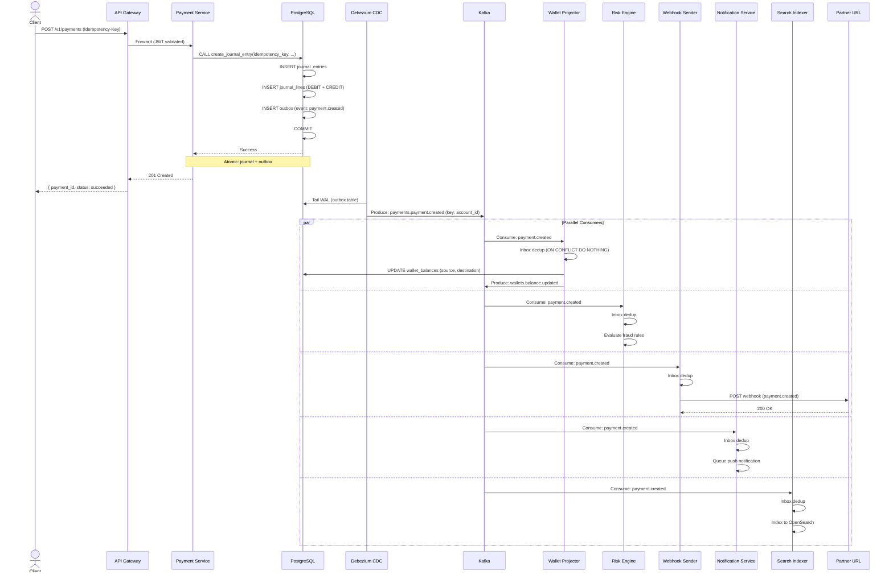
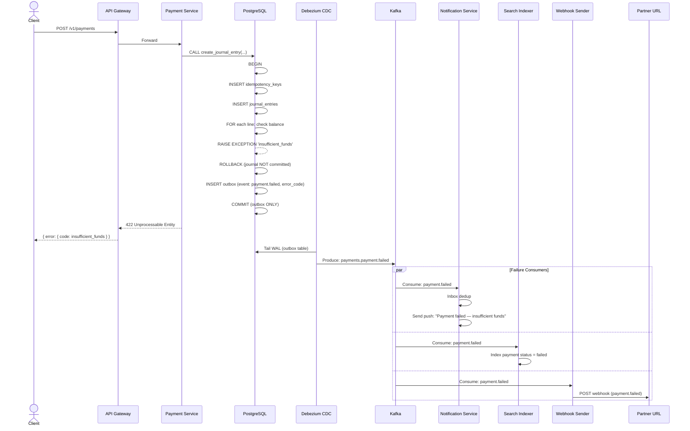
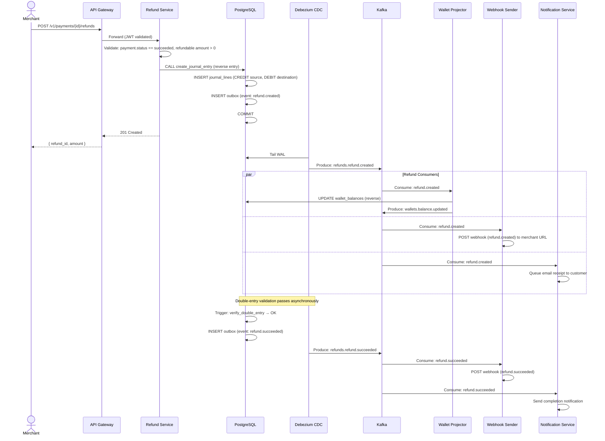
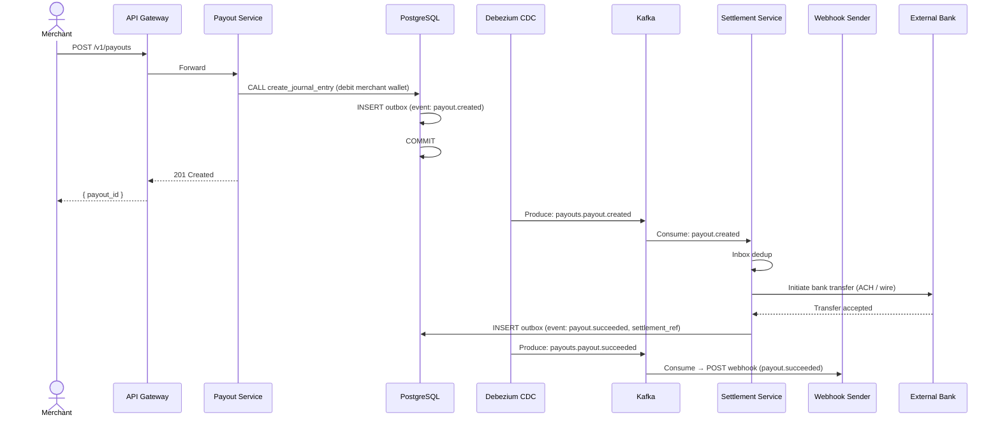
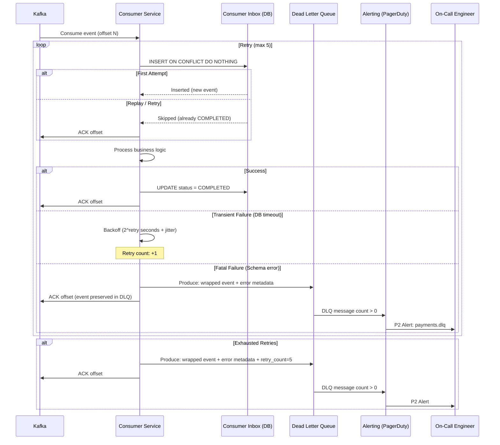
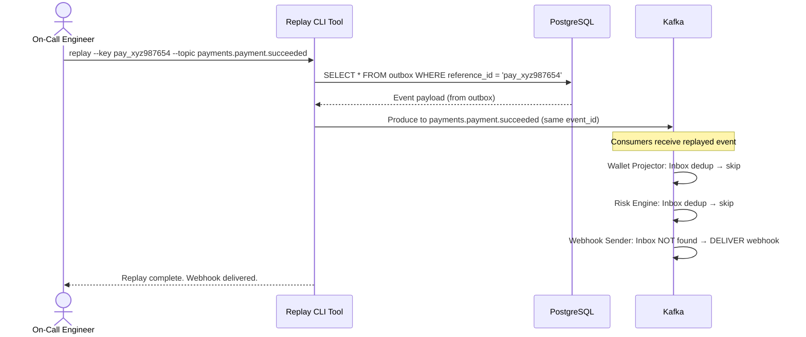

# Event Flow Diagrams — Cross-Cutting Reference

## MoMo-like Payment API Platform

> **Source**: Phase 09 — Event Schema & Governance (v1.0)
> **Purpose**: Visual end-to-end event flow diagrams for all critical business processes
> **Audience**: All engineering teams
> **Last Updated**: 2026-05-20

> **⚠️ Implementation note (Phase-9 alignment, 2026-07-10):** The implemented platform keeps a
> **serial chain** `payment-service → fraud-service → financial-core (ledger) → notification-service`
> because ledger posting depends on the fraud decision. The parallel-consumer diagrams below
> (Risk Engine, Wallet Projector, etc.) are the target design for future services and run
> **alongside** the serial chain, not as a replacement. Preserving the serial order is a
> product decision recorded in `PLAN-phase9-alignment.md` (OQ-C).

---

## 1. Payment Success Flow (Happy Path)



---

## 2. Payment Failure Flow (Insufficient Funds)



---

## 3. Refund Flow



---

## 4. Payout Flow



---

## 5. Consumer DLQ Flow



---

## 6. Replay by Key (Targeted Fix)



---

## 7. Outbox Table Structure

```sql
-- Each service's database contains an outbox table
-- This table is the source of truth for CDC → Kafka
CREATE TABLE outbox (
    id              UUID PRIMARY KEY DEFAULT gen_random_uuid(),
    aggregate_type  VARCHAR(255) NOT NULL,
    aggregate_id    VARCHAR(255) NOT NULL,
    event_type      VARCHAR(255) NOT NULL,
    event_topic     VARCHAR(255) NOT NULL,
    payload         JSONB NOT NULL,
    partition_key   VARCHAR(255) NOT NULL,
    headers         JSONB DEFAULT '{}',
    created_at      TIMESTAMPTZ NOT NULL DEFAULT NOW(),
    processed_at    TIMESTAMPTZ,
    status          VARCHAR(20) NOT NULL DEFAULT 'PENDING'
        CHECK (status IN ('PENDING', 'SENT', 'FAILED'))
);

CREATE INDEX idx_outbox_status_created ON outbox(status, created_at)
    WHERE status = 'PENDING';

-- Purge old outbox rows (scheduled job, runs hourly)
DELETE FROM outbox
WHERE status = 'SENT'
  AND processed_at < NOW() - INTERVAL '7 days';
```

---

## 8. Debezium Connector Configuration (Reference)

```json
{
  "name": "outbox-connector",
  "config": {
    "connector.class": "io.debezium.connector.postgresql.PostgresConnector",
    "database.hostname": "financial-core-db.internal",
    "database.port": "5432",
    "database.user": "debezium_cdc",
    "database.dbname": "financial_core_db",
    "table.include.list": "public.outbox",
    "publication.autocreate.mode": "filtered",
    "plugin.name": "pgoutput",
    "transforms": "outbox",
    "transforms.outbox.type": "io.debezium.transforms.outbox.EventRouter",
    "transforms.outbox.route.topic.replacement": "${routedByValue}",
    "transforms.outbox.table.field.event.id": "id",
    "transforms.outbox.table.field.event.key": "partition_key",
    "transforms.outbox.table.field.event.payload": "payload",
    "transforms.outbox.table.field.event.timestamp": "created_at",
    "transforms.outbox.route.by.field": "event_topic",
    "transforms.outbox.table.expand.json.payload": "true",
    "key.converter": "org.apache.kafka.connect.storage.StringConverter",
    "value.converter": "io.confluent.connect.avro.AvroConverter",
    "value.converter.schema.registry.url": "https://schema-registry.platform.com"
  }
}
```
