# Phase 10 — System Flows

## MoMo-like Payment API Platform

> **Document Status**: Draft v1.0
> **Last Updated**: 2026-05-20
> **Classification**: CONFIDENTIAL — Internal Use Only
> **Audience**: All Engineering Teams, Architecture Review Board, SRE, QA
> **Input**: Phase 08 — API Design (v3.0); Phase 09 — Event Schema & Governance (v1.0); Phase 06 — High-Level Architecture (v6.0)
> **Author Level**: Principal Architect
> **Approval Gate**: 🏗️ Architecture Review Board (ARB) Final Sign-off

---

## Table of Contents

1. [Goal & Scope](#1-goal--scope)
2. [Key Decisions](#2-key-decisions)
3. [Documents Produced](#3-documents-produced)
4. [Flow Diagrams](#4-flow-diagrams)
   - [F01 — Payment Request Flow](#f01--payment-request-flow)
   - [F02 — Authentication & Authorization Flow](#f02--authentication--authorization-flow)
   - [F03 — Idempotency Enforcement Flow](#f03--idempotency-enforcement-flow)
   - [F04 — Event-Driven & CDC Flow](#f04--event-driven--cdc-flow)
   - [F05 — Refund Saga Flow](#f05--refund-saga-flow)
   - [F06 — Payout Settlement Flow](#f06--payout-settlement-flow)
   - [F07 — Error Handling & Mapping Flow](#f07--error-handling--mapping-flow)
   - [F08 — Webhook Delivery & Retry Flow](#f08--webhook-delivery--retry-flow)
   - [F09 — Dead Letter Queue Recovery Flow](#f09--dead-letter-queue-recovery-flow)
   - [F10 — Search & Transaction History Flow](#f10--search--transaction-history-flow)
   - [F11 — Observability & Tracing Flow](#f11--observability--tracing-flow)
   - [F12 — Deployment & Release Flow](#f12--deployment--release-flow)
5. [Example Deliverables](#5-example-deliverables)
6. [Key Questions](#6-key-questions)
7. [Implementation Tasks](#7-implementation-tasks)
8. [Common Mistakes](#8-common-mistakes)
9. [KPIs & Exit Criteria](#9-kpis--exit-criteria)
10. [Connection to Next Phase](#10-connection-to-next-phase)

---

## 1. Goal & Scope

### 1.1 Goal

Map every critical path through the system as an end-to-end flow diagram. Each flow traces a request, event, or operational process across all architectural layers — from client to database and back — providing a single source of truth for how the system behaves under normal, failure, and recovery conditions.

### 1.2 Scope

- **12 end-to-end flows** covering request, auth, idempotency, event processing, saga, payout, error handling, webhook delivery, DLQ recovery, search, observability, and deployment
- Every flow references specific API endpoints (Phase 08), Kafka topics (Phase 09), DB tables and procedures (Phase 07), and security controls (Phase 05)
- Each flow includes: happy path, failure modes, latency budgets, and retry behavior

### 1.3 Input Alignment

| Upstream Phase | Flow Dependency |
|---------------|----------------|
| **Phase 08 — API Design** | API endpoints, auth scopes, error codes, idempotency keys, webhook events |
| **Phase 09 — Event Schema** | Kafka topics, event types, outbox → CDC pipeline, DLQ topics, consumer inbox pattern |
| **Phase 07 — Data Architecture** | `create_journal_entry` procedure, `wallet_balances` projection, `idempotency_keys`, `journal_lines` |
| **Phase 06 — High-Level Architecture** | Backpressure, circuit breakers, consistency models, admission control, retry matrix |
| **Phase 05 — Security Architecture** | JWT validation, API key auth, RBAC scopes, mTLS, rate limiting, PII handling |

---

## 2. Key Decisions

| # | Decision | Rationale |
|---|----------|-----------|
| D01 | **One flow per critical path** | Each flow is self-contained, showing a complete end-to-end trace. Cross-references connect related flows. |
| D02 | **Show both happy path and failure modes** | Every flow includes at least one failure branch. Production incidents are almost always failure-path scenarios. |
| D03 | **Latency budgets on every hop** | Each inter-service call has a P99 budget. Flows that exceed budgets trigger alerting (Phase 20). |
| D04 | **Anchored to upstream phase artifacts** | Every API call references a Phase 08 endpoint. Every event references a Phase 09 topic. No orphaned references. |
| D05 | **Mermaid sequence diagrams** | Text-based diagrams stored in version control. Renderable in any Markdown viewer. |

---

## 3. Documents Produced

| Document | Location | Status |
|----------|----------|--------|
| **System Flows Reference** | `docs/stages/B-domain-architecture/10-system-flows.md` (this document) | ✅ v1.0 |
| **System Overview** | `docs/cross-cutting/architecture/system-overview.md` | 🚧 Pending |
| **Architecture Diagrams** | `docs/cross-cutting/architecture/architecture-diagrams.md` | 🚧 Pending |
| **Service Catalog** | `docs/cross-cutting/architecture/service-catalog.md` | 🚧 Pending |

---

## 4. Flow Diagrams

### F01 — Payment Request Flow

**Scope**: Full payment lifecycle — API ingress to DB commit to response.

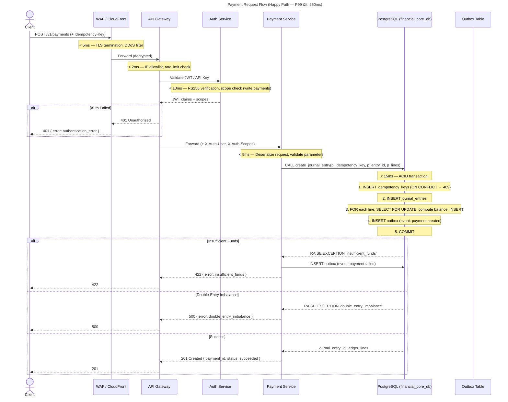

**Failure Modes**:

| Failure Point | Detection | Response | Recovery |
|--------------|-----------|----------|----------|
| WAF DDoS threshold | Shield Advanced auto-mitigation | 503 to malicious IPs | Auto-recover after attack subsides |
| Rate limit exceeded | Token bucket exhausted | 429 + Retry-After header | Client backs off |
| Auth token expired | JWT `exp` claim | 401 + redirect to refresh | Client refreshes token |
| DB connection pool full | HikariCP `PoolTimeoutException` | 503 (fast fail) | Pool recovers when connections released |
| Deadlock on `SELECT FOR UPDATE` | PostgreSQL `40001` | Retry 3x with 50ms + jitter | Auto-retry succeeds |

---

### F02 — Authentication & Authorization Flow

**Scope**: JWT issuance, validation, API key auth, scope enforcement across all endpoints.

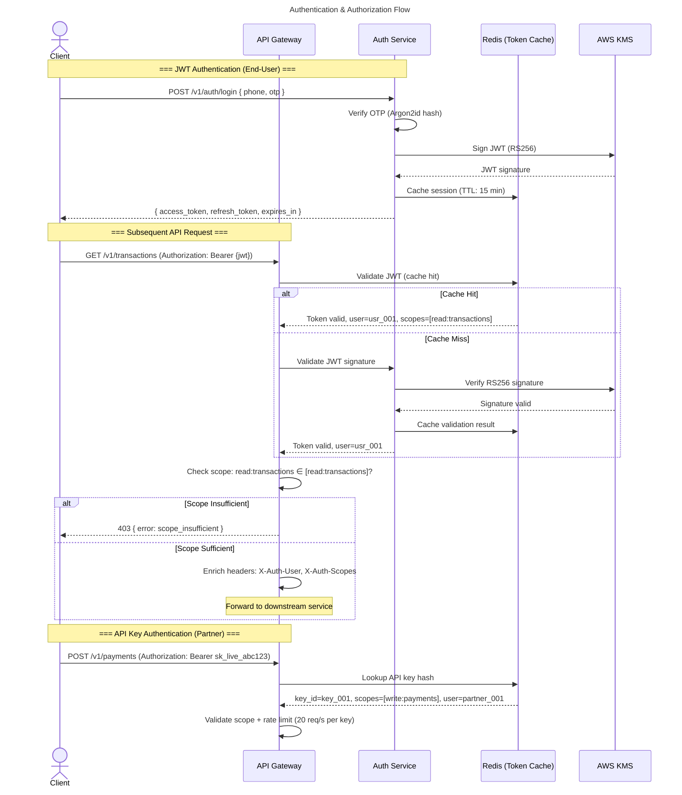

**Latency Budget**:

| Step | P99 Target | Notes |
|------|-----------|-------|
| JWT signature verification (cached) | < 5ms | Redis cache hit |
| JWT signature verification (uncached) | < 15ms | KMS round-trip |
| API key lookup (Redis) | < 2ms | Always cached |
| Scope check (Gateway in-memory) | < 1ms | Map lookup |

---

### F03 — Idempotency Enforcement Flow

**Scope**: Two-layer idempotency (Redis cache + DB UNIQUE constraint) with replay and collision detection.

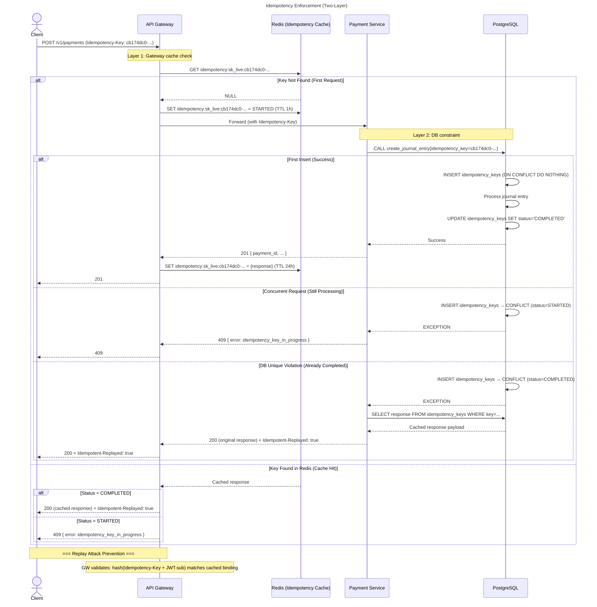

**Key Differences from Stripe**:

| Aspect | Our Implementation | Stripe |
|--------|-------------------|--------|
| Header | `Idempotency-Key` | `Idempotency-Key` ✓ |
| Scope | Per API key | Per API key ✓ |
| TTL | 24 hours | 24 hours ✓ |
| Replay binding | Bound to `JWT.sub` via hash | Bound to API key |

---

### F04 — Event-Driven & CDC Flow

**Scope**: Outbox → Debezium CDC → Kafka → Consumer Inbox → Side Effects. (Expanded from Phase 09 §4.1.)

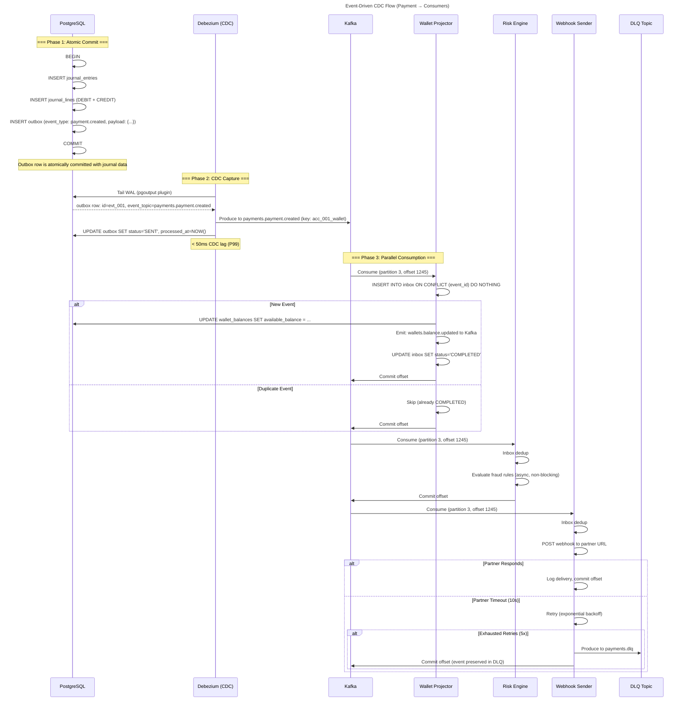

**CDC Latency Budget**:

| Metric | P50 | P95 | P99 |
|--------|-----|-----|-----|
| Outbox INSERT to Kafka produce | < 10ms | < 30ms | < 50ms |
| Consumer lag (committed offset vs. latest) | < 100ms | < 500ms | < 2s |
| Alert threshold | — | — | > 10,000 messages |

---

### F05 — Refund Saga Flow

**Scope**: Refund as a distributed saga with compensating transaction on failure.

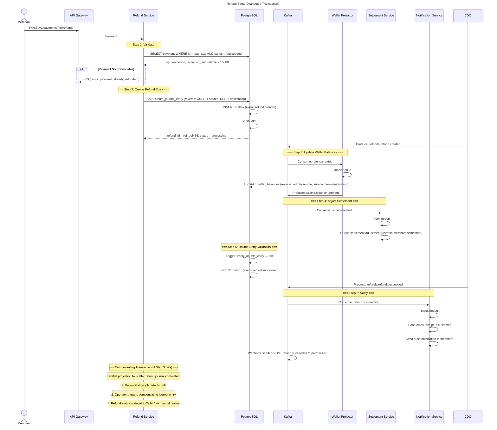

**Saga State Transitions**:

```
refund.created → refund.succeeded (all steps complete)
refund.created → refund.failed (validation or processing failed)
refund.succeeded → [immutable — no further transitions]
```

---

### F06 — Payout Settlement Flow

**Scope**: Merchant payout from platform wallet to external bank account.

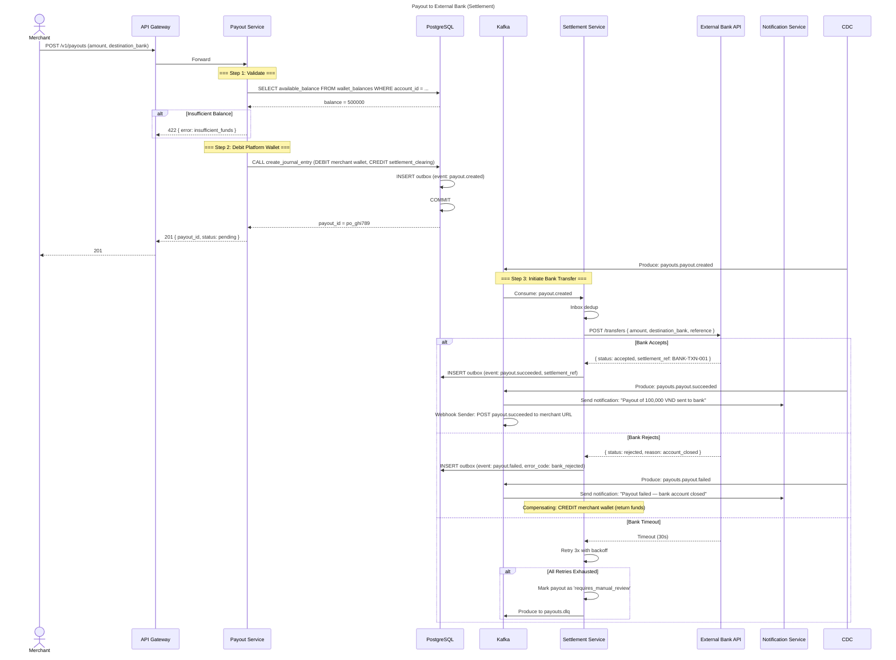

---

### F07 — Error Handling & Mapping Flow

**Scope**: How errors propagate from DB exceptions to standardized API error responses.

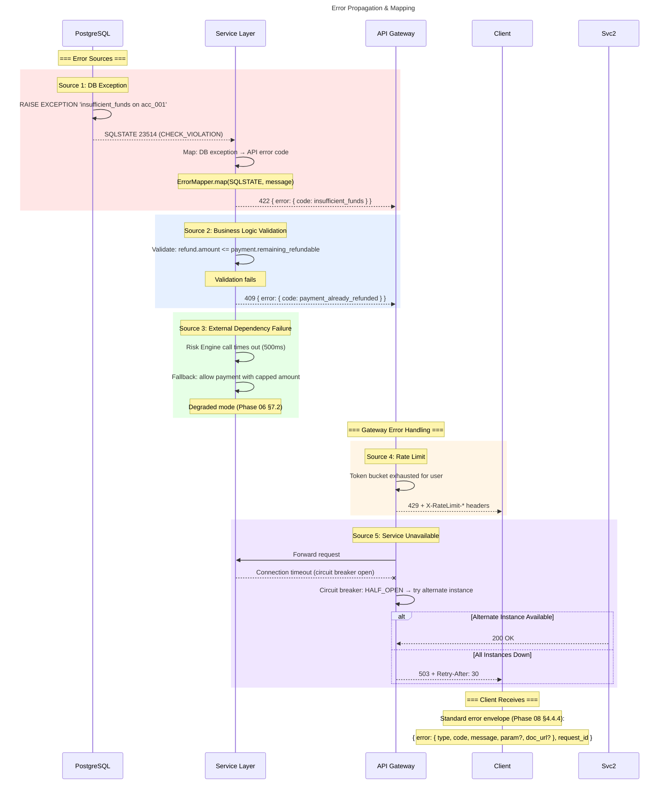

**Error Mapping Table** (Cross-reference with Phase 08 §4.8.2):

| DB Exception | SQLSTATE | API Error Code | HTTP | Retryable? |
|-------------|----------|---------------|------|:--:|
| `insufficient_funds` | 23514 | `insufficient_funds` | 422 | No |
| `duplicate key` (idempotency) | 23505 | `idempotency_replayed` / `duplicate_transaction` | 409 | No |
| `foreign key violation` | 23503 | `account_not_found` | 404 | No |
| `deadlock detected` | 40001 | N/A (auto-retry) | — | Yes (3x) |
| `connection timeout` | 08006 | `service_unavailable` | 503 | Yes (exponential backoff) |
| `statement timeout` | 57014 | `internal_error` | 500 | Yes (1x) |
| Double-entry imbalance | P0001 (RAISE) | `double_entry_imbalance` | 500 | No (manual investigation) |

---

### F08 — Webhook Delivery & Retry Flow

**Scope**: Webhook delivery lifecycle — signature generation, delivery, retry, DLQ.

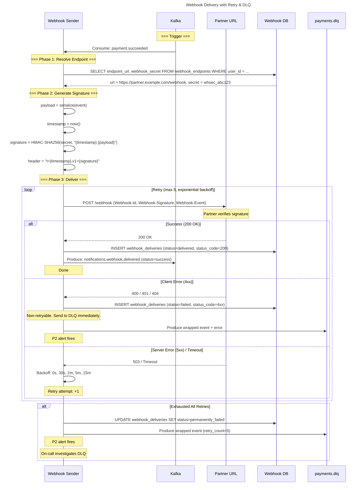

**Retry Schedule** (Phase 08 §4.9.2):

| Attempt | Delay | Cumulative Time |
|---------|-------|----------------|
| 1 | 0s | 0s |
| 2 | 30s | 30s |
| 3 | 2m | 2m 30s |
| 4 | 5m | 7m 30s |
| 5 | 15m | 22m 30s |
| 6 | 1h | 1h 22m |
| 7 | 4h | 5h 22m |
| 8 | 8h | 13h 22m → DLQ |

---

### F09 — Dead Letter Queue Recovery Flow

**Scope**: Operational workflow for recovering events from DLQ topics.

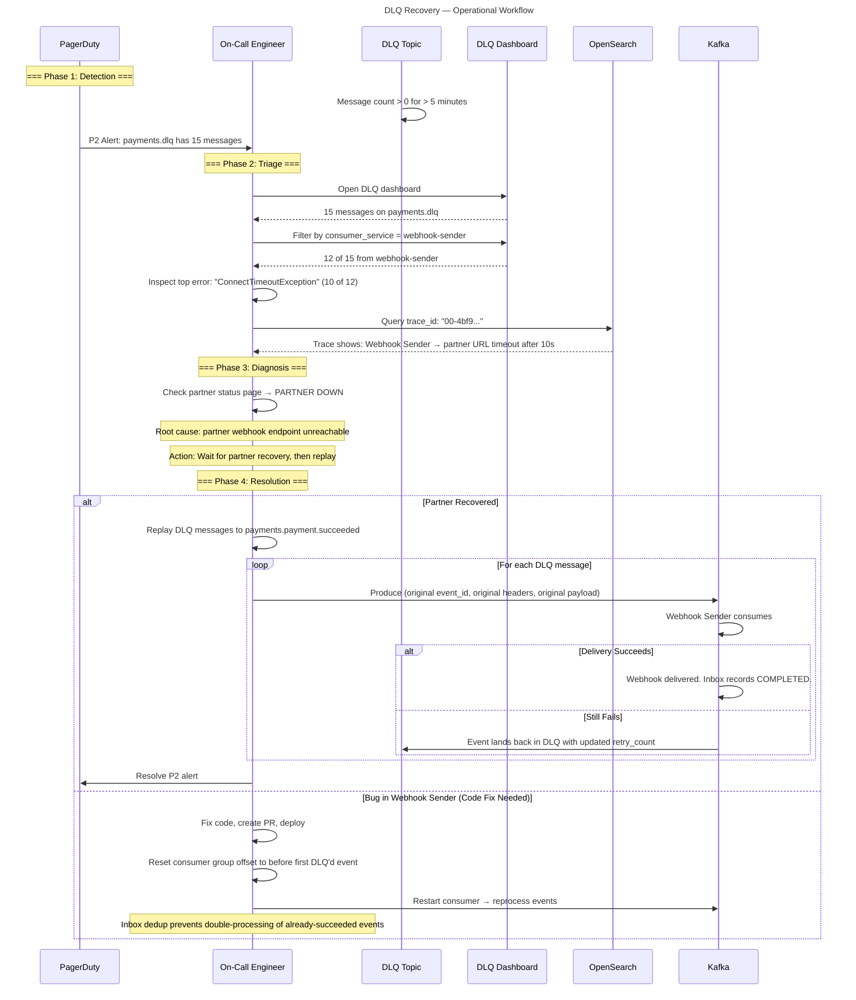

---

### F10 — Search & Transaction History Flow

**Scope**: How transaction history is queried — CQRS read path via OpenSearch with eventual consistency.

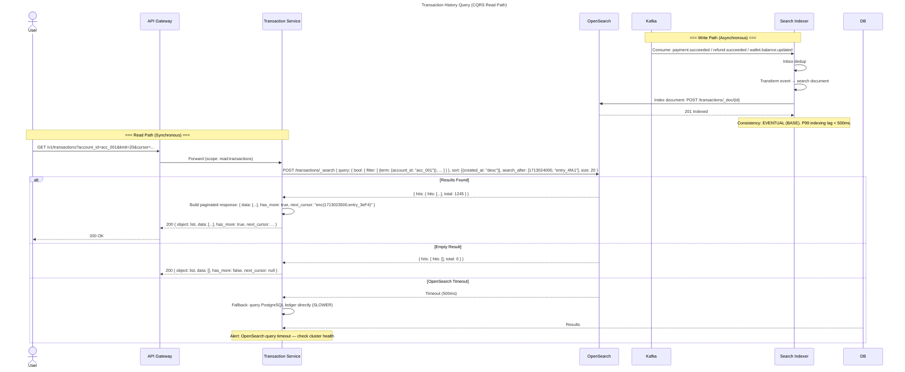

**Consistency Guarantee**:

| Query Type | Data Source | Consistency | Max Staleness |
|-----------|------------|-------------|---------------|
| Transaction List | OpenSearch (indexed from events) | Eventual (BASE) | P99 < 500ms |
| Single Transaction Detail | PostgreSQL (ledger) | Strong (ACID) | 0ms |
| Wallet Balance | PostgreSQL (wallet_balances) | Strong (ACID) | 0ms |
| Payment Status | PostgreSQL (journal_entries) | Strong (ACID) | 0ms |

**Fallback Strategy**: If OpenSearch is unavailable, queries route to PostgreSQL directly. This is slower (P99 ~150ms vs P99 ~30ms for OpenSearch) but ensures availability. Alert fires if fallback is active for > 5 minutes.

---

### F11 — Observability & Tracing Flow

**Scope**: How trace context propagates through all layers, enabling end-to-end debugging.

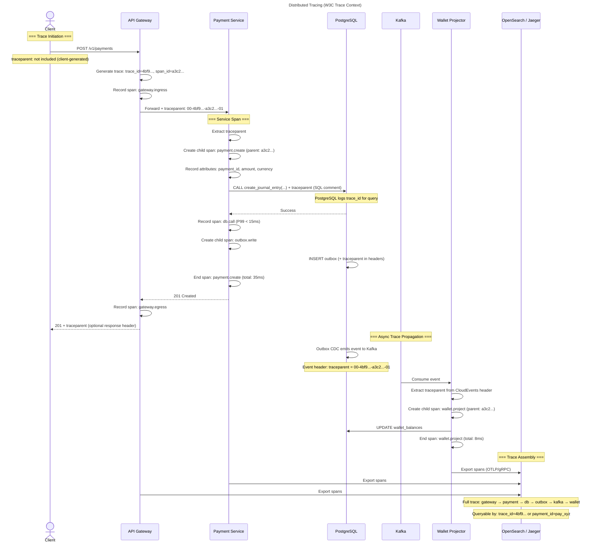

**Tracing SLOs**:

| Metric | Target |
|--------|--------|
| Trace sampling rate (production) | 100% of error traces, 10% of success traces |
| Span export latency | < 100ms |
| Trace retention (Jaeger/OpenSearch) | 7 days hot, 30 days warm |

**Debugging a Failed Transaction** (per Phase 06 §10.1):
1. Extract `payment_id` from support ticket.
2. Query OpenSearch: `trace_id` linked to `payment_id`.
3. Follow spans: did it reach `db.call`? Did it reach `outbox.write`? Did it reach `kafka.produce`?
4. If trace stops at a specific span → root cause identified.

---

### F12 — Deployment & Release Flow

**Scope**: CI/CD pipeline from PR merge to production deployment with canary and rollback.

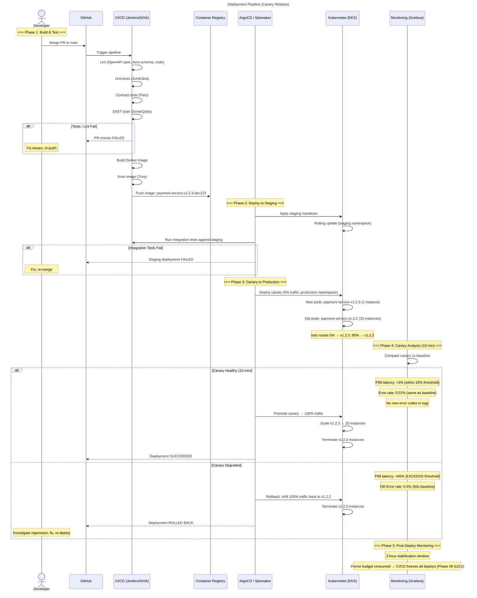

**Deployment Gates** (per Phase 25 — Production Readiness):

| Gate | Check | Blocking? |
|------|-------|:--:|
| Unit tests | 100% pass | ✅ |
| Contract tests | No breaking changes | ✅ |
| SAST | No HIGH/CRITICAL findings | ✅ |
| Image scan | No CRITICAL CVEs | ✅ |
| Staging integration | All scenarios pass | ✅ |
| Canary analysis | P99 < 10% regression, error rate ≤ baseline | ✅ |
| Post-deploy monitoring | No SLO violation in 2 hours | ✅ |
| Error budget | > 0 remaining | ✅ |

---

## 5. Example Deliverables

### 5.1 Trace Propagation: Full Lifecycle

```json
{
  "trace_id": "4bf92f3577b34da6a3ce929d0e0e4736",
  "spans": [
    {
      "span_id": "a3c2d1e4f5",
      "parent_id": null,
      "name": "gateway.ingress",
      "service": "api-gateway",
      "start_time": "2026-05-20T10:30:00.000Z",
      "duration_ms": 82,
      "attributes": {
        "http.method": "POST",
        "http.url": "/v1/payments",
        "http.status_code": 201,
        "idempotency_key": "cb174dc0-..."
      }
    },
    {
      "span_id": "b4d3e2f1a6",
      "parent_id": "a3c2d1e4f5",
      "name": "payment.create",
      "service": "payment-service",
      "start_time": "2026-05-20T10:30:00.005Z",
      "duration_ms": 65,
      "attributes": {
        "payment_id": "pay_xyz987654",
        "amount": 15000,
        "currency": "VND"
      }
    },
    {
      "span_id": "c5e4f3a2b7",
      "parent_id": "b4d3e2f1a6",
      "name": "db.call",
      "service": "payment-service",
      "start_time": "2026-05-20T10:30:00.010Z",
      "duration_ms": 12,
      "attributes": {
        "db.system": "postgresql",
        "db.operation": "create_journal_entry",
        "db.sql.table": "journal_entries"
      }
    },
    {
      "span_id": "d6f5a4b3c8",
      "parent_id": "b4d3e2f1a6",
      "name": "outbox.write",
      "service": "payment-service",
      "start_time": "2026-05-20T10:30:00.025Z",
      "duration_ms": 3
    },
    {
      "span_id": "e7a6b5c4d9",
      "parent_id": "a3c2d1e4f5",
      "name": "wallet.project",
      "service": "wallet-projector",
      "start_time": "2026-05-20T10:30:00.055Z",
      "duration_ms": 8,
      "attributes": {
        "messaging.system": "kafka",
        "messaging.destination": "payments.payment.succeeded",
        "messaging.kafka.partition": 3,
        "messaging.kafka.offset": 1245789
      }
    }
  ]
}
```

---

## 6. Key Questions

| # | Question | Answer |
|---|----------|--------|
| Q1 | What trace sampling rate should we use in production? | 100% of error traces (5xx, circuit breakers, DLQ routing), 10% of success traces. This gives complete visibility into failures while controlling observability cost. |
| Q2 | How long should the canary analysis window be? | 10 minutes minimum. This covers at least one full metrics scrape cycle and allows P99 latency to stabilize. Extend to 30 minutes for database migrations. |
| Q3 | What happens if OpenSearch is down for transaction history? | Fallback to PostgreSQL ledger table for queries. This is slower but available. Alert fires immediately (P1). |
| Q4 | How do we handle idempotency key collisions across different users? | Idempotency keys are scoped to API key. Even if two users generate the same UUID, they are in different namespaces. Gateway enforces this by binding `hash(key + JWT.sub)`. |
| Q5 | Can the payment flow work if Kafka is down? | Yes. The synchronous payment request completes via DB commit only. The outbox table buffers events. When Kafka recovers, Debezium CDC resumes from the last committed WAL position. No events are lost. |
| Q6 | What is the rollback time for a canary deployment? | < 30 seconds. Istio shifts 100% traffic back to the stable version. Pods terminate gracefully (drain in-flight requests for 30s). |

---

## 7. Implementation Tasks

### P0 — Critical Path

- [ ] **T01**: Implement trace context propagation (W3C Trace Context) in API Gateway, all services, and Kafka event headers.
- [ ] **T02**: Implement idempotency key binding (`hash(key + JWT.sub)`) in API Gateway.
- [ ] **T03**: Implement circuit breaker + fallback for external dependencies (Risk Engine, Bank API).
- [ ] **T04**: Implement canary deployment pipeline with automated analysis (Argo Rollouts / Spinnaker).
- [ ] **T05**: Implement error mapping layer in all services (DB Exception → API Error Code).
- [ ] **T06**: Implement OpenSearch fallback to PostgreSQL for transaction history queries.

### P1 — Before Vertical Slice (Phase 17)

- [ ] **T07**: Implement DLQ dashboard (Kafka UI / Confluent Control Center) for operational triage.
- [ ] **T08**: Implement consumer retry + DLQ routing in consumer framework.
- [ ] **T09**: Implement webhook delivery retry with exponential backoff.
- [ ] **T10**: Configure canary analysis metrics (P99 latency, error rate, log anomalies).

### P2 — Before Production Readiness (Phase 25)

- [ ] **T11**: Implement automated DLQ replay tooling (by key, by offset range).
- [ ] **T12**: Implement reconciliation job for wallet balance drift detection.
- [ ] **T13**: Load-test canary deployment process (ensure < 30s rollback).
- [ ] **T14**: Document runbooks for each failure scenario in this phase.

---

## 8. Common Mistakes

| Mistake | Consequence | Prevention |
|---------|-------------|-----------|
| **No trace context on async boundaries** | Trace breaks at Kafka → consumer boundary. Can't debug end-to-end. | All Kafka event headers include `traceparent`. Consumers extract and create child spans. |
| **Blocking retries inside DB transaction** | Retry loop holds DB connection open → pool exhaustion → cascading failure. | Retries happen at the consumer level, outside any DB transaction. |
| **Canary analysis too short** | Promote canary after 30 seconds → regression only visible after 2 minutes → already on 100% traffic. | Minimum 10-minute analysis window. |
| **No fallback for search** | OpenSearch is down → transaction history returns 503 → user cannot see any transactions. | Always fall back to PostgreSQL. Degraded performance is better than no service. |
| **Hardcoded retry delays** | Fixed `sleep(1000)` in retry loop → thundering herd when dependency recovers. | Exponential backoff + random jitter. |
| **Missing idempotency binding** | Attacker sniffs valid `Idempotency-Key`, replays with their session → gets cached success response. | Gateway binds `hash(key + JWT.sub)`. |

---

## 9. KPIs & Exit Criteria

| # | Criterion | Target | Measurement |
|---|-----------|--------|-------------|
| K01 | Trace coverage | 100% error traces, 10% success traces sampled | Jaeger / OpenSearch trace count |
| K02 | Trace context propagation | `traceparent` present on 100% of Kafka event headers | Avro schema validation |
| K03 | Idempotency binding | 100% of idempotency keys bound to `JWT.sub` at Gateway | Gateway audit log |
| K04 | Canary analysis coverage | All deployments use canary with ≥ 10 min analysis | CI/CD pipeline metrics |
| K05 | Rollback time | < 30 seconds for any canary rollback | Deployment event log |
| K06 | Search fallback | OpenSearch → PostgreSQL fallback tested and functional | Integration test |
| K07 | Error mapping coverage | 100% of DB exception types mapped to API error codes | Static analysis of error mapper |
| K08 | Flow documentation | All 12 flows documented with diagrams and failure modes | This document |

**Exit Gate**: All K01–K08 must be ✅ before ARB sign-off.

---

## 10. Connection to Next Phase

| Downstream Phase | How System Flows Connect |
|-----------------|------------------------|
| **Phase 11 — Technology Selection** | The flows define latency budgets, consistency requirements, and throughput targets that drive technology choices (Kafka vs. RabbitMQ, OpenSearch vs. Elasticsearch, Redis vs. Memcached). |
| **Phase 12 — Infrastructure Design** | Network topology, VPC subnets, security groups, and load balancer configurations must support the communication patterns shown in each flow. |
| **Phase 13 — Platform Core** | The `@app/core` library implements trace context propagation, error mapping, retry policies, and circuit breaker patterns defined in these flows. |
| **Phase 14 — Testing Strategy** | Integration tests, contract tests, and chaos tests are designed to exercise the exact failure modes documented in each flow. |
| **Phase 17 — Vertical Slice** | The first E2E working flow implements F01 (Payment Request Flow) + F04 (Event-Driven Flow) end-to-end in staging. |
| **Phase 20 — Observability** | The tracing, metrics, and alerting configurations are derived from the latency budgets and failure modes in each flow. |
| **Phase 23 — Chaos Engineering** | Game day scenarios are selected from the failure modes in each flow (e.g., "what happens when Kafka is partitioned?"). |
| **Phase 25 — Production Readiness** | The deployment canary analysis (F12) and error budget policy are validated as part of the launch gate. |

---

### 🛑 APPROVAL GATE → 🏗️ Architecture Review Board

**Checklist**:

- [ ] All 12 flow diagrams are complete with happy path and failure modes
- [ ] Each flow references specific Phase 08 endpoints and Phase 09 topics
- [ ] Latency budgets are defined for every inter-service hop
- [ ] Trace context propagation is defined across all boundaries (sync + async)
- [ ] Idempotency binding (`hash(key + sub)`) is documented in F03
- [ ] Canary deployment flow (F12) has defined analysis gates and rollback trigger
- [ ] All failure modes reference specific error codes from Phase 08 §4.8
- [ ] DLQ recovery workflow (F09) is documented as an operational runbook
